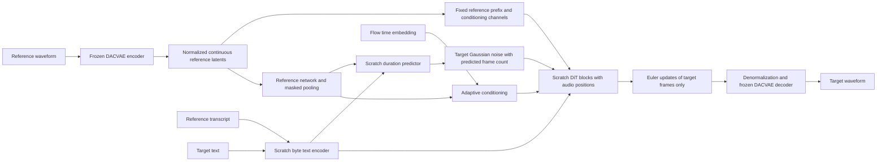

# Implementation audit — 19 September 2026

The core remains a **non-autoregressive, reference-conditioned DiT-style flow model**
over continuous DACVAE latents. It is not an LLM or a discrete-token autoregressive
model. The TTS components initialize from scratch; only DACVAE is pretrained in the
documented training baseline. No trained speech checkpoint or user corpus is available
in this workspace. Synthetic tests establish mechanics, not intelligible speech or
voice-cloning quality.

## Verified architecture

| Component | Verified behavior |
|---|---|
| Codec | Frozen `facebook/dacvae-watermarked`; tested 48 kHz, hop 1,920, 128 continuous channels, 25 frames/s; posterior means; upstream watermarking decoder retained |
| Text | UTF-8 bytes, vocabulary 260, fixed special IDs; reference and target segments; sinusoidal positions; depthwise convolutions and residual MLPs; no pretrained text weights |
| Audio transformer | Packed latent inputs, additive sinusoidal **packed audio positions**, noncausal self-attention, text cross-attention, feed-forward layers, adaptive normalization |
| Global reference | Baseline framewise MLP `C → D → D`, masked mean: **[B,D]**, not [B,C] |
| Adaptive conditioning | Time embedding [B,D] plus reference summary [B,D]; each block produces nine D-wide modulation vectors |
| Duration | Pooled target-byte text features [B,D], reference summary [B,D], log reference frames/reference bytes [B,1] → log target frames/target bytes |
| Initialization | Adaptive projections and final velocity projection zero-initialized intentionally; preserved |
| Tiny / Small | D=256 / 384; 8 / 12 blocks; 4 / 6 heads; 13,526,017 / 44,361,473 trainable parameters, excluding codec |

The codec has 107,671,171 parameters, so “Tiny” describes the TTS generator rather
than the entire deployment. At C=128, P=2, raw packed input is **514**, velocity output
is **256**, and hidden width D is a separate choice. Detailed shapes and batch/request
traces are in [tensor-contracts.md](tensor-contracts.md).



## Findings and changes

| Classification | Verified finding | Implementation and evidence |
|---|---|---|
| Confirmed implementation bug | Unused components of partial packs entered the input projection. Changing padding changed valid predictions; a reproduced random-network example changed them by about 1.05. | Sanitize current state and reference channels before packing. Odd reference/target/total lengths and NaN padding invariance tests pass for P=1,2,3. |
| Confirmed implementation bug | Multiplying squared error by zero did not exclude masked NaN/Inf. Empty target masks silently returned zero loss. | Sanitize operands before subtraction; reject empty targets. Hand-computed reductions and poisoned-padding tests pass. |
| Confirmed implementation bug | Codec input reshaping could silently flatten unsupported waveform ranks. | Reject non-mono/nonfloat/nonfinite waveform tensors; decode validates [frames,C]. |
| Confirmed implementation bug | Waveform extraction used the complement of the reference mask, including padded frames for externally padded requests. | Use `valid & ~reference`; waveform API explicitly restricts B=1. |
| Confirmed implementation bug | Merge discarded duplicate waveforms even when speaker/transcript/split labels conflicted. | Fail on conflicting duplicate labels; regression test covers conflict. Within-partition duplicate rejection remains logged for review. |
| Confirmed implementation bug | ASR metric normalization stripped non-ASCII letters, including English names with accents. | Versioned Unicode-preserving scoring; retain legacy scoring option. Rescore both sides before comparing versions. |
| Missing validation/test coverage | Shapes, partial packs, null-condition invariance, analytic solver behavior, zero-init gradient progression, normalization stats and codec identity had insufficient coverage. | Explicit contracts, focused tests, finite-gradient/activation diagnostics, codec weight SHA-256 and preprocessing metadata. |
| Missing interface capability | Inference required the caller to provide the reference transcript. There was already no inference speaker-ID table. | `synthesize(text, ref_audio=...)` and `--ref-audio`; lazy optional ASR obtains the transcript. This is an audio-only **API**, not a transcript-free TTS architecture. |
| Potential architectural limitation | Byte/text-to-audio alignment has no supervised monotonic alignment objective. Total duration cannot establish word timing. | Content/duration evaluation protocol and frozen cases added; no unsupported alignment-quality claim. |
| Potential architectural limitation | Mean-pooled frame MLP has no explicit identity objective; arbitrary same-speaker pairs need not share emotion or recording style. | Reference path ablations and optional reference networks added; identity/style protocol below. |
| Optional experimental improvement | Temporal encoding, attentive/statistical pooling, extra duration features, speaker balancing and frame-weighted loss might help. | Individually configurable, disabled by default; synthetic execution tested, comparative speech experiments **not run**. |

Audio ordering, correct Euler interval sizes, clean reference prefixes, target-only
supervision, joint CFG in the original training/sampling paths, and zero initialization
were already present. They were documented and tested rather than described as newly
invented fixes. Direct generator calls now share centralized dropout payload removal.

## Preserved baseline and compatibility

`baselines/2026-09-19/original-source.tar.gz` preserves the pre-edit implementation,
configs, documentation and tests. Its SHA-256 is recorded in `manifest.json`.
`tiny-initialization.pt` is deterministic seed-42 initialization, explicitly **not
trained** and not a deployable Synthesizer checkpoint. No speech checkpoint existed
to preserve. The original suite had 18 passing tests.

Run the archived baseline without replacing the working tree:

```bash
mkdir -p /tmp/dacvae-original-baseline
tar -xzf baselines/2026-09-19/original-source.tar.gz -C /tmp/dacvae-original-baseline
PYTHONPATH=/tmp/dacvae-original-baseline/src .venv/bin/python -m pytest \
  /tmp/dacvae-original-baseline/tests -q
PYTHONPATH=/tmp/dacvae-original-baseline/src .venv/bin/python -m dacvae_tts inspect \
  --config /tmp/dacvae-original-baseline/configs/tiny.yaml
```

Current Tiny/Small defaults preserve parameter names/shapes and original loss
weighting. Correctness fixes affect malformed/padded inputs and are always enabled;
use the archived code for an exact historical reproduction. Reference architecture,
pooling, duration-feature and packing changes need compatible newly trained weights;
do not load baseline weights into a changed architecture with `strict=False`.

New metadata verifies codec weights and preprocessing. Old caches/checkpoints still
load with an explicit identity-verification warning; an absent historical digest
cannot be retroactively verified. Treat caches as immutable. Preparation is not
resumable in place; merge references the original absolute shard paths. Source
inventory digests cover filenames, sizes and timestamps, **not all source bytes**;
individual accepted waveforms have hashes. Exact hashes cannot detect lossy duplicates.

## Conditioning objective and unresolved questions

The intended baseline objective is **speaker identity transfer to new linguistic
content** using distinct complete same-speaker recordings. No inference speaker ID,
voice enrollment table, dedicated pretrained speaker encoder, or per-voice finetuning
is required. The learned summary may also encode content, prosody, noise and channel
characteristics. It has not been shown to isolate identity.

Evaluate identity separately from naturalness and style. Freeze speaker-disjoint
cases, add cross-session pairs where session labels exist, then author separate
short-reference, noisy-reference and different-style subsets. Do not promise emotion,
prosody or microphone-style transfer from arbitrary same-speaker supervision. No
reference augmentation or separate style control is enabled by default.

The actual 4M-row corpus's hours, speaker/session inventory, transcript correctness,
near duplicates and original file access remain unknown. Reliable speaker labels are
needed for training pairing even though inference takes only reference audio. Cache
audit detects exact duplicates, split leakage, corrupt latents and supplied interval
overlap; it does not prove the absence of unlabeled overlap or incorrect transcripts.
Per-rule rejection logs exist; complete corpus-specific removed-speaker/filter tables
still need to be assembled from those logs before production training.

## Evidence and next gate

See [validation-results.json](validation-results.json) for executed checks and
[experiments.md](experiments.md) for commands, ablations, gates and unrun work.
No measured WER/CER/DNSMOS improvement, cloning success rate, full-corpus throughput,
eight-physical-GPU result or speech learnability result is claimed.

**First next experiment:** run codec-only reconstruction on a small clean English
subset, listen and score original/reconstructed speech, then overfit Tiny on distinct
same-speaker utterances with ground-truth target duration. Resolve failures before
scaling, adding identity/alignment losses, or using preference training/distillation.

Primary research checked for this audit: [DACVAE source](https://github.com/facebookresearch/dacvae)
and [F5-TTS](https://arxiv.org/abs/2410.06885). They motivate continuous codec handling
and flow-TTS experiments; their results are not results for this smaller architecture.
The [research record](research.md) links the post-training sources and distinguishes
the implemented flow-error surrogate from a likelihood objective.
