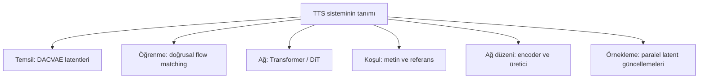
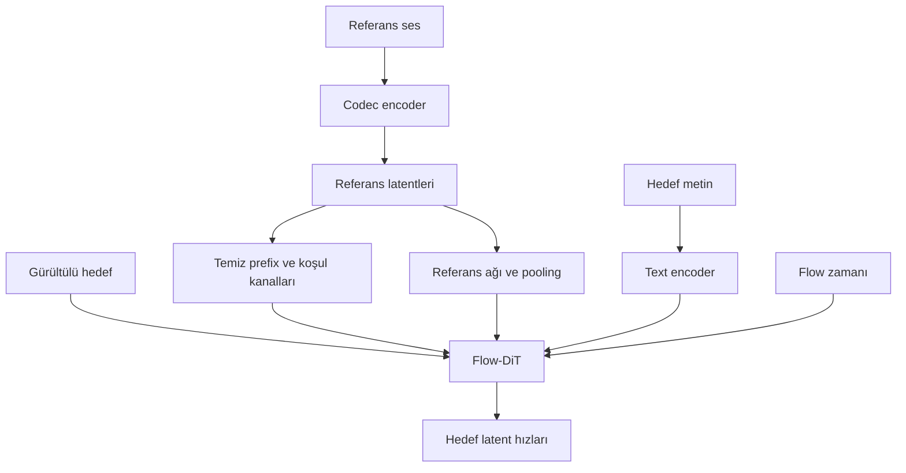
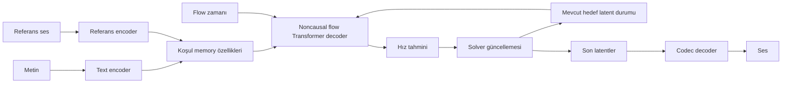

# Flow-DiT mimarileri: Rectified Flow, Flow Matching, referans koşullandırma ve encoder–decoder

**Tarih:** 19 Eylül 2026  
**Kapsam:** TTS bağlamında dört terimin anlamı, ilişkisi, gerçek mimari farkları, eğitim/inference akışı ve bizim DACVAE-TTS modelindeki karşılıkları.  
**İlgili belge:** [Kapsamlı model ve araştırma raporu](kapsamli-tts-arastirma-raporu.md).

## Ana fikir

**Bu dört isim, birbirini dışlayan dört rakip mimari değildir. Aynı model dört tanıma da uyabilir.** İsimler sistemin farklı özelliklerini öne çıkarır:

| Terim | Hangi soruya cevap veriyor? | Kısa anlamı |
|---|---|---|
| **Flow-matching DiT** | Üretici hangi yöntemle eğitiliyor, hangi ağ kullanılıyor? | Hız alanını flow matching ile öğrenen Transformer üreticisi |
| **Rectified Flow DiT** | Hangi flow kurulumu tercih edilmiş? | Doğrusal gürültü–veri interpolasyonuna dayanan rectified-flow kurulumu ve Transformer üreticisi |
| **Referans koşullu Flow-DiT** | Üretim hangi ek bilgiye bağlı? | Metne ek olarak referans sesinden bilgi alan flow Transformer |
| **Encoder–decoder Rectified Flow DiT** | Bilgi işleme modülleri nasıl ayrılmış? | Koşulları encoder ile işleyen, hedef temsili rectified-flow decoder ile üreten sistem |

Örneğin bir model **encoder–decoder düzeninde, referans koşullu, rectified-flow hedefiyle eğitilmiş bir DiT** olabilir. Bu modeli kısaca “flow-matching DiT” diye adlandırmak da öğrenme yöntemi bakımından uyumlu olabilir. İsim değişince zorunlu olarak kod veya matematik değişmiş olmaz.

## İçindekiler

1. [Önce sistemi bağımsız parçalara ayıralım](#parcalar)
2. [DiT nedir?](#dit)
3. [Flow-matching DiT nedir?](#flow-matching)
4. [Rectified Flow DiT nedir?](#rectified-flow)
5. [Referans koşullu Flow-DiT nedir?](#referans)
6. [Encoder–decoder Rectified Flow DiT nedir?](#encoder-decoder)
7. [Attention düzenleri arasındaki gerçek farklar](#attention)
8. [Dört terimin toplu karşılaştırması](#karsilastirma)
9. [Sayısal örnek: bizim modelde bir istek](#ornek)
10. [Eğitim ve inference neden farklı?](#egitim-inference)
11. [AdaLN, codec, duration ve streaming ilişkisi](#diger-parcalar)
12. [Gerçek modellerde isimlerin karşılığı](#modeller)
13. [Kalite ve hız için ne seçmeliyiz?](#secim)
14. [Sık karıştırılan noktalar](#yanlis-anlamalar)
15. [Kaynaklar](#kaynaklar)

<a id="parcalar"></a>
## 1. Önce sistemi bağımsız parçalara ayıralım

Bir TTS sisteminin mimarisini tek bir etiketle tam anlatamayız. En az altı karar vardır:

| Karar ekseni | Örnek seçenekler | Bizim baseline |
|---|---|---|
| Ses temsili | Waveform, mel, sürekli codec latentleri, ayrık codec tokenları | Sürekli DACVAE latentleri |
| Öğrenme hedefi | Flow matching, diffusion noise prediction, token cross-entropy | Doğrusal interpolasyonlu hız regresyonu |
| Üretici ağ | Transformer, convolution/U-Net, hibrit | DiT tarzı Transformer |
| Koşullar | Metin, referans ses, stil açıklaması, speaker ID | Metin ve referans ses; içeride referans transkripti |
| Ağ düzeni | Ortak token dizisi, ayrı encoder/decoder, hibrit | Ayrı text/reference encoder'ları ve koşullu üretici |
| Üretim prosedürü | AR token üretimi, tam-dizi ODE, chunked üretim | Tam-dizi non-autoregressive Euler örneklemesi |

Bu eksenler birlikte değerlendirilir. “DiT” demek DACVAE kullanılıyor demek değildir. “Referans koşullu” demek speaker-ID tablosu var demek değildir. “Encoder–decoder” demek autoregressive üretim demek değildir.



<a id="dit"></a>
## 2. DiT nedir?

**DiT, Diffusion Transformer kısaltmasıdır.** Üretim sürecindeki tahmin ağı olarak Transformer kullanır. Orijinal çalışma görüntü latentlerini patch'lere ayırır; Transformer bunları işler. AdaLN, cross-attention ve ek koşullandırma tokenları gibi blok seçenekleri incelenmiştir. DiT adı bugün flow tabanlı Transformer üreticileri için de kullanılır; orijinal diffusion loss'unun aynen kullanıldığını tek başına garanti etmez. [Orijinal DiT makalesi](https://arxiv.org/html/2212.09748v2).

Bizim ses uygulamamızda kavramsal akış:

```text
Gürültülü ses latentleri + flow zamanı + metin/referans koşulları
                              ↓
                     Giriş projeksiyonu
                              ↓
                      Transformer blokları
                              ↓
                   Her latent için hız tahmini
```

Buradaki Transformer çıktısı cümle veya kelime tokenı değil, latent uzayında bir değişim vektörüdür. Codec decoder bu vektörü doğrudan sese çevirmez: önce hız tahminleriyle örnekleme tamamlanır, oluşan son latent dizi decode edilir.

### 2.1 DiT ile LLM aynı şey mi?

Hayır. Transformer bir ağ ailesidir; LLM bu aileyi kullanabilen bir model türüdür. Bizde:

- Bir sonraki kelimeyi tahmin eden dil modeli hedefi yok.
- Ses codebook indislerini soldan sağa üretme hedefi yok.
- Her solver adımında bütün hedef ses dizisi birlikte işleniyor.
- Sürekli latentler üzerinde hız tahmin ediliyor.

Bir sistem pretrained text encoder kullanabilir; bu, ses üreticisinin AR bir LLM olduğu anlamına gelmez. Tersine bir AR sistem küçük bir flow/DiT head de içerebilir. Bu yüzden bütün üretim zincirine bakılmalıdır.

<a id="flow-matching"></a>
## 3. Flow-matching DiT nedir?

**Flow matching**, gürültü dağılımından veri dağılımına taşıyan zamana bağlı bir vektör alanını öğrenme yöntemidir. DiT bu alanı tahmin eden ağ olduğunda “flow-matching DiT” denir. Flow matching tek bir interpolasyon eğrisiyle sınırlı değildir; farklı probability path'ler kullanılabilir. Eğitimde seçilen ara noktalar ve hedef hızlarla regresyon yapılabilir; standart bu kurulumda her eğitim örneği için ODE çözmek gerekmez. [Flow Matching for Generative Modeling](https://arxiv.org/html/2210.02747v2).

### 3.1 Genel gösterim

Koşulları $c$, başlangıç gürültüsünü $\epsilon$, hedef latentleri $z$ ile gösterelim. Bir yol seçimi:

$$x_t=\alpha(t)z+\sigma(t)\epsilon.$$

Bu eşleştirilmiş örnek yolunun türevi:

$$u_t=\dot\alpha(t)z+\dot\sigma(t)\epsilon.$$

Ağ $v_\theta(x_t,t,c)$ üretir ve hedef hızla farkı azaltır. Bu iki-uçlu gösterim açıklayıcı bir örnektir; bütün flow-matching formülasyonlarının tek tanımı değildir. “Conditional flow matching” içindeki conditional sözcüğü, eğitim yollarının uç örneklere koşullandırılmasını da anlatabilir; mutlaka referans sesi anlamına gelmez.

### 3.2 Bizim kodda bunun somut karşılığı

Yerel uygulama $\alpha(t)=t$, $\sigma(t)=1-t$ seçer:

$$x_t=(1-t)\epsilon+tz,\qquad v^*=z-\epsilon.$$

Burada $z$ inference sırasında bilinmez; eğitim kayıtlarından gelir. Eğitimde hedef hızın hesaplanabilmesi, inference'ta hedef konuşmanın modele verildiği anlamına gelmez. Inference'ta ağ öğrendiği alanı metin, referans ve mevcut gürültülü duruma bakarak tahmin eder. [Yerel eğitim akışı](tensor-contracts.md).

<a id="rectified-flow"></a>
## 4. Rectified Flow DiT nedir?

**Rectified flow**, iki dağılım arasında taşımayı, örnekler arasındaki doğrusal yolların hızlarına regresyonla öğrenen bir yaklaşımdır. Standart doğrusal kurulumda gürültü/veri çifti için hedef $z-\epsilon$ olur. Transformer bu alanı öğreniyorsa “Rectified Flow DiT” denir. Aynı doğrusal yol ve regresyon ayarları seçildiğinde bu eğitim, ilgili conditional flow-matching kurulumu ile örtüşür. Ancak bütün flow matching yöntemleri rectified flow ile özdeş değildir. [Rectified Flow makalesi](https://arxiv.org/html/2209.03003v1).

### 4.1 “Rectified” tek adım ve tamamen düz inference yolu mu demek?

Hayır. Eğitimde her örnek çifti için çizilen yolun düz olması, öğrenilmiş alanın inference yörüngelerinin kusursuz düz olmasını garanti etmez. Bir ara noktaya farklı eğitim çiftleri farklı hızlar önerebilir; regresyon bunları ortak bir alanda öğrenir. Sonlu kapasite ve optimizasyon hataları da vardır.

**Reflow**, modelden yeni başlangıç/bitiş eşleşmeleri üretip yeniden eğiterek yolları düzleştirmeyi hedefleyen ek prosedürdür. Temel doğrusal loss kullanmak, reflow veya distillation yapıldığı anlamına gelmez. Bizim baseline'da bu adla bir reflow süreci uygulanmış kabul edilmemelidir. [Rectified Flow](https://arxiv.org/html/2209.03003v1), [yerel araştırma kaydı](research.md).

### 4.2 Özgün, tek boyutlu sayısal örnek

Bu örnek gerçek ses ölçümü değil, yerel interpolasyon denkleminin aritmetiğidir. Bir latent bileşeninde $\epsilon=-1$ ve $z=2$ seçelim:

$$x_t=-1+3t,\qquad v^*=3.$$

| Flow zamanı t | Eğitim ara değeri x_t | Hedef hız |
|---:|---:|---:|
| 0 | −1 | 3 |
| 0,25 | −0,25 | 3 |
| 0,50 | 0,50 | 3 |
| 0,75 | 1,25 | 3 |
| 1 | 2 | 3 |

İdeal sabit hızda tek Euler adımı $-1+1\times3=2$ verir. Gerçek modelin hızı böyle sabit ve hatasız olmak zorunda değildir. Bu nedenle örnek, bir adımda kaliteli konuşma üretiminin kanıtı değildir.

### 4.3 Flow-matching DiT ile karşılaştırma

| Soru | Flow-matching DiT | Rectified Flow DiT |
|---|---|---|
| İsim neyi vurgular? | Genel öğrenme çerçevesi + Transformer | Doğrusal taşıma/rectification yaklaşımı + Transformer |
| Yol mutlaka doğrusal mı? | Hayır | Standart burada tartışılan eğitimde evet |
| Hedef her zaman z−ε mı? | Hayır; yol seçimine bağlı | Basit doğrusal kurulumda evet |
| Aynı kod olabilir mi? | Evet | Aynı path, pairing, loss ve sampling seçilirse |
| Referans ses zorunlu mu? | İsimden çıkmaz | İsimden çıkmaz |
| Reflow/distillation zorunlu mu? | Hayır | Temel RF eğitimi için hayır |
| Birinin adı daha iyi kaliteyi garanti eder mi? | Hayır | Hayır |

Başka iki repository'yi karşılaştırırken etiket yerine interpolasyon, noise/data coupling, zaman örnekleme dağılımı, loss ağırlıkları ve sampler incelenmelidir. Bağımsız noise/data eşleştirmesi kullanmak, tam veri dağılımları arasında optimal transport coupling hesaplandığı anlamına gelmez.

<a id="referans"></a>
## 5. Referans koşullu Flow-DiT nedir?

Bu isim öğrenme yönteminden çok **üretimin hangi bilgiyle yönlendirildiğini** belirtir. Metin ne söyleneceğini, referans ses ise kimin sesine ve hangi akustik özelliklere yaklaşılacağını sağlar:

$$v_\theta(x_t,t,c_{\mathrm{text}},c_{\mathrm{reference}}).$$

Bu alan doğrusal rectified-flow hedefiyle de başka bir flow path ile de eğitilebilir. Referans koşullandırması encoder–decoder veya ortak token dizisi düzeninde uygulanabilir.

### 5.1 Referans sesin modele ulaşabileceği yollar

| Yol | İşlem | Taşıyabileceği bilgi / dikkat noktası |
|---|---|---|
| **Temiz prefix / infilling** | Referans latentleri üretim dizisinin başında görünür | Ayrıntılı ses bağlamı; toplam dizi uzunluğunu artırır |
| **Ayrı koşul kanalları** | Referans değerleri maskeyle ek giriş özelliklerine konur | Model hangi konumun referans olduğunu görür |
| **Global özet** | Encoder + pooling ile tek vektör | Kompakt koşul; kimlik dışında içerik/stil/gürültü de içerebilir |
| **Referans tokenları / memory** | Referans özellikleri attention ile sorgulanır | Farklı konumlar farklı referans özelliklerini seçebilir |
| **Speaker/style modülasyonu** | Referans embedding'i AdaLN/FiLM gibi yollara verilir | Global koşul aktarımı; ayrıca kimlik ayrıştırması ispatlanmalı |

Bu yollar birlikte kullanılabilir. Bizim baseline ilk üç yolu birleştirir; global özet adaptif koşullandırmaya gider. [Doğrulanmış yerel mimari](architecture-audit.md).



### 5.2 Voice cloning neden mümkün olabilir?

Eğitimde aynı konuşmacının farklı kayıtlarını reference/target olarak eşleştirmek, modelin referanstaki ses özelliklerini yeni içeriğe taşımasını öğrenmesini hedefler. Bu bir öğrenme stratejisidir; yalnız referans vermek yüksek klonlama başarısını garanti etmez.

Referansın kelimeleri, mikrofonu, arka plan gürültüsü ve duygusu kimliğe karışabilir. Speaker similarity, içerik doğruluğu ve doğallık ayrı ölçülmelidir. Inference'ta bir speaker-ID lookup şart değildir; referans kayıt doğrudan koşulu oluşturabilir.

### 5.3 Referans koşullu olmak ref-text gerektirir mi?

Hayır; bu ayrıca tasarlanır. E2-TTS'nin temel sürümü prompt transkripti kullanırken X1 varyantı bu gereksinimi kaldıracak biçimde düzenlenmiştir. Bu örnek, referans sesi ile referans metninin ayrı tasarım kararları olduğunu gösterir. [E2-TTS](https://arxiv.org/html/2406.18009v2).

Bizim arayüz kullanıcıdan yalnız `ref_audio` alabilir; transkript verilmezse opsiyonel ASR içeride çıkarır. Dolayısıyla **audio-only kullanıcı arayüzü vardır, fakat mevcut generator transcript-conditioned'dır.** Bu arayüzle gerçek transcript-free model birbirine karıştırılmamalıdır.

<a id="encoder-decoder"></a>
## 6. Encoder–decoder Rectified Flow DiT nedir?

Burada isim üçüncü bir özelliği, **ağın nasıl bölündüğünü** anlatır:

1. Encoder metni ve/veya referansı özelliklere çevirir.
2. Üretici decoder mevcut gürültülü hedefi, zamanı ve bu özellikleri işler.
3. Decoder'ın hız tahmini solver tarafından kullanılır.
4. Son latentleri ayrı codec decoder dalga biçimine çevirir.



Şema genel bir tasarımdır; her model ayrı reference Transformer veya bu isimde bir `memory` modülü içermez. Encoder yalnızca metni işleyebilir, reference başka yoldan gelebilir.

### 6.1 Üç farklı encoder–decoder anlamı

| Kullanım | Encoder | Decoder | Aynı şey mi? |
|---|---|---|---|
| **Codec encoder–decoder** | Waveform → latent | Latent → waveform | Ses temsilini sıkıştıran sistem |
| **Koşul encoder–üretici decoder** | Metin/ref → koşul özellikleri | Gürültülü latent → hız tahmini | Bu bölümde asıl kastedilen ağ düzeni |
| **U-Net encoder–decoder** | Çözünürlüğü azaltan yol | Çözünürlüğü artıran yol ve skip bağlantıları | Ağ içindeki çok-ölçekli düzen |

Bir model codec kullandığı için otomatik olarak encoder–decoder DiT sayılmaz. Metin encoder'ı olması da ses omurgasının U-Net gibi downsample/upsample yaptığı anlamına gelmez.

### 6.2 Decoder kelimesi autoregressive demek değil

GPT benzeri bir decoder çoğunlukla causal attention ve sıradaki token hedefi kullanır. Buradaki flow decoder ise **noncausal** olabilir: bütün hedef ses konumlarına bakıp hepsinin hızını aynı forward'da tahmin eder.

Bu yüzden aynı anda şu üç özellik mümkün:

- Encoder–decoder ağ düzeni.
- Non-autoregressive hedef üretimi.
- Çok adımlı rectified-flow örneklemesi.

Kaç forward gerektiğini “decoder” kelimesi değil, üretim algoritması belirler. Ayrıca referans encoder'ı sıfırdan da pretrained de olabilir; isim bunu açıklamaz.

<a id="attention"></a>
## 7. Attention düzenleri arasındaki gerçek farklar

“Encoder–decoder” etiketi altında bile farklı attention grafikleri olabilir. Asıl karşılaştırma, hangi tokenların hangi tokenları okuyabildiğidir.

### 7.1 Ortak token dizisi ve self-attention

```text
[time] [text özellikleri] [reference özellikleri] [gürültülü hedef]
                              ↓
                       ortak self-attention
```

Tam çift yönlü erişim varsa koşul tokenlarının hidden state'leri de değişen hedeften etkilenir. Giriş metni sabit olsa bile bunların bütün katmanlardaki değerleri sabit değildir. Ek attention maskeleri kullanılırsa farklı bağımlılık yapıları kurulabilir; “ortak dizi” adı tek başına maskeyi tanımlamaz.

### 7.2 Ayrı self-attention ve cross-attention: bizim baseline

```text
Ses latentleri → audio self-attention → text cross-attention → FFN
                                             ↑
                                  text encoder özellikleri
```

Ses önce sesle etkileşir, sonra ayrı işlemle metin koşulunu okur. Bu iki işlemin ağırlıkları ve residual yolları ayrıdır. Yerel kodda her biri AdaLN ile modüle edilir. Audio self-attention dizisi referans prefix'ini de içerir. [Yerel Block](../src/dacvae_tts/model.py).

### 7.3 Ses sorguları, birleşik ses/koşul K–V: Darya örneği

İncelenen Darya `TextJointAttention` kodunda:

```text
Q = ses hidden state'lerinden
K = [ses key'leri ; koşul key'leri]
V = [ses value'ları ; koşul value'ları]
                     ↓
          tek attention softmax işlemi
```

Koşul, metin ve mevcutsa ayrı referans özelliklerini içerebilir. Ses sorguları hem ses hem koşul anahtarlarını okur; koşul tokenları bu blokta kendi sorgularıyla yeniden güncellenmez. SDPA yolu `is_causal=False` kullanır ve koşul K/V cache fonksiyonu bulunur. Bu, bizim ardışık self/cross düzenimizle aynı işlem değildir: birleşik softmax'ta ses ve koşul anahtarları aynı normalizasyonda ağırlıklandırılır. [Darya kaynak kodu](https://github.com/Respaired/Darya_TTS/blob/main/model_transformer.py).

Bu mekanizmaya “joint attention” denmesi, bütün modalitelerin çift yönlü olarak güncellendiği MM-DiT ile tamamen aynı olduğu anlamına gelmez.

### 7.4 Maliyet ve cache açısından karşılaştırma

Burada $M$ ses tokenı, $Q$ koşul tokenı sayısıdır. Aşağıdakiler sadece attention skorlarının kaba boyutlarıdır; toplam FLOP veya gerçek latency değildir.

| Düzen | Attention skor boyutu, head başına | Koşul özellikleri sabit kalabilir mi? |
|---|---|---|
| Tam ortak self-attention | $(M+Q)\times(M+Q)$ | Hedefe bakıyorlarsa katman içi hidden state'leri hayır |
| Ayrı ses self + koşul cross | $M\times M$ ve $M\times Q$ | Bağımsız encoder çıktıları/KV projeksiyonları evet |
| Yalnız ses query, birleşik K/V | $M\times(M+Q)$ | Bağımsız koşul K/V'si evet |

Son iki satırın skor elemanı toplamı aynı olabilir; fakat projeksiyonlar, normalizasyon, residual, kernel çağrıları ve temsil davranışı farklıdır. Flash/SDPA bu matrisleri bellekte açıkça tutmak zorunda değildir. Bu tablo bir hızlanma ölçümü değildir.

**Cache için esas kural:** Bir hesap sadece metin/referans gibi sabit girdilere bağlıysa solver adımları arasında yeniden kullanılabilir. $x_t$'ye bağlıysa genellikle yeniden hesaplanır. Bizim DiT içindeki referans hidden state'leri, temiz referans girdisine rağmen hedef self-attention etkileşiminden dolayı değişebilir. [Yerel inference sözleşmesi](tensor-contracts.md).

<a id="karsilastirma"></a>
## 8. Dört terimin toplu karşılaştırması

| Özellik | Flow-matching DiT | Rectified Flow DiT | Referans koşullu Flow-DiT | Encoder–decoder Rectified Flow DiT |
|---|---|---|---|---|
| Vurgulanan eksen | Öğrenme yöntemi ve ağ | Flow yolu/yaklaşımı ve ağ | Koşullandırma | Ağ düzeni ve flow yaklaşımı |
| Transformer üretici | Evet | Evet | Evet | Evet |
| Doğrusal yol zorunluluğu | Genel FM için yok | Standart RF kurulumunda var | İsmin kendisi belirlemez | RF kurulumundan gelir |
| Referans ses | Belirtilmiyor | Belirtilmiyor | Evet | Ayrıca belirtilmeli; olabilir |
| Ayrı güçlü text encoder | İsimden çıkmaz | İsimden çıkmaz | İsimden çıkmaz | Encoder rolü belirtilir; hangi modality/güçte olduğu ayrıca incelenir |
| AdaLN şart mı? | Hayır | Hayır | Hayır | Hayır |
| DACVAE şart mı? | Hayır | Hayır | Hayır | Hayır |
| Ref-text şart mı? | İsimden çıkmaz | İsimden çıkmaz | İsimden çıkmaz | İsimden çıkmaz |
| Tek adım mı? | Şart değil | Şart değil | Şart değil | Şart değil |
| Streaming mi? | İsimden çıkmaz | İsimden çıkmaz | İsimden çıkmaz | İsimden çıkmaz |
| Daha iyi WER garanti mi? | Hayır | Hayır | Hayır | Hayır |

### 8.1 Aynı modelin dört doğru açıklaması

Varsayımsal bir tasarımda:

```text
Text encoder + reference encoder
               ↓
Noncausal Transformer decoder
               ↓
Doğrusal x_t ve z−ε flow loss'u
               ↓
Euler ile sürekli latent üretimi
```

Bu tasarım için “flow-matching DiT”, “rectified-flow DiT”, “referans koşullu flow-DiT” ve “encoder–decoder rectified-flow DiT” ifadeleri farklı ayrıntı düzeylerinde kullanılabilir. Aralarında seçim yapılacaksa hangi özelliğin değiştirildiği ayrıca söylenmelidir.

<a id="ornek"></a>
## 9. Sayısal örnek: bizim DACVAE-TTS modelinde bir istek

**Örnek istek:** 3 saniyelik referans ses, 6 saniye olarak belirlenmiş hedef uzunluğu, Tiny model. Süreler gösterim içindir; bir kalite benchmark'ı değildir.

Yerel codec 25 frame/s, 128 kanal; packing faktörü 2:

| Adım | Hesap | Sonuç |
|---|---|---|
| Referans frame sayısı | 3 × 25 | 75 |
| Hedef frame sayısı | 6 × 25 | 150 |
| Toplam geçerli frame | 75 + 150 | 225 |
| Packed token | ceil(225 / 2) | 113 |
| Frame başına ham giriş | 128 durum + 128 referans + 1 gösterge | 257 |
| Packed ham giriş | 2 × 257 | 514 |
| Tiny hidden width | Config | 256 |
| Packed hız çıkışı | 2 × 128 | 256 |
| Decode edilen hedef örnekleri | 150 × 1920 | 288.000; 48 kHz'de 6 saniye |

Batch 1 için `113×514` giriş projeksiyondan sonra `113×256` hidden state olur. Hız çıktısı `113×256`, unpack sonucu 226 frame kapasitesi verir; yalnız eklenen son padding frame'i kesilerek 225'e dönülür. Sonra 150 hedef frame seçilir.

Burada Tiny hidden width ile packed çıkış tesadüfen ikisi de 256'dır. Small'da hidden width 384 olurken packed çıkış yine 256'dır. [Tensor sözleşmeleri](tensor-contracts.md).

### 9.1 Referans–hedef sınırı bir pack'in ortasına denk gelir

0 tabanlı frame numarasıyla referans 0–74, hedef 75–224 aralığındadır. 37 numaralı pack, frame 74 ve 75'i birlikte taşır:

```text
Pack 37 = [son referans frame'i | ilk hedef frame'i]
                    sabit      |     güncellenebilir
```

Pack'i bütünüyle “referans” saymak ilk hedef frame'i dondurur; bütünüyle “hedef” saymak referansı değiştirir. Yerel kod frame maskelerini korur, loss ve solver güncellemelerini frame düzeyinde uygular. Son pack'in padding bileşeni sanitize edilir.

### 9.2 Zaman ile ses konumu farklıdır

Üreticiye $t=0,5$ verildiğinde bu “sesin 4,5'inci saniyesindeyiz” demek değildir. Referans ve hedefin bütün konumları aynı forward'da işlenir; $t$ gürültüden veriye dönüşümün aşamasıdır. Audio position ise 0, 1, …, 112 packed tokenlarının sırasını belirtir.

Bu nedenle iyi bir tasarım hem flow zamanını hem ses konumunu açıkça temsil etmelidir. AdaLN time koşullandırması, ses pozisyon embedding'inin yerini tutmaz.

<a id="egitim-inference"></a>
## 10. Eğitim ve inference neden farklı?

### 10.1 Bir eğitim örneği

Yerel uygulamanın kavramsal özeti:

```python
# Açıklayıcı pseudocode; repository API'si değildir.
reference, target, text = sample_distinct_same_speaker_pair()
epsilon = independent_gaussian_like(target)
t = sample_flow_time()

noisy_target = (1 - t) * epsilon + t * target
predicted_velocity = model(noisy_target, t, text, reference)
true_velocity = target - epsilon

flow_loss = mse_on_valid_target_frames(predicted_velocity, true_velocity)
loss = flow_loss + 0.1 * duration_loss
```

Her update'te genellikle rastgele bir $t$ seçmek yeterlidir; inference'taki 16 adımı sırayla yürütmek gerekmez. Baseline duration loss'u geçerli metin/frame metadata'sından türetilir. Frozen codec'in latentleri önceden cache edildiği için her optimizer adımında codec çalışmaz.

### 10.2 Bir inference isteği

```python
# Açıklayıcı pseudocode; repository API'si değildir.
condition = encode_text_and_reference_once(text, reference_audio)
target_length = predict_or_override_duration(condition)
x = independent_gaussian(target_length)

for t0, t1 in consecutive_pairs(time_grid):
    velocity = model(x, t0, condition)
    x = x + (t1 - t0) * velocity

audio = codec_decode(denormalize(x))
```

Bu sade örnek yalnız hedef durumunu gösterir. Bizim gerçek uygulama referans prefix'ini de dizi içinde taşır, her adımda sabit tutar, padding'i sıfırlar ve sadece hedefi decode eder.

### 10.3 Çok adımlılık autoregressive olmak mı?

Hayır. İki farklı bağımlılık vardır:

| Üretim biçimi | Ardışık olan nedir? |
|---|---|
| AR codec-token üretimi | Sonraki ses tokenının önceki tokenlara dayanması |
| NAR flow örneklemesi | Bütün dizinin bir sonraki solver durumunun önceki solver durumuna dayanması |

NAR flow'da her adım bütün zaman konumlarını paralel günceller, ancak solver adımları birbirine bağlıdır. Encoder–decoder düzeni bu ayrımı değiştirmez.

### 10.4 Guidance eklenirse hesap ne olur?

Yerel CFG denklemi:

$$v_g=v_{\mathrm{null}}+g(v_{\mathrm{cond}}-v_{\mathrm{null}}).$$

| Ayar | Yerel Euler adımı | Dal-eşdeğer üretici değerlendirmesi |
|---|---:|---:|
| g=1, koşullu dal yeterli | 16 | 16 |
| g=1,5, iki dal | 16 | 32 |
| g=1,5, iki dal | 8 | 16 |

Yerel baseline iki dalı ayrı çağırır; batch'lenmiş bir uygulamada gerçek çağrı sayısı azalabilir ama iki dalın hesap yükü devam eder. Başka makalelerin “NFE” tanımı farklı olabilir; tabloyu karşılaştırırken hangi dalların sayıldığını kontrol etmek gerekir.

Null dalda hangi koşulların kaldırıldığı eğitim ve inference'ta aynı olmalıdır. Zaman bilgisi kalır; referans özetini kaldırıp temiz referansı ana dizide bırakmak tüm referans koşulunu kaldırmış olmak değildir. [Yerel CFG sözleşmesi](tensor-contracts.md).

<a id="diger-parcalar"></a>
## 11. AdaLN, codec, duration ve streaming ile ilişkisi

### 11.1 AdaLN bu isimlerin neresinde?

AdaLN, time/reference gibi koşulları bloklara taşımanın bir yoludur. Şu tasarımlar ayrı ayrı mümkündür:

- Rectified Flow DiT + AdaLN.
- Rectified Flow DiT + normal LN ve condition tokenları.
- Encoder–decoder Flow-DiT + additive time ve cross-attention.
- Referans koşullu Flow-DiT + global AdaLN ve tam reference prefix'i.

AdaLN değiştirilince flow hedefi aynı kalabilir. Flow hedefi değiştirilince AdaLN aynı kalabilir. Önceki araştırmadaki alternatifler [kapsamlı raporun AdaLN bölümünde](kapsamli-tts-arastirma-raporu.md#adaln) açıklanır. Mimari adı üzerinden “AdaLN daha iyi/kötü ses verir” sonucu çıkmaz.

### 11.2 DACVAE bu isimlerin neresinde?

DACVAE temsil katmanıdır. Bu dört terimden hiçbiri tek başına DACVAE şartı koymaz. Model mel, başka VAE latentleri veya farklı sürekli temsiller üzerinde de çalışabilir. Bizde DACVAE frozen kalır; Transformer onun normalize edilmiş latent uzayında üretim yapar.

Codec encoder, text encoder, reference encoder ve flow decoder farklı modüllerdir. “Encoder eklemek” dendiğinde hangisinin kastedildiği açık yazılmalıdır.

### 11.3 Duration ve alignment otomatik çözülür mü?

Hayır. Sabit uzunlukta bir latent dizisiyle ODE üretimi başlatmak için hedef uzunluğuna karar verilmelidir. Bunu predictor, ratio, manuel süre veya başka bir uzunluk mekanizması belirleyebilir. Encoder–decoder adı, phoneme duration veya monotonic alignment bulunduğunu garanti etmez.

Toplam 6 saniye doğru tahmin edilse bile bazı kelimeler atlanabilir veya yanlış sürelerde söylenebilir. Text encoder kalitesi ve metin–ses eşleşmesi ayrı sorundur. Bizde predicted ve ground-truth duration ile aynı örnekleri değerlendirmek, süre hatasını üretici hatasından ayırmak için gereklidir.

### 11.4 Streaming otomatik gelir mi?

Hayır. Full-sequence noncausal attention kullanan bir modeli “encoder–decoder” veya “hızlı flow” diye adlandırmak streaming yapmaz. Chunk sınırları, geleceğe erişim, context cache, overlap ve codec latency ayrıca tasarlanıp ölçülmelidir. Bizim mevcut uygulamamızda doğrulanmış streaming mimarisi yoktur.

<a id="modeller"></a>
## 12. Gerçek modellerde bu isimler nasıl kullanılıyor?

| Model | Terimlerin karşılığı | Asıl incelenecek fark |
|---|---|---|
| **Bizim DACVAE-TTS** | Referans koşullu, doğrusal flow-matching, DiT tarzı üretici; ayrı encoder'lar | Full prefix + global ref, küçük scratch text encoder, ayrı self/cross attention |
| **Darya** | Yazarın ifadesiyle rectified-flow encoder/decoder DiT | Ayrı güçlü text encoder; ses query ve birleşik K/V; farklı FSQ codec |
| **Echo-TTS** | Referans koşullu sürekli latent flow üretimi | Reference/text ağları ve guidance; farklı codec |
| **Irodori-TTS** | Referans koşullu rectified-flow DiT | Semantic-DACVAE, Japonca frontend ve sürüme bağlı duration düzeni |
| **F5-TTS** | Flow-matching DiT, text refinement | ConvNeXt text yolu, audio/text birleştirme, sampling |
| **E2-TTS** | Flow-matching Transformer; U-Net tarzı skip'ler | Time tokenı ve infilling; orijinal DiT bloğuyla bire bir aynı değil |

Kaynaklar: [Darya](https://github.com/Respaired/Darya_TTS), [Echo](https://jordandarefsky.com/blog/2025/echo/), [Irodori v3](https://huggingface.co/Aratako/Irodori-TTS-500M-v3), [F5-TTS](https://aclanthology.org/2025.acl-long.313/), [E2-TTS](https://arxiv.org/html/2406.18009v2), [yerel audit](architecture-audit.md).

Bu satırlar bir kalite sıralaması değildir. Aynı aile etiketine sahip iki modelin codec'i, encoder kapasitesi, eğitim verisi, maskeleri ve solver'ı çok farklı olabilir. Ayrıntılı sayısal karşılaştırmalar için [ana araştırma raporuna](kapsamli-tts-arastirma-raporu.md) bakılmalıdır.

### 12.1 Bizim modeli en açık nasıl adlandırmalıyız?

> **Frozen DACVAE latentlerinde çalışan, metin ve referans sesle koşullandırılmış, doğrusal flow-matching hedefiyle sıfırdan eğitilen, ayrı text/reference encoder'ları ve noncausal DiT tarzı üreticisi olan NAR TTS.**

Kısa kullanım:

> **Referans koşullu DACVAE Flow-DiT TTS.**

Matematiksel amaç açıklanırken standart doğrusal rectified-flow kurulumu ile örtüşme ayrıca belirtilebilir. “Encoder–decoder benzeri koşullandırma düzeni” demek makuldür; ancak bizim küçük convolutional text encoder'ımızın Darya'nın güçlü Transformer encoder'ıyla aynı olduğunu ima etmemelidir.

<a id="secim"></a>
## 13. Yüksek kalite ve hız için ne seçmeliyiz?

Bu dört isim arasından birini seçerek kalite artırılmaz. Değiştirilecek gerçek bileşen seçilmelidir.

| Soru | Somut deney | Ölçülecek sonuç |
|---|---|---|
| Metni daha iyi anlamak gerekiyor mu? | Mevcut text encoder vs daha güçlü scratch encoder | WER/CER, zor metinler, encoder latency |
| Referans aktarımı yetersiz mi? | Full ref / summary / both; ayrı ref memory | Unseen-speaker SIM, reference leakage, doğallık |
| Koşul aktarımı pahalı mı? | AdaLN vs token/additive yöntemler | Aynı bütçede kalite, bellek, latency |
| Attention düzeni iyileştirilebilir mi? | Ayrı self/cross vs audio-query birleşik K/V | Kararlılık, content/voice, gerçek runtime |
| Az adımda ses bozuluyor mu? | Grid/step taraması; sonra kaliteli teacher distillation | Omissions, repetitions, akustik kalite, NFE |
| Duration yanlış mı? | GT/predicted/perturbed süre | Süre hatasının WER üzerindeki payı |

**Mevcut proje için öneri:** Doğrusal flow hedefini, frozen DACVAE'yi ve referans koşullandırmayı koru. Önce codec reconstruction ve Tiny learnability kontrolünü geç. Ardından encoder/attention/koşullandırma değişimlerini tek tek karşılaştır. Güçlü bir text encoder denemek için RF'yi bırakmak gerekmez; AdaLN alternatifini denemek için encoder–decoder düzenini kaldırmak gerekmez.

Yeni attention topolojisi bazen daha iyi cache fırsatı verir; bunun kaliteli ve hızlı olduğu ancak eşleştirilmiş deneyle gösterilir. Eğitim verisi, parametre bütçesi, referanslar, duration politikası ve sampling ayarları sabit tutulmadan neden-sonuç yorumu yapılmamalıdır.

<a id="yanlis-anlamalar"></a>
## 14. Sık karıştırılan noktalar

| İfade | Doğru açıklama |
|---|---|
| “RF ile FM tamamen ayrı iki ağdır.” | Bunlar öncelikle öğrenme/path tanımlarıdır; aynı ağ ve loss ile örtüşebilirler. |
| “Her FM, RF'dir.” | FM daha genel path seçeneklerine sahiptir. |
| “Doğrusal eğitim yolu, inference yolunun kusursuz düz olduğunu gösterir.” | Göstermez; öğrenilmiş alan, eşleştirmeler ve tahmin hataları önemlidir. |
| “Rectified flow demek reflow yapılmış demektir.” | Temel loss ve ek reflow prosedürü ayrı şeylerdir. |
| “DiT varsa AdaLN zorunludur.” | Koşullandırma token/additive/cross-attention ile de yapılabilir. |
| “Encoder–decoder demek GPT gibi AR demektir.” | Decoder noncausal NAR flow üreticisi olabilir. |
| “Codec encoder–decoder varsa model encoder–decoder DiT'dir.” | Temsil codec'i ve üretici ağ topolojisi ayrı kavramlardır. |
| “Referans koşullu model ref-text ister.” | Transkript kullanımı ayrı tasarım kararıdır. |
| “Audio-only API tamamen transcript-free'dir.” | İçeride ASR ile transkript üretiliyor olabilir. |
| “Temiz referans sabit olduğundan DiT içindeki tüm ref hidden state'leri cache edilir.” | Hedefle attention etkileşimi varsa değişebilirler. |
| “16 adım, her zaman 16 model değerlendirmesidir.” | CFG dalları ve solver aşamaları sayı üzerinde etkilidir. |
| “NAR tek forward'da tamamlanır.” | Dizi paralelliği ile solver adım sayısı farklıdır. |
| “Encoder–decoder daha kaliteli olmak zorundadır.” | Etiketten kalite garantisi çıkmaz; veri ve implementasyon belirler. |
| “Daha iyi WER, ses kimliği ve doğallık da daha iyi demektir.” | Bunlar ayrı ölçülmelidir. |

<a id="kaynaklar"></a>
## 15. Kaynaklar ve bu belgenin sınırı

| Kaynak | Bu belgede ne için kullanıldı? |
|---|---|
| [Flow Matching for Generative Modeling](https://arxiv.org/html/2210.02747v2) | Genel flow-matching çerçevesi ve path esnekliği |
| [Flow Straight and Fast: Rectified Flow](https://arxiv.org/html/2209.03003v1) | Doğrusal yollar, rectification ve reflow ayrımı |
| [Scalable Diffusion Models with Transformers](https://arxiv.org/html/2212.09748v2) | DiT ve koşullandırma blokları |
| [E2-TTS](https://arxiv.org/html/2406.18009v2) | Flow infilling, Transformer ve ref-text varyantı |
| [F5-TTS](https://aclanthology.org/2025.acl-long.313/) | Flow-matching DiT örneği |
| [Darya model kodu](https://github.com/Respaired/Darya_TTS/blob/main/model_transformer.py) | Encoder/decoder düzeni, noncausal audio-query attention ve K/V cache |
| [Yerel model](../src/dacvae_tts/model.py) | Ayrı audio self-attention ve text cross-attention |
| [Yerel tensor sözleşmeleri](tensor-contracts.md) | Şekiller, maskeler, training/inference ve CFG sayımı |
| [Yerel mimari denetimi](architecture-audit.md) | Frozen codec, scratch bileşenler ve doğrulama sınırları |
| [Kapsamlı araştırma raporu](kapsamli-tts-arastirma-raporu.md) | Model aileleri, sayısal kalite karşılaştırmaları ve deney önerileri |

Bu belge açıklama ve dokümantasyon çalışmasıdır. Yeni mimari uygulanmadı, eğitim başlatılmadı ve yeni kalite/hız benchmark'ı üretilmedi. Sayısal interpolasyon ve tensor örnekleri açıklayıcı hesaplamalardır; WER/CER/DNSMOS veya klonlama sonucu değildir.
