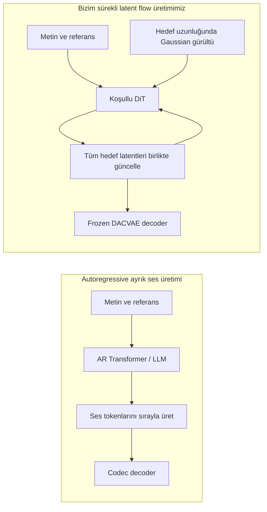
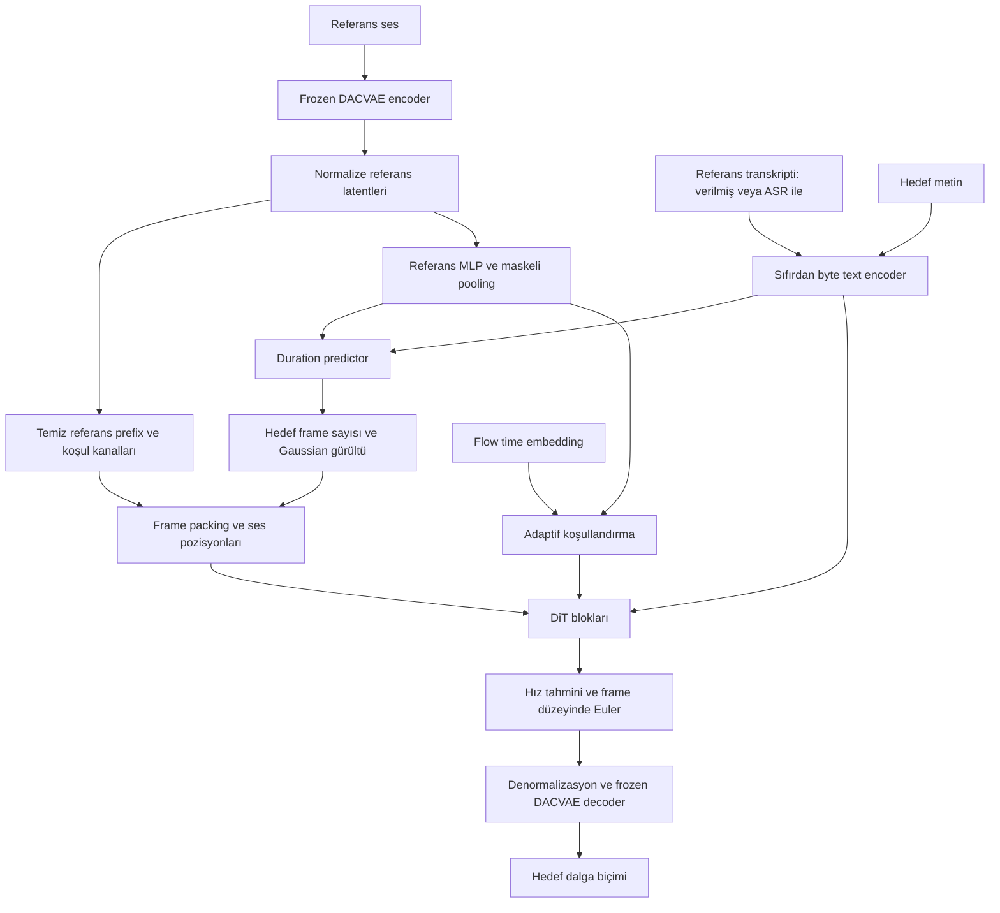
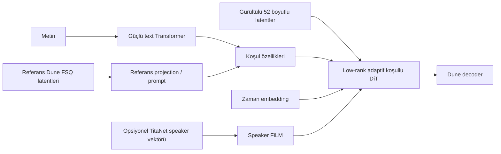
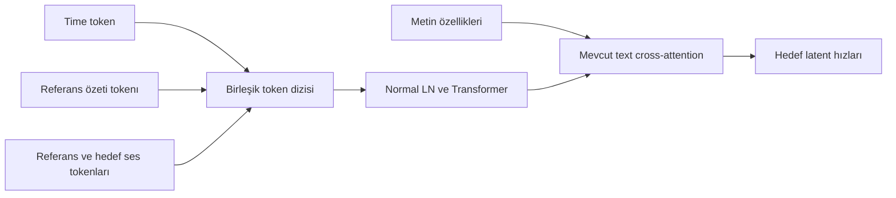
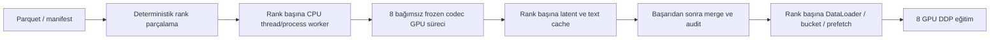
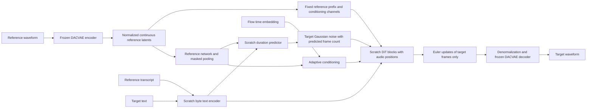

# DACVAE-TTS: kapsamlı model, mimari ve kalite araştırma raporu

**Tarih:** 19 Eylül 2026  
**Proje:** [kadirnar/dacvae-tts](https://github.com/kadirnar/dacvae-tts)  
**Amaç:** Konuşmada ele alınan model karşılaştırmalarını, mimari açıklamalarını, sayısal kanıtları, önerileri ve depodaki teknik kayıtları tek Markdown dosyasında toplamak.

Bu rapor araştırma ve dokümantasyon çalışmasıdır; model kodunu değiştirmez. Ana metin Türkçedir. Ayrıntı ve komut kaybını önlemek için mevcut İngilizce teknik belgeler de sonunda tam metin ekler olarak korunmuştur. Bu bir konuşma dökümü değil, erişilebilir konuşma içeriği ve depo kayıtlarının birleştirilmiş teknik raporudur.

**Kanıt sınırı:** Bizim modelin eğitilmiş bir konuşma checkpoint'i ve kullanıcının gerçek korpusu bu araştırmada değerlendirilmedi. Yayımlanmış model sonuçları, yazarların kendi veri ve değerlendirme koşullarına aittir. Yerel sentetik testler, gerçek konuşma kalitesi veya klonlama başarısı kanıtı değildir. Kapsam, araştırılmış açık model aileleridir; internetteki her fine-tune veya yayımlanmamış sistemin eksiksiz listesi iddia edilmez.

## İçindekiler

1. [Hedef, kısıtlar ve kanıt sınıfları](#hedef)
2. [Codec, LLM, DiT ve rectified flow açıklaması](#temeller)
3. [Bizim modelin doğrulanmış mimarisi](#bizim-mimari)
4. [Echo, Irodori, Darya ve bizim model](#ana-karsilastirma)
5. [Tüm model ailelerinin inceleme haritası](#model-haritasi)
6. [Text encoder araştırması](#text-encoder)
7. [Referans transkriptinin sayısal etkisi](#ref-text)
8. [AdaLN ve tüm alternatifleri](#adaln)
9. [Duration, alignment ve referans kalitesi](#alignment)
10. [Post-training araştırması](#post-training)
11. [Ön işleme ve CPU/GPU paralelliği](#performans)
12. [Inference örnekleri](#inference)
13. [Deney matrisi ve kabul ölçütleri](#deneyler)
14. [Karar kaydı, sınırlamalar ve sonraki adımlar](#kararlar)
15. [Birincil kaynaklar](#kaynaklar)
16. [Mevcut teknik belgelerin tam metin ekleri](#ekler)

<a id="hedef"></a>
## 1. Hedef, kısıtlar ve kanıt sınıfları

| Başlık | Korunan gereksinim |
|---|---|
| Eğitim verisi | Kullanıcının hazırladığı İngilizce text–audio korpusu; toplam 4 milyon satır |
| Eğitim donanımı | 8 GPU; RTX 4090 veya A100 gibi donanımlar değişebilir |
| Önceden eğitilmiş bileşen | Frozen pretrained DACVAE; baseline TTS bileşenleri sıfırdan başlatılır |
| Üretim mimarisi | Non-autoregressive, referans koşullu DiT tarzı Transformer; sürekli latentler ve flow matching |
| Boyutlar | Tiny ve Small |
| Klonlama arayüzü | Referans ses; inference speaker-ID tablosu veya `speaker-1` parametresi yok |
| Öncelik | İçerik doğruluğu, doğal ses, görülmemiş konuşmacı benzerliği; ardından ölçülmüş hız |
| Karar politikası | Önce doğruluk ve öğrenebilirlik, sonra karşılaştırmalı mimari deneyler ve post-training |

4 milyon satır tek başına eğitim saatini söylemez. Örnek hesap olarak ortalama 5 saniye yaklaşık 5.556 saat, 10 saniye yaklaşık 11.111 saat eder. Bunlar gerçek korpusun ölçülmüş süreleri değildir. Konuşmacı sayısı, süre dağılımı, kayıt oturumları ve transkript doğruluğu ayrıca çıkarılmalıdır.

| Etiket | Anlamı |
|---|---|
| **Doğrulanmış kod davranışı** | Yerel implementasyon veya incelenen kaynak kodunda görülmüş |
| **Yerel ölçüm** | Depodaki kayıtlı test/benchmark; donanım ve veri kapsamıyla sınırlı |
| **Yayımlanmış sonuç** | Makale/model kartındaki yazar ölçümü; burada bağımsız yeniden üretim yok |
| **Hipotez / öneri** | Denemeye değer, fakat bizim modelde kalite artışı gösterilmemiş |
| **Bilinmiyor / çalıştırılmadı** | Kaynakta veya bu ortamda yeterli kanıt yok |

Mimari tercihin parametre maliyeti matematiksel olarak hesaplanabilir. WER, CER, DNSMOS veya klonlama başarısındaki etkisi ise deney gerektirir. Başka bir modelin iyi sonucu, tek bir bileşenin nedensel katkısının kanıtı değildir.

<a id="temeller"></a>
## 2. Codec, LLM, DiT ve rectified flow

### 2.1 DAC ile DACVAE aynı şey değil

| Aile | Temsil | Önemli ayrım |
|---|---|---|
| Descript DAC | RVQ ile ayrık codebook indisleri; içeride sürekli özellikler de bulunur | AR, masked-token veya sürekli özellik üretimi için kullanılabilir |
| Meta DACVAE | Sürekli varyasyonel latentler | Bizim frozen checkpoint ailemiz |
| DAC-türevi codec | Değiştirilmiş VAE, RVQ, FSQ, semantik özellik veya decoder | Ortak soy, checkpoint veya latent uyumluluğu anlamına gelmez |
| Dune FSQ | Darya'nın kullandığı 52 boyutlu FSQ temsili | Meta DACVAE ile aynı codec değildir |

Codec, dalga biçimini kısa bir sayısal diziye sıkıştırır ve tekrar sese dönüştürür. TTS üreticisi ise metin ve referans üzerinden bu diziyi tahmin eder. Aynı codec'i kullanan iki modelin üretim mimarisi tamamen farklı olabilir. [DAC](https://github.com/descriptinc/descript-audio-codec), [DACVAE](https://github.com/facebookresearch/dacvae), [Darya](https://github.com/Respaired/Darya_TTS).

### 2.2 LLM tabanlı AR ile bizim NAR sistem arasındaki fark



**DiT**, diffusion sürecindeki tahmin ağının Transformer olmasını ifade eder. **Rectified flow / flow matching**, gürültü ile veri arasında bir hız alanı öğrenme yaklaşımıdır. Transformer kullanmak modeli otomatik olarak bir LLM yapmaz. NAR, tek adımda konuşma demek de değildir: bizim baseline tüm hedef diziyi paralel işler ama bunu birçok solver adımında tekrarlar.

### 2.3 Öğrenilen denklem

Hedef latent $z$, bağımsız Gaussian gürültü $\epsilon$ ve flow zamanı $t$ için:

$$x_t=(1-t)\epsilon+tz,\qquad v^*=z-\epsilon.$$

Model $v_\theta(x_t,t,\text{text},\text{reference})$ tahmin eder. Euler örneklemesinde:

$$x_{k+1}^{\mathrm{target}}=x_k^{\mathrm{target}}+(t_{k+1}-t_k)v_k^{\mathrm{target}}.$$

Flow zamanı $t$, sesin kaçıncı frame'inde olduğumuzdan farklıdır. Ses sırası için ayrıca pozisyon bilgisi gerekir. Nonuniform zaman çizelgesinde sabit $1/N$ yerine gerçek aralık kullanılmalıdır. Referans prefix'i güncellenmez; padding de üretime katılmaz.

<a id="bizim-mimari"></a>
## 3. Bizim modelin doğrulanmış mimarisi

### 3.1 Bileşenler

| Bileşen | Mevcut baseline |
|---|---|
| Codec | `facebook/dacvae-watermarked`; frozen; 48 kHz, hop 1920, 128 kanal, 25 frame/s |
| Latent çıkarımı | Posterior mean; eğitim bölümünden kanal bazlı normalizasyon |
| Tokenizer | 256 UTF-8 byte + 4 özel token; toplam 260 |
| Text encoder | Sıfırdan embedding, referans/hedef segmentleri, sinüzoidal pozisyon, depthwise convolution ve residual MLP |
| Referans özeti | Framewise `C→D→D` MLP ve maskeli ortalama; çıktı `[B,D]` |
| Ses üreticisi | Noncausal self-attention + metne cross-attention + FFN; AdaLN-Zero tarzı koşullandırma |
| Ses pozisyonu | Packed ses tokenlarına eklenen sinüzoidal pozisyon |
| Duration | Hedef metin havuzu, referans özeti, referans frame/byte oranından log hedef frame/byte tahmini |
| Çıkış | Packed latent hız tahmini; unpack sonrası hedef frame güncellemeleri |
| Başlatma | Adaptif projeksiyonlar ve son hız projeksiyonu sıfır başlatılır |



### 3.2 Tensor sözleşmeleri

Boyutlar: batch $B$, toplam ses uzunluğu $L$, latent kanal $C$, packing $P$, gizli genişlik $D$, metin uzunluğu $S$, packed uzunluk $K=\lceil L/P\rceil$.

| Sınır | Şekil |
|---|---|
| Geçerli frame maskesi | `[B,L]` |
| Referans frame maskesi | `[B,L]` |
| Hedef maskesi | `valid & ~reference`, `[B,L]` |
| Güncel latent / referans koşul latentleri | Her biri `[B,L,C]` |
| Referans konum göstergesi | `[B,L,1]` |
| Frame başına ham giriş | `[B,L,2C+1]` |
| Packed ham giriş | `[B,K,P(2C+1)]` |
| Transformer gizli durumu | `[B,K,D]` |
| Text encoder çıktısı | `[B,S,D]` |
| Referans özeti / time embedding | Her biri `[B,D]` |
| Packed hız çıkışı | `[B,K,PC]` |
| Unpack edilmiş hız | `[B,L,C]`; ek padding kesilir |

**C=128 ve P=2 için ham packed giriş 514, packed hız çıkışı 256'dır. Bunlar Transformer genişliği D ile karıştırılmamalıdır.** Tek sayıda referans frame olduğunda bir pack hem referans hem hedef içerebilir; loss ve güncelleme frame düzeyinde kalır. Tam padding tokenları attention'da maskelenir; kısmen geçerli pack erişilebilir kalır. Boş hedef reddedilir.

### 3.3 Boyut ve maliyet

| Ayar | Tiny | Small |
|---|---:|---:|
| Genişlik D | 256 | 384 |
| Üretici blokları | 8 | 12 |
| Attention head | 4 | 6 |
| Text convolution blokları | 3 | 4 |
| Eğitilebilir parametre | 13.526.017 | 44.361.473 |
| Ek frozen codec parametresi | 107.671.171 | 107.671.171 |
| Codec dahil yaklaşık toplam | 121,20M | 152,03M |

Tiny adı tüm deployment'ın 13,5M olduğu anlamına gelmez. Codec ayrı bir maliyettir. Eğitimin öncesinde latent cache hazırlanması, codec'i her optimizer adımında çalıştırma maliyetini ortadan kaldırır.

### 3.4 Loss ve classifier-free guidance

Baseline flow loss'u **utterance başına ortalama** alır; uzun ve kısa kayıtların ağırlığı buna göre oluşur. Frame-weighted seçenek farklı bir deneydir:

$$L_{\mathrm{flow,frame}}=\frac{\sum_{b,l,c}m_{\mathrm{target},b,l}(\hat v-v^*)^2}{C\sum_{b,l}m_{\mathrm{target},b,l}}.$$

Toplam amaçta duration teriminin ağırlığı 0,1'dir. Flow/duration ağırlıklarını değiştirmeden önce kayıp ve gradyan ölçekleri ölçülmelidir.

Baseline yaklaşık %10 ortak metin/referans dropout kullanır. Null dalda temiz referansın ana latent yolundan, ayrı koşul kanallarından, global özetten ve metin yollarından taşınması engellenir. Yapısal uzunluklar/maskeler kalabilir; flow zamanı kalmalıdır.

$$v_{\mathrm{guided}}=v_{\mathrm{null}}+g(v_{\mathrm{cond}}-v_{\mathrm{null}}).$$

`g=1` koşullu tahminle eşdeğerdir ve null forward gerektirmez. `16 adım, g=1.5` ayarında iki dalın her adımda değerlendirilmesi **32 dal-eşdeğer hesap** yapar. İki dalı batch'lemek hesap işini yok etmez. Ayrı metin ve speaker guidance, buna uygun dropout eğitimi olmadan eklenmemelidir.

### 3.5 Kod denetimi ve korunmuş baseline

Önceki denetimde padding'in projeksiyona sızması, maskeli NaN/Inf loss davranışı, codec şekil doğrulaması, padded waveform çıkarımı, çelişkili duplicate etiketleri ve Unicode ASR normalizasyonu gibi doğrulanmış sorunlar giderildi. Ses pozisyonu, doğru Euler aralığı ve zero-init zaten vardı; yeni özellik gibi sunulmadı.

Orijinal kaynak `baselines/2026-09-19/original-source.tar.gz` içinde korunmuştur. `tiny-initialization.pt` eğitilmiş model değildir. Arşiv, uyumluluk ve tüm doğrulama ayrıntıları [Ek C](#ek-c) ve [Ek H](#ek-h) içinde bulunur.

<a id="ana-karsilastirma"></a>
## 4. Echo, Irodori, Darya ve bizim model

### 4.1 Dört yönlü mimari karşılaştırma

| Özellik | Bizim Tiny / Small | Echo-TTS | Irodori-TTS | Darya-TTS |
|---|---|---|---|---|
| Üretim | NAR DiT tarzı flow matching | Sürekli latent flow matching | Rectified-flow DiT | Rectified-flow encoder/decoder DiT |
| Boyut | 13,53M / 44,36M, codec hariç | Yaklaşık 2,4B | v3 yaklaşık 500M; sürüme göre değişir | Yazar yaklaşık 1B bildiriyor |
| Codec | Meta DACVAE | Fish S1-DAC'tan türetilmiş sürekli temsil | Semantic-DACVAE | Dune FSQ |
| Latent | 128 kanal, 25 Hz; P=2 ile 12,5 packed token/s | 80 boyutlu temsil | v3 Japonca 32 boyutlu temsil | 52 boyut, 12,5 Hz |
| Dil / eğitim | Yalnız kullanıcının İngilizce korpusu | Büyük ölçekli İngilizce karşılaştırma modeli | Japonca odaklı | İngilizce, Farsça/Tacikçe, Rusça |
| Metin | Sıfırdan byte + convolution | Byte text encoder | Pretrained Japonca embedding dahil sürümler | Paylaşılan config'de scratch Transformer |
| Referans | Tam prefix + koşul kanalları + global MLP özeti | Ayrı referans Transformer; ref-text gerektirmeyen arayüz | Referans Transformer; ref-text gerektirmeyen arayüz | Infilling prompt; ayrıca opsiyonel speaker/style yolu |
| Ref-text | İçeride gerekli; kullanıcı vermeyince opsiyonel ASR | Gerekmez | Gerekmez | Prompt ve style yollarını ayrı değerlendirmek gerekir |
| Kalite durumu | Eğitilmiş konuşma ölçümü yok | Yazar araştırması/demolar | Model kartı değerlendirmeleri | Kullanıcının olumlu dinleme gözlemi ve yazar demoları; ortak benchmark yok |

Kaynaklar: [Echo](https://jordandarefsky.com/blog/2025/echo/), [Irodori v3](https://huggingface.co/Aratako/Irodori-TTS-500M-v3), [Irodori v4.1](https://huggingface.co/Aratako/Irodori-TTS-v4.1-Small), [Darya](https://github.com/Respaired/Darya_TTS), yerel [mimari denetimi](architecture-audit.md).

### 4.2 Darya'da özellikle dikkat çekenler

İncelenen kaynak config'de decoder genişliği 1280, 20 katman, 16 head; text encoder 1024 genişlik, 12 katman, 16 head ve 3333 vocabulary kullanıyor. `kind: scratch` etkin: config'deki `pretrained_name` alanının varlığı pretrained text ağırlıklarının kullanıldığı anlamına gelmiyor. Kaynak kodda ayrı `using_pretrained` seçeneği de var.

`LowRankAdaLN` ismine rağmen iç normalizasyon merkezleme yapmadan RMS kullanıyor; shift/scale/gate için düşük-rank düzeltmeler ve `tanh` gate içeriyor. **Darya, AdaLN'yi tamamen kaldırmış bir model değil.** Opsiyonel TitaNet yolu ek pretrained speaker bağımlılığı getirir; bizim scratch referans baseline'ımıza otomatik taşınmamalı. Kaynak: [model kodu](https://github.com/Respaired/Darya_TTS/blob/main/model_transformer.py), [config](https://github.com/Respaired/Darya_TTS/blob/main/config_transformer.json).



Yazar sınırlamaları: 30 saniyelik eğitim parçaları, prompt ile çıktının ortak uzunluk bütçesi, duration prior'ın prosodiye etkisi ve speaker-only yolunda daha zayıf benzerlik. İkinci eğitim aşaması/discriminator opsiyonel; yazar discriminator'ı kullanmadığını belirtiyor. Bu yüzden duyulan kaliteyi adversarial eğitime bağlayamayız.

Yazar İngilizce 22 bin+ saat, Farsça/Tacikçe 14 bin, Rusça 3500 ve diğer dillerde 12 bin saat bildiriyor. CPU RTF iddiaları 16 adımda sunucu CPU'sunda yaklaşık 0,05–0,09, i7-12700H üzerinde yaklaşık 0,5; 8 adımda laptop üzerinde yaklaşık 0,25. Bunlar bizim donanımımızda ölçülmedi. [Darya sınırlamaları](https://github.com/Respaired/Darya_TTS/blob/main/FootNotes_Limitations.md).

**Mühendislik çıkarımı:** Darya'dan text encoder kapasitesi, düşük latent hızı, koşul projeksiyonları ve cache fikirleri araştırılabilir. “Darya iyi duyuluyor, dolayısıyla low-rank AdaLN tek başına kaliteyi artırır” sonucu çıkarılamaz. Codec, eğitim verisi, kapasite, duration ve sampler birlikte değişiyor.

### 4.3 Irodori ve Echo'dan alınabilecek dersler

- Irodori'nin ayrı duration eğitimi, üretici ve süre tahmininin katkısını ayırmak için ilginçtir. v4→v4.1 Joyo standard CER **5,35 ± 0,18 → 4,69 ± 0,02** olarak bildirilirken kısa referans benzerliğinde v3'e göre gerileme belirtiliyor. Tek metrikte iyileşme genel kalite artışı değildir. [Irodori v4.1](https://huggingface.co/Aratako/Irodori-TTS-v4.1-Small).
- Echo'nun ayrı text/reference conditioning tasarımı, referans transkripti gerektirmeyen sistem için mimari örnektir. Yazar A100 üzerinde 30 saniyeyi yaklaşık 1,45 saniyede üretim bildiriyor; bunu bizim Tiny'nin beklenen gecikmesi gibi kullanamayız. [Echo](https://jordandarefsky.com/blog/2025/echo/).
- Bu modellerin çok daha büyük kapasitesi ve farklı pretrained bağımlılıkları var. Yalnızca bizim verimizle sıfırdan eğitilen küçük modelde aynı kaliteyi garanti eden bir karşılaştırma yok.

<a id="model-haritasi"></a>
## 5. Tüm model ailelerinin inceleme haritası

Aşağıdaki harita, model seçiminin hangi soruya cevap verdiğini gösterir. Codec/parametre/veri ayrıntıları ve model başına doğrudan kaynak bağlantıları **[Ek A'daki eksiksiz katalogda](#ek-a)** da korunmuştur.

| Model / aile | İncelenen konu | Bizim için ne ifade ediyor? |
|---|---|---|
| Echo-TTS | Sürekli latent, referans Transformer, ayrı guidance | Yakın mimari; Meta DACVAE değil |
| Irodori v3 / v4 / v4.1 | Semantic-DACVAE, text/caption/reference, duration | Japonca deneyler; İngilizce sonuç yerine kullanılamaz |
| Darya-TTS | Dune FSQ, scratch text Transformer, low-rank adaptif koşul | Kalite/latency fikirleri; farklı codec ve kapasite |
| Text-Audiobox / Text-AB | 128 kanal, 25 Hz DACVAE, flow DiT, mT5 | Codec temsiline en yakın büyük ölçekli örneklerden |
| DMOSpeech, orijinal | DAC-türevi VAE, distillation ve metric optimization | Post-training araştırması |
| JAX DACVAE-Echo / scaled Echo / Vocalino-OpenEcho | Meta DACVAE uyarlamaları | Yakın implementasyon aileleri; ortak kalite ölçümü yok |
| 3arab-TTS v2 | Arapça DACVAE flow DiT | Dil ve veri verimliliği karşılaştırması |
| Parakeet, Darefsky | DAC ve delayed-codebook AR | Konuşma üretim öncülü; NVIDIA ASR modeli değil |
| Parler Mini / Large | DAC AR, metinle ses/stil açıklaması | Native arbitrary-reference cloning ile aynı ürün değil |
| Dia 1.6B | DAC AR, diyalog ve audio prompting | Diyalog ve prompt transkripti karşılaştırması |
| Zonos 0.1 | DAC Transformer / Mamba2 hibrit | Phoneme ve reference speaker embedding |
| Zonos 2 | DAC MoE | Aktif parametre / toplam ağırlık ayrımı |
| OuteTTS 1.0 1B | IBM DAC konuşma çeşidi + Llama | AR speaker profile iş akışı |
| Fish S1 / S1-mini | Değiştirilmiş DAC, dual AR, distillation | Büyük öğretmen ve veri katkısı |
| Fish S2-Pro | Değiştirilmiş DAC, slow/fast AR | Streaming odaklı farklı üretim mimarisi |
| MaskGCT | Semantik + DAC-türevi acoustic masked-token | DAC kullanımı AR olmak zorunda değil |
| Higgs Audio v2 | X-Codec türevi semantik/acoustic tokenizer | Doğrudan orijinal DAC checkpoint'iyle eşitlenmemeli |
| Movie Gen Audio | DACVAE flow ile soundtrack/effect/music | TTS doğruluğu değil ses üretim ölçeği |
| DiTVC | DACVAE voice conversion | İçeriği metin yerine kaynak konuşma sağlar |
| MultiFoley | Video kontrollü custom DAC-VAE | Foley görevi; klonlama benchmark'ı değil |
| HunyuanVideo-Foley | Custom DAC-VAE, 128 kanal/50 Hz | Kanal sayısı aynı olsa da frame hızı farklı |
| MOSS-SoundEffect v2 | DACVAE DiT flow | Ses efekti, TTS değil |
| VampNet | Masked DAC-türevi müzik tokenları | Masked üretim örneği |
| MaskVAT | Video-to-audio masked DAC | NAR ayrık codec üretimi |
| DiscoDiff | Sürekli DAC özelliklerinde müzik diffusion | Sürekli temsil alternatifleri |
| TRIA | Yaklaşık 43M masked DAC davul modeli | Small'a yakın boyut, çok daha dar görev |
| E2-TTS | Zaman tokenı, flow infilling, ref-text X1 ablation | AdaLN'siz üretim ve transkript etkisi |
| F5-TTS | DiT + ConvNeXt text refinement + Sway | Text/alignment ve sampler deneyleri |
| SimpleSpeech | SQ-Codec, in-context koşullandırma | Text encoder ve koşul biçimi ablation'ları |
| DiTTo-TTS | Mel-VAE ağırlıklı LDM; DAC ablation | Codec reconstruction/generation ve encoder uyumu |
| ReGen / ReGenVoice | Waveform diffusion codec ve latent TTS | Text encoder, duration, NFE etkileri |
| ZipVoice / ZipVoice-Distill | Zipformer flow, toplamsal time | AdaLN'siz aday ve hız/kalite değiş tokuşu |
| StyleTTS | AdaIN stil aktarımı | AdaIN/AdaLN insan dinleme karşılaştırması |
| DEX-TTS | Zaman değişken/değişmez stil yolları | Kimlik, stil ve içerik ayrımının önemi |
| CuteTTS | AR continuous latent + diffusion head | Speaker token/AdaLN karşılaştırması; ana mimari önerisi değil |
| FastFit | İteratif vocoder | AdaLN kaldırmanın akustik etkisi; WER deneyi değil |
| EzAudio | Waveform VAE + DiT, AdaLN-SOLA | Düşük-rank koşullandırma; ses efekti görevi |
| DiT / PixArt-α | Görüntü diffusion Transformer | Koşullandırma ve başlatma kontrol deneyleri |
| F5R-TTS / Diffusion-DPO | Reward/preference araştırması | Post-training hedefi ve matematiksel sınırlar |

### 5.1 Sürüm karışıklıklarını önleme

- Dia 2, Dia 1.6B ile aynı codec kabul edilmemeli: Dia 2 Mimi kullanıyor.
- DMOSpeech 2, orijinal DMOSpeech ile aynı codec değil: mel/Vocos kullanıyor.
- DiTTo'nun ana modeli Mel-VAE; DAC deneyleri ablation.
- Stable Audio Open'ın kendi continuous autoencoder'ı var; benzer convolution/Snake kodu Meta DACVAE kullanıldığı anlamına gelmez.
- Qwen3-TTS kendi speech tokenizer'ını kullanıyor; decoder benzerliği checkpoint özdeşliği kanıtı değil.
- VoiceDesigner/MM-DiT gibi multimodal Transformer tanımları otomatik olarak AdaLN'siz anlamına gelmez. AdaLN kullanımını ayrıca kontrol etmek gerekir. [VoiceDesigner](https://arxiv.org/html/2608.13613v1).

<a id="text-encoder"></a>
## 6. Diffusion TTS için text encoder araştırması

### 6.1 Üç farklı kararı ayırmak gerekir

1. **Normalizasyon:** Yazılı metni hangi konuşma biçimine çevireceğiz?
2. **Tokenizasyon:** Byte, karakter, subword veya phoneme hangi birimlerle temsil edilecek?
3. **Encoder:** Bu birimler convolution, Transformer veya başka bir ağla nasıl bağlamsallaştırılacak?

Pretrained ByT5'i scratch byte encoder ile eşitleyemeyiz. Aynı byte birimlerini kullanmaları, aynı dil bilgisine veya temsil kalitesine sahip oldukları anlamına gelmez.

| Aday | Avantaj hipotezi | Risk / maliyet | Durum |
|---|---|---|---|
| Mevcut byte + convolution | Küçük, harici pretrained text bağımlılığı yok | Uzun bağlam ve telaffuz hizalaması sınırlı olabilir | Baseline |
| Unicode karakter + encoder | İngilizce metinde farklı token uzunluğu | Vocabulary ve checkpoint değişir; otomatik kalite üstünlüğü yok | Deney |
| Byte + ConvNeXt | Yerel metin örüntülerini iyileştirebilir | Başka omurgada ters etki gösterebilir | Deney |
| Byte + yerel conv + bidirectional Transformer | Uzak bağlam ve kelime ilişkileri | Parametre, encoder gecikmesi ve overfit riski | Öncelikli kalite hipotezi |
| Phoneme destekli frontend | Özel adlar/heteronym için telaffuz kontrolü | G2P hataları, aksan ve normalization kararları | Kontrollü karşılaştırma |
| Pretrained SpeechT5 / ByT5 / mT5 | Hazır dil veya konuşma-metni temsili | Sıfırdan TTS baseline kısıtını değiştirir | Varsayılana eklenmez |

### 6.2 DiTTo: daha büyük text encoder her zaman daha iyi değil

| Encoder | Codec | WER ↓ | CER ↓ | SIM-o ↑ |
|---|---|---:|---:|---:|
| ByT5-base | Mel-VAE | 6,22 | 3,82 | 0,5482 |
| SpeechT5 | Mel-VAE | 3,07 | 1,15 | 0,5423 |
| ByT5-base | Mel-VAE++ | 3,11 | 1,17 | 0,5323 |
| SpeechT5 | Mel-VAE++ | 2,99 | 1,06 | 0,5364 |

SpeechT5 encoder 85M, ByT5-base 415M olarak raporlanıyor. Pretraining, dil ve tokenizer farkları birlikte değiştiği için bu saf boyut ablation'ı değil. Metin-konuşma uyumu önemli bir hipotez; bizim frozen codec'i yeniden eğitme önerisi değil. [DiTTo, Tablo 6](https://proceedings.iclr.cc/paper_files/paper/2025/file/80e77d9ed2f74dcaf1a42cb1a2593559-Paper-Conference.pdf).

Codec ablation'ında Mel-VAE / DAC24 / DAC44 için TTS WER **2,93 / 7,21 / 14,58**, reconstruction PESQ **2,95 / 4,37 / 3,74**. İyi codec reconstruction, kolay üretilebilir latent anlamına gelmeyebilir; Meta DACVAE sıralaması değildir. Kaynak ve ayrıntılar Ek A'da.

### 6.3 SimpleSpeech: text encoder doğruluğu etkiliyor, DNSMOS farkı küçük kalabiliyor

| Text encoder | WER ↓ | SIM ↑ | DNSMOS ↑ |
|---|---:|---:|---:|
| ByT5 | 3,3 | 0,956 | 3,90 |
| BERT ile değiştirilmiş | 19,2 | 0,958 | 3,86 |

WER 15,9 yüzde puan kötüleşiyor; bu sonucun nedeni yalnızca tokenizasyon olarak atanamaz. Farklı pretrained encoder'lar ve temsiller karşılaştırılıyor. [SimpleSpeech, Tablo 5](https://arxiv.org/html/2406.02328v1).

### 6.4 F5: ConvNeXt her omurgaya aynı etkiyi yapmıyor

| F5 makalesindeki deney | WER ↓ | SIM ↑ |
|---|---:|---:|
| F5-TTS | 4,17 | 0,54 |
| F5-TTS + LongSkip | 5,17 | 0,53 |
| E2-TTS yeniden uygulaması | 9,63 | 0,53 |
| E2-TTS + Conv2Text | 18,10 | 0,49 |

Bu küçük ölçekli Mandarin karşılaştırması, E2'nin kendi büyük İngilizce sonucuyla karıştırılmamalı. F5'te text refinement ile omurga birlikte tasarlanmış. Aynı bileşeni başka ağa eklemek faydayı garanti etmiyor. Saf DiT/text hizalaması sorunları, ConvNeXt seçimini araştırmaya değer kılıyor; tek başına bizim modele kalite kanıtı değil. [F5-TTS, mimari deneyleri ve Tablo 4](https://aclanthology.org/2025.acl-long.313.pdf).

### 6.5 ReGen: WER ve speaker similarity aynı yönde hareket etmeyebilir

| ReGenVoice text encoder deneyi | WER ↓ | SIM ↑ | UTMOS ↑ |
|---|---:|---:|---:|
| Transformer encoder | 1,46 | 0,64 | 4,07 |
| Encoder yok | 1,38 | 0,61 | 4,09 |
| ConvNeXt V2 | 2,13 | 0,56 | 3,92 |

Encoder'ı kaldırmak WER'i biraz iyileştirirken benzerliği düşürüyor. Çalışmanın streaming amacı ve özel codec/aligner yapısı da seçimde rol oynuyor; bizim modele streaming desteği kazandırıldığı anlamına gelmez. [ReGen, Tablo 8](https://arxiv.org/html/2607.09134v1).

### 6.6 Bizim için önerilen text deneyleri

- **T0:** Mevcut byte-convolution baseline.
- **T1:** Aynı byte tokenizer, ConvNeXt tabanlı refinement.
- **T2:** Aynı byte tokenizer, yerel convolution + Tiny için 2, Small için 4 bidirectional Transformer katmanı. Bu katman sayıları başlangıç hipotezidir; yayımlanmış optimum değildir.
- **T3:** Kontrollü karakter frontend; kapasite ve token uzunluğu farkını raporla.
- **T4:** İngilizce phoneme destekli frontend; özel ad, sayı, kısaltma ve telaffuz kontrolünü ayrı değerlendir.

Önce encoder değişimini, sonra tokenizer değişimini ölçmek nedensel yorumu kolaylaştırır. Aynı metin/reference/seed, aynı veri ve eğitim bütçesi kullanılmalı. Text encoder, solver adımlarından bağımsız olarak bir kez çalıştırılabilir; bu nedenle daha güçlü bir encoder'ın toplam latency maliyeti üreticiye aynı sayıda katman eklemekle eşdeğer değildir. Gerçek maliyet profille ölçülmelidir.

<a id="ref-text"></a>
## 7. Referans sesinin transkriptini yazmak kaliteyi artırıyor mu?

**Evrensel bir evet/hayır sonucu yok.** Referans transkriptiyle eğitilmiş modelde doğru transkript yararlı bir koşul olabilir. Transkriptsiz çalışmak üzere eğitilmiş bir model için bu bağımlılık gerekli olmayabilir. Sadece inference'ta metni silmek, transkriptsiz eğitim ablation'ı değildir.

### 7.1 E2-TTS'nin doğrudan karşılaştırması

| Eğitim başlangıcı | Model | Ref-text | WER ↓ | SIM-o ↑ |
|---|---|---|---:|---:|
| Sıfırdan | E2-TTS | Var | 2,0 | 0,675 |
| Sıfırdan | E2-TTS X1 | Yok | 2,0 | 0,664 |
| Pretrained başlangıç | E2-TTS | Var | 1,9 | 0,708 |
| Pretrained başlangıç | E2-TTS X1 | Yok | 2,0 | 0,705 |

Scratch karşılaştırmada bildirilen hassasiyette WER eşit; SIM farkı 0,011. Pretrained karşılaştırmada WER farkı 0,1 yüzde puan, SIM farkı 0,003. X1 ayrı bir model/eğitim düzenidir. Sonuç, “ref-text her modelde büyük kalite artışı sağlar” iddiasını desteklemiyor. [E2-TTS, Tablo 3](https://arxiv.org/html/2406.18009v2).

### 7.2 Üç arayüzü ayırmak

| Arayüz | Örnek | Gerçekte ne oluyor? |
|---|---|---|
| Ref-text gerektirmeyen mimari | Echo, Irodori; Zonos'un speaker embedding yolu | Metin bağımlılığı bu yolda yok |
| Transcript-conditioned prompt | Dia, Fish'in dokümante prompt iş akışı | Audio ile eşleşen prompt transkripti gerekiyor |
| Audio-only kullanıcı API'si | Bizim `ref_audio=` arayüzümüz | Opsiyonel ASR içeride referans metnini çıkarıyor |

Kullanıcıya `speaker-1` vermemek, içeride transkript kullanmamakla aynı şey değil. Doğru transkript biliniyorsa ASR atlanabilir; hatalı ASR koşullandırmayı bozabilir. Gerçek transcript-free sürüm ayrı eğitilmeli ve değerlendirilmelidir.

### 7.3 Bizim için ölçülmesi gereken beş durum

1. İnsan doğrulamalı doğru referans transkripti.
2. Aynı referansın ASR transkripti.
3. Kontrollü hata eklenmiş referans transkripti.
4. Transkript kullanan modelde boş metin: yalnızca robustness deneyi.
5. Transkriptsiz çalışacak şekilde ayrıca eğitilen aday.

Süre başlığının ref-frame/ref-byte oranını kullandığı unutulmamalı. Metni kaldırırken duration yolunu da tanımlamadan değiştirmek, transkript ve süre etkilerini karıştırır. Eğitimde referans keyfi kırpılırsa tam eski transkript kullanılmamalıdır.

<a id="adaln"></a>
## 8. AdaLN ve alternatifleri: kapsamlı değerlendirme

### 8.1 Mevcut AdaLN ne yapıyor?

Her üretici blokta self-attention, text cross-attention ve feed-forward için ölçek, kaydırma ve residual kapısı üretiliyor:

$$c=e_{\mathrm{time}}(t)+e_{\mathrm{reference}},$$
$$h'=\mathrm{LN}(h)\odot(1+s(c))+b(c),\qquad h_{\mathrm{out}}=h+g(c)\odot F(h').$$

Time ve referans özeti ayrı girdilerdir; aynı boyutta toplandıktan sonra adaptif projeksiyona gider. Global modülasyon tüm konumlara aynı parametreleri uygular, ama her konumun girdisi/attention ilişkileri farklı olduğu için çıktılar sabit olmaz. Normalize edilen şey ham waveform değil, Transformer gizli özellikleridir.

| AdaLN maliyeti | Tiny | Small |
|---|---:|---:|
| Blokların `D→9D` projeksiyonları | 4.737.024 | 15.966.720 |
| Eğitilebilir model içindeki pay | %35,02 | %35,99 |

Hesap $N\times9D(D+1)$. Bu projeksiyonlar her ses frame'i için yeniden bağımsız hesaplanmaz. **%35 parametre azaltımı, %35 hızlanma demek değildir.** Kayıtlı proje parametreleri ve [model kodu](../src/dacvae_tts/model.py) temel alınmıştır.

### 8.2 Tüm adaylar

| Alternatif | AdaLN tamamen kalkar mı? | Koşul aktarımı | Karar |
|---|---|---|---|
| Normal LN + condition tokenları | Evet | Time ve referans tokenları self-attention'a girer | İlk kaldırma deneyi |
| Toplamsal koşullandırma | Evet | Time/reference projeksiyonu gizli özelliklere eklenir | Basit düşük parametreli aday |
| Ayrı reference cross-attention | Başka time yolu ile evet | Hedef özellikler referans dizisini sorgular | Ayrıntılı klonlama hipotezi |
| AdaIN | AdaLN kalkar, adaptif norm kalır | Kanal başına temporal istatistikler | Önce stil yolunda dene |
| Normalizasyonsuz FiLM | Evet | Doğrudan koşula bağlı scale/shift | AdaLN'ye yakın; WER üstünlük kanıtı yok |
| Shared AdaLN / AdaLN-SOLA | Hayır | Ortak projeksiyon ve küçük katman düzeltmesi | Parametre azaltma kontrol deneyi |
| Zipformer benzeri omurga | Olabilir | Additive time + conv/attention/bypass | Daha büyük mimari araştırma |
| RMSNorm / QK-Norm | Tek başına hayır | Normalizasyon seçimini değiştirir | Time ve ref aktarımının yerini doldurmaz |
| ReZero / LayerScale türü gate | Tek başına hayır | Residual akışı ölçekler | Koşul bilgisini ayrıca vermek gerekir |
| MM-DiT | Zorunlu olarak hayır | Modaliteler arasında ortak attention | AdaLN ile birlikte kullanılabilir |

### 8.3 Aday 1: normal LayerNorm + koşullandırma tokenları



Büyük `9D` projeksiyonları yerine koşulu attention taşır. Mevcut tam referans yolu, metin encoder'ı ve cross-attention korunarak deney izole edilebilir. Zaman tokenı CFG null dalında kalır; referans tokenı dropout politikasına uyar. Ek tokenlar frame loss'una veya waveform çıkışına dahil edilmez; ses pozisyonları açıkça korunur.

E2-TTS zaman embedding'ini ek token olarak kullanıyor. Scratch 50 bin saat Libriheavy modeli **WER 2,0, SIM-o 0,675, SMOS 4,66 ± 0,07** bildiriyor. Bu uygulanabilirlik kanıtı; AdaLN'li eşdeğerden üstünlük kanıtı değil. [E2-TTS](https://arxiv.org/html/2406.18009v2).

| SimpleSpeech condition ablation | WER ↓ | SIM ↑ | DNSMOS ↑ |
|---|---:|---:|---:|
| In-context tokenlar | 3,3 | 0,956 | 3,90 |
| Cross-attention | 9,6 | 0,958 | 3,90 |

WER 6,3 yüzde puan kötüleşirken DNSMOS değişmiyor. Cross-attention'ın her yerde kötü olduğu sonucu çıkarılamaz; codec, encoder ve koşul tasarımı farklı. [SimpleSpeech, Tablo 5](https://arxiv.org/html/2406.02328v1).

**Neden aday?** NAR/DiT/DACVAE çekirdeğini korur, aynı referans özetinin aktarımını sınar, parametre maliyetini azaltabilir. **Risk:** Küçük model time/reference tokenlarını yeterince kullanamayabilir; AdaLN'nin her katmana doğrudan koşul verme avantajı kaybolabilir.

### 8.4 Aday 2: toplamsal zaman koşullandırması

$$h\leftarrow h+W_t e(t).$$

ZipVoice resmi kodunda gerçekten `src = src + time_emb` vardır. BiasNorm ve öğrenilebilir bypass yolları, bizim scale/shift/gate yapımızdan farklıdır. [Resmi Zipformer kodu](https://github.com/k2-fsa/ZipVoice/blob/master/zipvoice/models/modules/zipformer.py).

| LibriSpeech-PC test-clean, ZipVoice makalesi | Parametre | NFE, makale tanımı | WER ↓ | SIM-o ↑ | UTMOS ↑ |
|---|---:|---:|---:|---:|---:|
| F5-TTS resmi checkpoint | 336M | 32 | 1,89 | 0,655 | 3,89 |
| ZipVoice | 123M | 16 | 1,64 | 0,668 | 3,98 |
| ZipVoice-Distill | 123M | 8 | 1,54 | 0,647 | 4,11 |
| ZipVoice-Distill | 123M | 4 | 1,51 | 0,657 | 4,05 |

Tabloda 100 bin saat Emilia kullanımı belirtiliyor. Bunlar aynı mimaride AdaLN aç/kapa sonuçları değil; omurga, kapasite, text işleme ve sampling farklı. Küçük veri backbone deneyinde convolution kaldırılınca WER **1,69→9,79**, downsampling kaldırılınca **1,69→3,70**, bypass kaldırılınca **1,69→98,89**. Başarı sadece normalizasyonla açıklanamaz. [ZipVoice, Tablolar I ve V](https://arxiv.org/html/2506.13053v2).

**Öneri:** Önce mevcut DiT içinde additive-time deneyini yap. Zipformer'ın tümünü taşımayı ayrı araştırma olarak tut. 25 Hz DACVAE ve P=2 zaten 12,5 token/s verdiğinden daha fazla downsampling'in yararını varsayma.

### 8.5 Aday 3: ayrı referans cross-attention

$$R=E_{\mathrm{ref}}(z_{\mathrm{ref}}),\qquad h\leftarrow h+\mathrm{CA}(\mathrm{LN}(h),R,R).$$

Global tek vektör yerine hedefin farklı konumları farklı referans özelliklerini seçebilir. Bir tek key/value tokenı kullanılırsa softmax hep 1 olur; konuma göre seçim avantajı kalmaz. Çoklu referans özellikleri bu hipotezin esas parçasıdır.

| DEX-TTS, ESD unseen | WER ↓ | COS ↑ |
|---|---:|---:|
| Tam model | 8,35 | 75,58 |
| Decoder'ın zamana bağlı stil yolu yok | 9,18 | 74,90 |
| Stil temsilinde VQ yok | 16,84 | 76,38 |
| Çok seviyeli T-IV adapter yerine basit AdaIN | 10,28 | 75,29 |

Benzerlik artarken doğruluk bozulabiliyor. DEX text encoder'da AdaLN de kullanıyor; bu tamamen AdaLN'siz model değil. Basit AdaIN karşılaştırmasında kullanılan stil özelliklerinin seviyeleri de değişiyor. [DEX-TTS, Tablo 3](https://arxiv.org/html/2406.19135v1).

**Uygulama ilkesi:** Tam referans yolunu ilk deneyde koru; aynı anda yeni speaker loss ekleme. Bağımsız reference encoder'ın invariant K/V özellikleri cache edilebilir. Hedefle birlikte self-attention'dan geçen referans hidden state'lerinin sabit olduğunu varsayma. Ayrıntılı referans yolu kimliğin yanında metin, gürültü ve istenmeyen stili de taşıyabilir.

### 8.6 Aday 4: AdaIN

AdaIN kanal başına temporal istatistiklere, mevcut LN konum başına kanal istatistiklerine dayanır. Bu stil için önemli olabilir; padding ve reference/target ayrımı doğru yapılmalıdır.

| StyleTTS insan dinleme ablation'ı | CMOS, baseline'a göre |
|---|---:|
| AdaIN baseline | 0 |
| AdaIN → AdaLN | −0,21 |
| AdaIN → concatenation | −0,17 |
| AdaIN → normal InstanceNorm | −0,03 |

Orijinal StyleTTS'de AdaIN daha doğal bulunmuş. Sistem DACVAE flow DiT değil; bu nedenle bütün üretim bloklarına doğrudan aktarım önerilmiyor. Önce referans/stil yolunda kontrollü ablation daha anlamlı. [StyleTTS, Tablo VII](https://arxiv.org/pdf/2205.15439).

### 8.7 Speaker token ve AdaLN: CuteTTS kontrolü

| CuteTTS, LibriSpeech test-clean, CFG w=2 | WER ↓ | WavLM SIM ↑ | WeSpeaker SIM ↑ |
|---|---:|---:|---:|
| AdaLN ile speaker conditioning | 2,70 | 71,3 | 82,5 |
| Speaker bilgisi yok | 2,76 | 53,4 | 74,5 |
| Speaker sadece diffusion head'de | 2,52 | 71,2 | 82,5 |
| Speaker global token | 2,76 | 71,0 | 82,4 |

Token üstünlüğü gösterilmiyor; AdaLN ile küçük farklar var. Benzerlik skorları klonlama başarı yüzdesi değildir. CuteTTS AR bir sistem; yalnız diffusion head aktarım deneyi burada ilgili. Time AdaLN'nin de tamamen kaldırıldığı sonucu çıkarılamaz. Küçük farklar için istatistiksel anlamlılık iddiası yok. [CuteTTS, Tablo 6](https://arxiv.org/html/2608.08638v1).

### 8.8 Aday 5: normalizasyonsuz FiLM ve gate düzenlemeleri

FiLM genel olarak $\gamma(c)\odot h+\beta(c)$ biçiminde özellik modülasyonudur. Öncesine LN konulursa AdaLN ailesine çok yaklaşır. Normalizasyonu çıkarmak yeni bir sayısal kararlılık problemi doğurabilir. Darya'nın opsiyonel speaker FiLM yolu bir kullanım örneğidir; tek başına FiLM'in daha iyi WER/DNSMOS sağladığı kontrollü kanıt değildir.

ReZero/LayerScale benzeri residual ölçekler eğitim akışını düzenleyebilir ama flow zamanını veya speaker bilgisini kendiliğinden taşımaz. RMSNorm, QK-Norm ve gate değişimlerini koşullandırma değişimiyle aynı deneyde birleştirmemek gerekir. Bu seçenekler için bizim hedef kurulumda doğrulanmış kalite artışı bulunmuyor.

### 8.9 AdaLN-Single, düşük-rank ve SOLA

- **Shared / Single:** Ortak projeksiyon + katmana özel öğrenilebilir offset.
- **Basit düşük-rank:** Her `D→9D` projeksiyonunu `D→r→9D` olarak faktörize etmek.
- **SOLA:** Ortak taban + koşula bağlı, katmana özel düşük-rank düzeltmeler.

Bu üç yaklaşım aynı değil; hepsi AdaLN'yi tamamen kaldırma seçeneğinden de farklı.

| Matematiksel maliyet deneyi; eğitilmedi | Tiny, r=64 | Small, r=96 |
|---|---:|---:|
| Mevcut adaptif projeksiyonlar | 4.737.024 | 15.966.720 |
| Basit `D→r→9D`, ilk bias yok, son bias var | 1.329.152 | 4.465.152 |
| Tasarruf | 3.407.872 | 11.501.568 |
| Diğer parçalar sabitse yeni toplam | 10.118.145 | 32.859.905 |

Formül $N(10Dr+9D)$. Bunlar yalnız parametre hesaplarıdır; hız veya kalite ölçümü değildir. SOLA parametre sayısı olarak sunulmamalıdır.

PixArt-α görüntü deneyinde shared yapı **833M→611M**, **29 GB→23 GB** bildiriyor; bizim TTS sonucumuz değil. [PixArt-α, Bölüm 3.3](https://arxiv.org/html/2310.00426v3).

EzAudio'nun 128 kanallı waveform latent deneyinde basit AdaLN-Single kalite kaybı ve sayısal kararsızlık oluştururken SOLA daha kararlı bulunmuş. DiT-L/XL düzeltme rank'ları 32/36. Görev ses efekti üretimi; WER/CER veya speaker cloning kazancı kanıtlanmış değil. Grafikteki değerlerden tahmini kalite skoru üretilmedi. [EzAudio, Bölüm 3.2](https://www.isca-archive.org/interspeech_2025/hai25_interspeech.pdf).

### 8.10 AdaLN lehindeki kanıtlar

| Orijinal DiT, 400 bin güncelleme, görüntü üretimi | FID-50K ↓ |
|---|---:|
| In-context | 35,24 |
| Cross-attention | 26,14 |
| AdaLN | 25,21 |
| AdaLN-Zero | 19,47 |

AdaLN-Zero bu deneyde en başarılı. Parametreler eşit değil; FID görüntü metriği, konuşma metriği değil. Yine de koşullandırmayı kaldırmanın ve başlatmayı değiştirmenin risksiz olmadığını gösteriyor. [DiT, Tablo 4](https://arxiv.org/html/2212.09748v2).

| FastFit vocoder ablation | PESQ ↑ | MR-STFT ↓ | CMOS farkı |
|---|---:|---:|---:|
| FastFit | 3,712 | 0,866 | Referans |
| AdaLN yok | 3,411 | 0,974 | −0,168 |

Bu akustik reconstruction deneyi AdaLN lehine; metin doğruluğu veya bizim flow generator için doğrudan sonuç değil. [FastFit, Tablo 1](https://www.isca-archive.org/interspeech_2023/jang23b_interspeech.pdf).

### 8.11 AdaLN araştırmasının karar sonucu

**İlk AdaLN'siz aday:** normal LN + ayrı time/reference tokenları. **İkinci:** additive-time + reference tokenı. **Klonlama darboğazı görülürse:** ayrı referans cross-attention. **Parametre azaltma kontrolü:** shared taban + düşük-rank düzeltme. **Daha sonra:** AdaIN stil yolu.

Gerekçe kanıtlanmış kalite üstünlüğü değil; çekirdeği koruyarak bileşenin katkısını ölçebilmek. Mevcut tam AdaLN-Zero baseline korunmalı. Zero-init üst katman gradyanlarını ilk adımda sıfırlayabilir; bu tek başına bug değildir. Sonlu gradyan ve parameter update birkaç optimizer adımında izlenmelidir.

<a id="alignment"></a>
## 9. Duration, alignment ve referans kalitesi

### 9.1 Süre ile kelime hizalaması aynı şey değil

Mevcut predictor log hedef frame/byte oranını öğrenir. Referans frame/reference-byte oranı **konuşma hızı özelliğidir**; codec'in 25 frame/s sabitinden farklıdır. Padding, özel tokenlar ve boş metin denominator'a yanlış dahil edilmemeli. Silence süreleri oranı değiştirebilir.

ReGen'in Seed-en duration deneyinde GT süreyle WER **1,68**; 0,67× süreyle **6,01**, 1,5× süreyle **9,28**. Aynı kaynakta 4/8/16/25 NFE WER **4,20 / 1,93 / 1,77 / 1,62**; bu iki taramanın süre koşulları farklıdır ve tek ablation gibi birleştirilmemelidir. [ReGen, Tablo 9](https://arxiv.org/html/2607.09134v1).

### 9.2 Önce hata türünü ölç

| Hata | İnceleme |
|---|---|
| Yanlış telaffuz | Normalizasyon, frontend, özel ad ve homograph örnekleri |
| Kelime atlama | Duration, text/audio alignment, uzun metin, solver bütçesi |
| Tekrarlama / yanlış sıra | Attention/pozisyon ve süre dağılımı |
| Referans cümlesini söyleme | Reference-text leakage ve pairing |
| Speaker drift | Referans yolları, uzun hedefler, guidance |
| Metalik/bozuk ses | Codec reconstruction, latent dağılımı, guidance ve decoder |

Attention görselleştirmesi yardımcıdır ama doğru alignment kanıtı değildir. Yardımcı alignment loss hedef metin ve hedef ses üzerinde uygulanmalı; referans/hedef birleştirilmiş diziye basit diagonal zorlaması yapılmamalı. Pauseler ve farklı telaffuz uzunlukları desteklenmeli.

### 9.3 Referans encoder ve identity hedefi

Baseline framewise MLP + mean pooling korunur. Temporal network, attentive pooling ve mean/std pooling konfigüre edilebilir deneylerdir; sentetik çalışmaları gerçek speaker kazancı sayılmaz. Full sequence only / summary only / both ablation'ları ayrı yapılmalı.

Same-speaker fakat farklı kayıtlar positive pair olarak kullanılabilir. Speaker contrastive loss ancak kimlik aktarımı darboğazı doğrulanırsa eklenmeli; collapse ve label hataları izlenmeli. Frozen speaker teacher kullanılacaksa ek pretrained bağımlılık açıkça tanımlanmalı ve inference zorunluluğu yaratılmamalı.

Kimlik, duygu, prosodi ve kayıt koşulu farklı hedeflerdir. Rastgele aynı konuşmacı kayıtları emotion/style aktarımı için eşleşmiş supervision değildir. Noisy, cross-session ve farklı stil referanslar ayrı değerlendirilmelidir.

<a id="post-training"></a>
## 10. Post-training araştırması

| Yöntem | Araştırma örneği | Bizim için değerlendirme |
|---|---|---|
| Supervised flow matching | Mevcut baseline | Kalite karşılaştırmasının referansı |
| Offline preference | Diffusion-DPO esinli flow-error surrogate | Winner/loser yönü, uzunluk indirgemesi, frozen reference kontrolü gerekir |
| Metric reward / RL | F5R-TTS | Deterministik ODE hızlarını doğrudan log-probability sayamayız |
| Distribution matching / doğrudan metric optimization | Orijinal DMOSpeech | 128-step teacher→4-step raporu; bizim sistemde denenmedi |
| Duration-aware post-training | DMOSpeech 2 | Farklı mel/Vocos sistemi; duration etkisini ayırma dersi |
| Trajectory distillation | Mevcut deneysel araçlar | Güvenilir öğretmen ve eşleştirilmiş kalite/latency kontrolü |
| Best-of-N / reranking | Text-AB, bazı demo iş akışları | Tek örnek kalitesi değildir; N ve toplam maliyet raporlanır |

Kaynaklar: [F5R-TTS](https://arxiv.org/abs/2504.02407), [Diffusion-DPO](https://arxiv.org/abs/2311.12908), [DMOSpeech](https://proceedings.mlr.press/v267/li25ay.html), [DMOSpeech 2](https://arxiv.org/abs/2507.14988), [Text-AB](https://arxiv.org/html/2609.03992v1).

Önerilen sıra:

1. Sabit seen/unseen-speaker evaluation, veri leakage kontrolü, supervised baseline.
2. Yalnız training split'ten candidate üretimi; tüm ham WER/CER/DNSMOS/SIM değerlerini saklama.
3. Anlaşılabilirliği veya speaker benzerliğini düşüren winner'ları reddetme; yakın eşitlikleri atlama.
4. Düşük LR ile frozen reference-relative preference surrogate; winner reconstruction anchor ve gerçek veri replay'i ayrı ablate etme.
5. Candidate seçiminde kullanılan evaluator'dan bağımsız ASR/speaker ölçümü ve kör dinleme.
6. İyi teacher'dan progressive trajectory distillation; teacher guidance, grid, duration ve NFE'yi kaydetme.
7. Omissions, repetitions, speaker drift ve zor alt kümelerde regresyon yoksa ilerleme.

DNSMOS akustik kalite için yardımcıdır; doğru kelimeleri veya doğru kimliği garanti etmez. Sadece DNSMOS'u artıran aşırı pürüzsüz çıktıları başarı saymamak gerekir. Depodaki surrogate doğrulanmış likelihood-DPO veya GRPO olarak sunulmamalıdır. Bu korpusta preference veya distillation kalite artışı henüz gösterilmedi.

<a id="performans"></a>
## 11. Veri tokenizasyonu, codec optimizasyonu ve CPU/GPU paralelliği

### 11.1 Eğitim öncesi ne cache ediliyor?

Metin deterministik normalizasyon sonrası UTF-8 byte ID'lerine çevrilir. Ses frozen DACVAE posterior mean latentlerine dönüştürülür. Bu ses cache'i ayrık AR tokenları değildir. Codec/preprocessing hash'leri, normalizasyon ve provenance metadata'sı saklanır.

Training-split istatistikleri, tam aynı konuşmacıdan farklı utterance pairing'i ve speaker-disjoint validation/test gerekir. Arbitrary crop + tam transkript kullanılmaz. Exact duplicate ve bilinen interval overlap kontrolleri, yakın duplicate veya yanlış transkriptin tümünü tespit etmez.

### 11.2 Paralel düzen



CPU-only preprocessing ve Gloo DDP yolları da var. CPU paralelliğinin faydası otomatik değildir: tüm codec süreçleri, veri worker'ları, BLAS/OMP ve compiler worker'ları toplam CPU bütçesini paylaşır. 4M satır için Parquet file/row-group parçalama, her rank'ın JSONL'yi baştan taramasına göre daha uygun olabilir.

### 11.3 fast-dacvae'den alınan ve alınmayan davranışlar

İncelenen fork revision'ı `406f2e5c803927ef18cc9bbe38d715e5417459b9`. Yerel adapter frozen weight-norm folding, decoder grup cache'i, opsiyonel compile, bounded CUDA graphs ve opsiyonel channels-last fikirlerini uygular. Posterior mean, exact Snake ve watermark decoder korunur.

Fork'taki fixed posterior noise, Snake polynomial yaklaşımı, watermark çıkarımı ve ilk girdiye bağlı replay closure'ı bire bir taşınmadı; bunlar temsil veya API davranışını değiştirirdi. Graph replay yeni girdiyi buffer'a kopyalar. Compile/graphs opsiyoneldir; channels-last varsayılan yapılmadı. [İncelenen fork](https://github.com/kadirnar/fast-dacvae/tree/406f2e5c803927ef18cc9bbe38d715e5417459b9), [yerel ayrıntılar](fast-codec-parallel.md).

### 11.4 Kayıtlı yerel benchmark sonuçları

**Donanım:** tek RTX 5070 Ti, Ryzen 5 5600; PyTorch 2.8.0/CUDA 12.8. Sentetik codec girdileri; 8 fiziksel GPU veya gerçek konuşma kalite testi değil.

| FP32 codec yolu | Batch encode ms | Tek waveform decode ms |
|---|---:|---:|
| Reference | 52,21 | 45,27 |
| Fast native eager | 52,27 | 45,48 |
| Fast native graphs | 52,27 | 44,75 |
| Fast native compiled | 44,91 | 42,63 |
| Fast native compiled + graphs | 44,61 | 42,14 |
| Fast channels-last eager | 850,58 | 541,31 |

Bu iş yükünde compile+graphs yaklaşık **1,17× encode / 1,07× decode** throughput gösterdi. Native eager/graphs tek başına anlamlı GPU kazancı göstermedi. Channels-last belirgin biçimde kötüydü.

CPU'da 1 saniyelik girdide encode **326,73→325,29 ms**, decode **1018,73→883,65 ms**; decode yaklaşık 1,15×. Karışık uzunluklu 32 sentetik kayıtta loading/resample/encode/write süresi **0,667→0,466 s**, yaklaşık 1,43×; setup/merge hariç ve önceki batching değişimleri de dahil.

**Korunması gereken olumsuz sonuç:** Karışık uzunluk testinde 388.096 latent değerden biri `atol=rtol=2e-4` kapısını geçmedi; maksimum mutlak fark 2,57e-4. İlk strict run başarısızdı. Throughput raporu `--report-only` ile kaydedildi, tolerans gevşetilmedi. Küçük farklar, konuşma kalitesinin aynı olduğunun kanıtı değil. Compile opt-in kaldı.

Kayıtlı son suite **95 test** geçiriyor; bu dokümantasyon işinde yeniden koşturulmadı. İki-rank CPU/Gloo, process preprocessing, spawned worker resume, GPU prefetch eşdeğerliği ve toy inference kontrol edilmiş; 8 fiziksel GPU ölçeklenmesi ölçülmemiş. Tam test ve ham JSON bağlantıları [Ek G](#ek-g) ve [Ek H](#ek-h) içinde.

### 11.5 Çalıştırma komutları

```bash
# 8 GPU preprocessing: rank başına CPU process worker'ları
bash scripts/prepare_8gpu.sh /dataset/parquet-directory /cache/english \
  --codec-compile --workers 2 --worker-backend process --worker-threads 1 \
  --prefetch 8 --batch-size 8 --bucket-size 256 --batch-seconds 120

# CPU-only preprocessing
PREPARE_PROCESSES=2 OMP_NUM_THREADS=2 MKL_NUM_THREADS=2 \
  bash scripts/prepare_cpu.sh /dataset/parquet-directory /cache/english-cpu \
  --workers 2 --worker-backend process --worker-threads 1 --prefetch 4

# 8 GPU eğitim
TRAIN_WORKERS=2 TRAIN_PREFETCH=2 \
  bash scripts/train_8gpu.sh configs/tiny.yaml /cache/english/merged runs/tiny

# CPU DDP: doğruluk ve küçük deneyler
TRAIN_PROCESSES=2 TRAIN_WORKERS=2 OMP_NUM_THREADS=2 MKL_NUM_THREADS=2 \
  bash scripts/train_cpu.sh configs/tiny.yaml /cache/english-cpu/merged runs/tiny-cpu
```

Bu rapor bu komutları çalıştırmadı. Dataset/cache/checkpoint yolları örnektir. Gerçek korpus ölçümü ve codec kalite kontrolleri olmadan hız iddiaları ölçeklenmemelidir.

<a id="inference"></a>
## 12. Inference: yalnız ref-audio isteyen kullanıcı arayüzü

```python
from dacvae_tts.inference import Synthesizer

tts = Synthesizer("runs/tiny/last.pt", device="cuda", profile=True)
result = tts.synthesize(
    text="This is my new sentence.",
    ref_audio="reference.wav",
    output="outputs/example.wav",
)

# Aynı referansın codec encoding ve ASR işlemlerini tekrar etme:
voice = tts.prepare_reference("reference.wav")
tts.synthesize(
    "Another sentence.",
    reference=voice,
    output="outputs/another.wav",
)
```

```bash
uv pip install -e '.[codec,asr]'
dacvae-tts infer --checkpoint runs/tiny/last.pt \
  --ref-audio reference.wav --text "This is my new sentence." \
  --steps 16 --guidance 1.5 --seed 42 --profile \
  --output outputs/example.wav
```

Speaker-ID yok. Eğitilmiş checkpoint gerekli; initialization snapshot ses modeli değildir. Ref-text verilmezse opsiyonel ASR kullanılır; bu transcript-free mimari değildir. Doğru metin biliniyorsa `reference_text=` / `--reference-text` ile ASR atlanabilir. Encoder cache'i ile üretici içindeki target-dependent hidden state cache'i aynı değildir.

<a id="deneyler"></a>
## 13. Deney matrisi ve kabul ölçütleri

### 13.1 Sıralı kapılar

| Kapı | Çalışma | Geçme koşulu |
|---|---|---|
| G0 | Cache, maskeler, codec kimliği, pairing/split denetimi | Doğrulanmış veri/şekil sorunu kalmaması |
| G1 | Original→codec→reconstruction | Gerçek ses dinleme ve intelligibility/identity kontrolü |
| G2 | Tiny küçük temiz subset overfit; GT duration | Latent loss yanında anlaşılır hedef içerik ve referans kullanımı |
| G3 | Sabit unseen-speaker baseline | Ölçülebilir WER/CER/SIM/quality/latency başlangıcı |
| G4 | Tek tek encoder/conditioning/duration ablation | Eşleştirilmiş, maliyeti kayıtlı karşılaştırma |
| G5 | Başarılı değişimleri birlikte deneme | Etkileşim ve regresyon kontrolü |
| G6 | Small, performance ve post-training | Kalite temelleri doğrulandıktan sonra |

### 13.2 Öncelikli ablation matrisi

| Kod | Değişken | Sabit tutulacaklar | Hipotez |
|---|---|---|---|
| A0 | Mevcut AdaLN-Zero | Tüm baseline | Referans |
| A1 | LN + time/ref tokenları | Encoder, duration, packing, veri, solver | Adaptif projeksiyonsuz kalite korunabilir |
| A2 | Additive time + ref tokenı | A1'in diğer parçaları | Her katmana time aktarımı yardımcı olabilir |
| A3 | A2 + reference cross-attention | Diğer yollar ve objective | Daha ayrıntılı referans kimliği aktarılabilir |
| A4 | Shared AdaLN + düşük-rank düzeltme | Baseline backbone | Parametre azaltılırken kalite korunabilir |
| A5 | AdaIN stil yolu | Seçilmiş backbone | Doğallık/stil kazanımı olabilir |
| T0–T4 | Text frontend/encoder | Conditioning ve veri | Alignment/content darboğazı giderilebilir |
| D0–D2 | GT / predicted / perturbed duration | Aynı metin/ref/noise | Süre kaynaklı hatalar ayrılır |
| R0–R2 | Full ref / summary / both | Encoder kapasitesi mümkün olduğunca kontrol | Her yolun katkısı ölçülür |
| P1/P2 | Packing 1/2 | Aynı frame düzeyi başlangıç gürültüsü | Hız/temsil değiş tokuşu |
| S | Step 8/16/32, guidance 1/1.5/2 | Aynı checkpoint ve örnekler | Solver kalite maliyeti |

Bunların hepsi hazır konfigürasyon değildir. Mevcut `configs/experiments` yalnız bazı reference/duration/packing/loss/sampling deneylerini kapsar. **A1–A5 ve önerilen yeni text encoder'lar bu araştırma sırasında uygulanmadı.**

### 13.3 Değerlendirme örnekleri ve ölçümler

Başlangıç önerisi: 100 görülmemiş konuşmacı × 10 metin × 3 inference seed = checkpoint başına 3000 çıktı. Bu tasarlanmış protokoldür; gerçekleştirildiği iddia edilmez. Eğitim seed'leri ayrıca karşılaştırılmalı; inference seed çeşitliliği eğitim varyansının yerini tutmaz.

| Boyut | Ölçüm / protokol |
|---|---|
| İçerik | Corpus WER/CER; toplam edit/toplam referans birimi; normalization sürümü sabit |
| Kimlik | Bağımsız speaker encoder; speaker-disjoint ve cross-session |
| Doğallık | Kör eşleştirilmiş dinleme, CMOS/MOS; evaluator sayısı ve belirsizlik |
| Akustik | DNSMOS SIG/BAK/OVRL, UTMOS yardımcı; model/preprocessing sürümü |
| Süre | Mutlak ve göreli süre hatası, GT/predicted karşılaştırması |
| Başarısızlık | Boş/bozuk üretim, omitted/repeated words, reference leakage |
| Performans | Cold/warm latency, ref/text/duration/generation/decode süreleri, RTF, bellek |
| Hesap | Training compute, gerçek forward sayısı ve CFG dal-eşdeğer NFE |

Alt kümeler: uzun/kısa metin, kısa referans, noisy reference, adlar, sayılar, tarihler, kısaltmalar, tekrarlı ifadeler, noktalama ağırlıklı metin, farklı stil/oturum. Speaker bazında paired bootstrap aralıkları kullanılmalı; aynı konuşmacının örnekleri bağımsızmış gibi sayılmamalı.

Best-of-N yoksa her request/seed için tek örnek raporla. Varsa N, seçim metriği ve toplam latency/maliyet ayrı verilmeli. Kabul edilebilir regresyonlar değerlendirmeden önce yazılmalı. Bir kalite metriği iyileşip diğerleri geriliyorsa sonucu açıkça trade-off olarak raporla.

### 13.4 Sonuç kayıt şablonu

```yaml
experiment_id: null
status: not_run
baseline_checkpoint_sha256: null
candidate_checkpoint_sha256: null
source_commit: null
codec_identity: null
data_manifest_sha256: null
speaker_split_policy: null
change: null
training_seed: null
training_audio_hours_seen: null
training_gpu_hours: null
inference_seeds: [42, 43, 44]
duration_policy: ground_truth_then_predicted
steps: 16
guidance: 1.5
candidate_count_per_request: 1
evaluator_versions: {}
metrics_baseline: {}
metrics_candidate: {}
paired_speaker_bootstrap: {}
listening_results: null
latency_and_memory: {}
predeclared_regression_tolerances: {}
decision: pending
limitations: []
```

Depodaki çalıştırılabilir evaluation config ve JSON şablonu ayrıca [Ek E](#ek-e) içinde açıklanır. Yukarıdaki YAML araştırma kayıt örneğidir; yeni CLI konfigürasyon desteği iddia etmez.

<a id="kararlar"></a>
## 14. Karar kaydı ve öncelikli sonraki adımlar

| Karar | Neden seçildi? | Sayısal kanıtın sınırı |
|---|---|---|
| Frozen DACVAE korunur | Kullanıcının kesin tercihi; cache ve generator ayrımı | Codec kimliği/şekli doğrulanmış; korpus quality yok |
| NAR continuous flow korunur | Paralel hedef üretimi ve mevcut çekirdek tasarım | Başka model sonuçları bizim kaliteyi ispatlamaz |
| Byte baseline korunur | Scratch, küçük vocabulary, migrasyonsuz kontrol | En iyi frontend olduğu gösterilmedi |
| Daha güçlü scratch text encoder denenir | DiTTo/F5/SimpleSpeech/ReGen temsil etkileri | Bizim için katman sayıları hipotez |
| AdaLN varsayılanı hemen kaldırılmaz | Çelişen ama ciddi destekleyici deneyler var | %35–36 parametre maliyeti kaliteyi belirlemez |
| İlk kaldırma deneyi condition tokenları | En temiz ve sınırlı mimari değişim | Üstünlük değil uygulanabilirlik kanıtı |
| Duration önce izole edilir | İçerik hatalarını ciddi etkileyebilir | Başka modellerin süre duyarlılığı bizim ölçüm değil |
| Ref-text arayüzü ile mimari ayrılır | Audio-only API kullanıcı ihtiyacını karşılar | ASR kaynaklı hatalar ayrıca ölçülmeli |
| Speaker loss sonradan | Etiket/gürültü/style karışıklığı kontrol edilmeli | Bizim modelde speaker bottleneck henüz kanıtlanmadı |
| Compile/graphs opt-in | Yerel küçük hız kazancı, sayısal gate ihlali var | Gerçek konuşma toleransı henüz yok |
| Preference/distillation sonradan | Güçlü teacher/baseline gerektirir | Bu korpusta kalite artışı yok |

**İlk proje deneyi:** codec-only gerçek konuşma reconstruction ve Tiny learnability kapısı. **Bu kapılar geçtikten sonraki ilk AdaLN deneyi:** mevcut Tiny AdaLN-Zero ile normal LayerNorm + ayrı time/reference tokenlarını karşılaştırmak. Bu sıra hem önceki doğruluk önceliğini hem son AdaLN önerisini korur.

Bu raporda WER/CER/DNSMOS veya klonlama başarısı için bizim modele ait sonuç uydurulmadı. Darya'nın beğenilen demosu olumlu bir ürün gözlemidir; mimari bileşenlerin izole katkısını ispatlamaz. Genel bir “en iyi model” sıralaması için ortak İngilizce metin/reference/split/evaluator/hardware protokolü gerekir.

<a id="kaynaklar"></a>
## 15. Birincil kaynaklar

Sayısal tablolarda kaynaklar ilgili paragraf yanında verildi. Aşağıdaki liste ek gezinme içindir; diğer DAC ailelerinin model kartları Ek A'dadır.

| Konu | Kaynak |
|---|---|
| DAC | [DAC — birincil kaynak](https://github.com/descriptinc/descript-audio-codec) |
| DACVAE | [DACVAE — birincil kaynak](https://github.com/facebookresearch/dacvae) |
| Frozen checkpoint | [Frozen checkpoint — birincil kaynak](https://huggingface.co/facebook/dacvae-watermarked) |
| Fast codec fork | [Fast codec fork — birincil kaynak](https://github.com/kadirnar/fast-dacvae/tree/406f2e5c803927ef18cc9bbe38d715e5417459b9) |
| Echo | [Echo — birincil kaynak](https://jordandarefsky.com/blog/2025/echo/) |
| Irodori v3 | [Irodori v3 — birincil kaynak](https://huggingface.co/Aratako/Irodori-TTS-500M-v3) |
| Irodori v4.1 | [Irodori v4.1 — birincil kaynak](https://huggingface.co/Aratako/Irodori-TTS-v4.1-Small) |
| Darya | [Darya — birincil kaynak](https://github.com/Respaired/Darya_TTS) |
| E2-TTS | [E2-TTS — birincil kaynak](https://arxiv.org/html/2406.18009v2) |
| F5-TTS | [F5-TTS — birincil kaynak](https://aclanthology.org/2025.acl-long.313/) |
| SimpleSpeech | [SimpleSpeech — birincil kaynak](https://arxiv.org/html/2406.02328v1) |
| DiTTo, final ICLR | [DiTTo, final ICLR — birincil kaynak](https://proceedings.iclr.cc/paper_files/paper/2025/file/80e77d9ed2f74dcaf1a42cb1a2593559-Paper-Conference.pdf) |
| ReGen | [ReGen — birincil kaynak](https://arxiv.org/html/2607.09134v1) |
| ZipVoice | [ZipVoice — birincil kaynak](https://arxiv.org/html/2506.13053v2) |
| StyleTTS | [StyleTTS — birincil kaynak](https://arxiv.org/pdf/2205.15439) |
| DEX-TTS | [DEX-TTS — birincil kaynak](https://arxiv.org/html/2406.19135v1) |
| CuteTTS | [CuteTTS — birincil kaynak](https://arxiv.org/html/2608.08638v1) |
| FastFit | [FastFit — birincil kaynak](https://www.isca-archive.org/interspeech_2023/jang23b_interspeech.pdf) |
| EzAudio | [EzAudio — birincil kaynak](https://www.isca-archive.org/interspeech_2025/hai25_interspeech.pdf) |
| DiT | [DiT — birincil kaynak](https://arxiv.org/html/2212.09748v2) |
| PixArt-α | [PixArt-α — birincil kaynak](https://arxiv.org/html/2310.00426v3) |
| VoiceDesigner | [VoiceDesigner — birincil kaynak](https://arxiv.org/html/2608.13613v1) |
| DMOSpeech | [DMOSpeech — birincil kaynak](https://proceedings.mlr.press/v267/li25ay.html) |
| DMOSpeech 2 | [DMOSpeech 2 — birincil kaynak](https://arxiv.org/abs/2507.14988) |
| F5R-TTS | [F5R-TTS — birincil kaynak](https://arxiv.org/abs/2504.02407) |
| Diffusion-DPO | [Diffusion-DPO — birincil kaynak](https://arxiv.org/abs/2311.12908) |
| DNSMOS | [DNSMOS — birincil kaynak](https://github.com/microsoft/DNS-Challenge/tree/master/DNSMOS) |

<a id="ekler"></a>
## 16. Mevcut teknik belgelerin tam metin ekleri

Bu ekler rapor hazırlanırken depoda bulunan belgelerin içerik kopyalarıdır; önceki sonuçların tarih ve kapsamını korurlar. Başlık seviyeleri tek rapora uyarlanmıştır. Belgelerde geçen “implemented”, “passes” ve benchmark sonuçları o belgenin kayıt tarihindeki durumu anlatır; bu dokümantasyon turunda yeniden eğitim/test yapıldığı anlamına gelmez. Arşiv baseline ile güncel davranış arasında fark varsa belge tarihine ve ayrıntılı uyumluluk notuna bakılmalıdır.

| Ek | İçerik |
|---|---|
| [A](#ek-a) | Tüm DAC/DACVAE model kataloğu ve karşılaştırmalar |
| [B](#ek-b) | İlk mimari karar kaydı ve post-training araştırması |
| [C](#ek-c) | Doğrulanmış mimari denetimi, bug sınıfları, baseline arşivi |
| [D](#ek-d) | Tensor sözleşmeleri, training batch ve inference trace |
| [E](#ek-e) | Çalıştırma komutları, değerlendirme kapıları ve eksik deneyler |
| [F](#ek-f) | Dataset preparation performansı |
| [G](#ek-g) | Fast codec, CPU/GPU paralelliği, ölçümler ve sayısal sınırlamalar |
| [H](#ek-h) | Doğrulama ve benchmark kayıtları |


<a id="ek-a"></a>
## Ek A — model-comparison.md

Kaynak: [model-comparison.md](model-comparison.md). Aşağıda belge içeriği korunmuştur.

### DAC and DACVAE model comparison

Research date: 19 September 2026. This is a comparison of verified public model
families, not an exhaustive inventory of community fine-tunes or unpublished
systems. The research introduced no model-code changes. Published measurements
below are author-reported; these models were not independently benchmarked here.

#### Codec scope

| Category | Representation | Interpretation |
|---|---|---|
| [Descript DAC](https://github.com/descriptinc/descript-audio-codec) | Residual-vector-quantized discrete codes, with continuous internal features | Used by autoregressive, masked-token, and some continuous-latent generators. |
| [Meta DACVAE](https://github.com/facebookresearch/dacvae) | Continuous variational latents | The local checkpoint has 128 channels at 25 Hz for 48 kHz audio. |
| Custom DAC-derived codecs | Modified quantizers, semantic features, rates, or VAE bottlenecks | Related architecture does not imply interchangeable weights or latent spaces. |

#### Continuous-latent speech models

| Model | Codec and architecture | Comparison with this repository |
|---|---|---|
| [Echo-TTS](https://jordandarefsky.com/blog/2025/echo/) | Approximately 2.4B; flow matching over an 80-dimensional continuous representation derived from Fish S1-DAC, not Meta DACVAE. Byte text encoder and separate reference transformer; no reference transcript required. | Strong architectural neighbor, but different codec and much greater capacity. Uses separate text/reference dropout and guidance. |
| [Irodori-TTS v3](https://huggingface.co/Aratako/Irodori-TTS-500M-v3) | Approximately 500M; rectified-flow DiT, reference transformer, duration predictor; Japanese 32-dimensional Semantic-DACVAE and pretrained Japanese text embeddings. | Similar generation paradigm, different language, codec, and text initialization. |
| [Irodori v4/v4.1](https://huggingface.co/Aratako/Irodori-TTS-v4.1-Small) | Semantic-DACVAE; richer text/caption conditioning. v4.1 trains duration prediction separately after generator convergence. | Relevant to duration and conditioning comparisons; Japanese results do not establish English quality. |
| [Alignment-Free Text-Audiobox / Text-AB](https://arxiv.org/html/2609.03992v1) | Main model 3B; 128-dimensional, 25 Hz DACVAE at 48 kHz; flow-matching DiT, pretrained mT5, audio context. Pretraining uses 480,000 hours. | Closest major published representation comparison. Avoids explicit token-duration prediction, which is not equivalent to eliminating all inference-length decisions. |
| [DMOSpeech, original](https://proceedings.mlr.press/v267/li25ay.html) | Custom DAC-derived VAE; diffusion generation with distribution-matching distillation, adversarial training, and direct intelligibility/speaker metric optimization. | Closest post-training methodology comparison; results are not established for this repository's codec/objective. |
| [LAION JAX DACVAE-Echo](https://github.com/LAION-AI/jax-dacvae-echotts), [scaled Echo](https://github.com/LAION-AI/scaled-echo-tts), [Vocalino/OpenEcho](https://github.com/christophschuhmann/dacvae-echo) | Meta DACVAE adaptations of reference-conditioned flow generation. JAX implementation reports roughly 1.3B; scaled implementation has approximately 800M/3B/8B presets. | Close implementation relatives. Available code and training scaling measurements do not establish speech quality. |
| [3arab-TTS v2](https://huggingface.co/sherif1313/3arab-TTS-500M-v2) | Approximately 553M; rectified-flow DiT with text/reference transformers and Arabic 32-dimensional DACVAE. Author reports approximately 700 training hours. | Language-specific comparison; not independently verified evidence for English cloning quality or equivalent data efficiency. |

#### Discrete DAC speech models

| Model | Codec / generation | Voice conditioning and comparison |
|---|---|---|
| [Parakeet, Darefsky et al.](https://jordandarefsky.com/blog/2024/parakeet/) | Original 44.1 kHz DAC; 3B autoregressive encoder-decoder with delayed codebooks; approximately 100,000 hours. | Conversational speech research predecessor. Demonstrations explicitly include selected best-of-multiple samples. Unrelated to NVIDIA Parakeet ASR. |
| [Parler Mini](https://huggingface.co/parler-tts/parler-tts-mini-v1.1) / [Large](https://huggingface.co/parler-tts/parler-tts-large-v1) | 44.1 kHz DAC; approximately 0.9B / 2.2B autoregressive models. | Text-described voices/styles and known voices, rather than native arbitrary-reference cloning. |
| [Dia 1.6B](https://github.com/nari-labs/dia) | 44.1 kHz DAC; autoregressive encoder-decoder. | Dialogue and audio prompting with matching transcript context. Speaker turn tags are not necessarily fixed identity lookups. |
| [Zonos 0.1](https://github.com/Zyphra/Zonos) | DAC; approximately 1.6B Transformer or Mamba2/Transformer hybrid. | Phonemes plus reference speaker embeddings, with optional audio prefix. Embedding path does not require a reference transcript. |
| [Zonos 2](https://www.zyphra.com/our-work/zonos2) | DAC; autoregressive MoE, 8B total and approximately 900M active parameters; removes CFG. | Active parameters do not represent the total deployment footprint. |
| [OuteTTS 1.0 1B](https://huggingface.co/OuteAI/Llama-OuteTTS-1.0-1B) | IBM DAC speech variant, two codebooks; Llama-based AR generation; approximately 150 audio tokens/second. | Reference audio creates custom speaker profiles. Reports approximately 60,000 training hours. Earlier versions are not automatically DAC models. |
| [Fish S1 / S1-mini](https://huggingface.co/fishaudio/s1-mini) | Modified Fish DAC; dual AR, 4B / approximately 0.5B. | Reference prompting; mini is distilled. Over two million training hours and RLHF are reported, unlike a scratch-only baseline. |
| [Fish S2-Pro](https://huggingface.co/fishaudio/s2-pro) | Modified DAC, 10 codebooks at approximately 21 Hz; 4B slow backbone plus 400M fast decoder. | Reference cloning and streaming-oriented inference; reports over ten million training hours. |
| [MaskGCT](https://arxiv.org/html/2409.00750v3) | Approximately 1.1B; two-stage non-autoregressive masked-token generation. Custom DAC-derived acoustic tokenizer replaces the decoder with Vocos; separate semantic tokenizer. | Demonstrates that DAC does not imply AR. Semantic conditioning introduces additional pretrained dependencies. |
| [Higgs Audio v2 tokenizer](https://github.com/boson-ai/higgs-audio/blob/main/boson_multimodal/audio_processing/higgs_audio_tokenizer.py) | X-Codec-derived semantic/acoustic tokenizer with DAC encoder/decoder components, used for LLM-based audio generation. | Broader DAC-derived category, not direct original DAC checkpoint use; includes semantic-teacher dependencies. |

#### Reference-audio interfaces

| Interface | Examples | Inputs |
|---|---|---|
| No reference transcript | Echo, Irodori, Zonos speaker-embedding path | Target text and reference audio. |
| Transcript-conditioned prompting | Dia; [Fish documented workflow](https://github.com/fishaudio/fish-speech/blob/main/docs/en/inference.md) | Target text, reference audio, and reference transcript. |
| Audio-only wrapper over transcript conditioning | This repository | Target text and reference audio; optional ASR supplies the reference transcript internally. |

The local interface requires no speaker-ID lookup, but remains transcript-conditioned
internally. See [architecture audit](architecture-audit.md).

#### Other audio tasks

These systems inform codec or generation comparisons, not TTS cloning rankings.

| Model | Task / relationship |
|---|---|
| [Movie Gen Audio](https://arxiv.org/html/2410.13720v1) | Large flow-matching transformer for soundtracks, effects, and music; Meta DACVAE. |
| [DiTVC](https://pixl.cs.princeton.edu/pubs/Wang_2025_OVC/Wang-WASPAA-2025.pdf) | DACVAE reference-conditioned voice conversion; source speech supplies content and timing. |
| [MultiFoley](https://openaccess.thecvf.com/content/CVPR2025/papers/Chen_Video-Guided_Foley_Sound_Generation_with_Multimodal_Controls_CVPR_2025_paper.pdf) | Video-guided Foley with multimodal controls and custom DAC-VAE. |
| [HunyuanVideo-Foley](https://arxiv.org/html/2508.16930v1) | Multimodal diffusion/flow; custom DAC-VAE. Published 128-dimensional variant runs at 50 Hz, unlike this repository's 25 Hz codec. |
| [MOSS-SoundEffect v2](https://github.com/OpenMOSS/MOSS-TTS/blob/main/moss_soundeffect_v2/README.md) | Text-to-sound effects; DiT flow matching with DACVAE. |
| [VampNet](https://zenodo.org/records/10265299/files/000042.pdf) | Coarse-to-fine masked-token music generation with a DAC-derived tokenizer. |
| [MaskVAT](https://www.ecva.net/papers/eccv_2024/papers_ECCV/papers/11856.pdf) | Non-autoregressive masked-token video-to-audio using DAC. |
| [DiscoDiff](https://tik-db.ee.ethz.ch/file/98421a1293c8389a17dded4c09addaba/) | Coarse-to-fine text-to-music diffusion over continuous DAC features. |
| [The Rhythm in Anything / TRIA](https://interactiveaudiolab.github.io/assets/papers/oreilly2025ismir.pdf) | Approximately 43M masked-DAC-token drum generator. Similar size to local Small, but much narrower task. |

#### Version-specific exclusions

- [Dia 2](https://github.com/nari-labs/dia2) uses Mimi.
- [DMOSpeech 2](https://arxiv.org/html/2507.14988v1) uses mel spectrograms and Vocos.
- [DiTTo-TTS](https://arxiv.org/html/2406.11427v2) primarily uses Mel-VAE; DAC models are ablations.
- [Stable Audio Open](https://arxiv.org/html/2407.14358v2) has its own continuous autoencoder. Shared convolutional/Snake components do not establish use of a DAC or Meta DACVAE checkpoint.
- [Qwen3-TTS](https://github.com/QwenLM/Qwen3-TTS) has its own speech tokenizer. Decoder resemblance alone does not establish direct DAC/DACVAE checkpoint use.

#### Comparative evidence and limitations

DiTTo's reported codec ablation illustrates the difference between reconstruction
and generation quality:

| DiTTo configuration | WER (lower is better) | Codec reconstruction PESQ (higher is better) |
|---|---:|---:|
| Mel-VAE | 2.93 | 2.95 |
| DAC 24 kHz | 7.21 | 4.37 |
| DAC 44 kHz | 14.58 | 3.74 |

Better reconstruction PESQ did not yield better TTS WER in these configurations.
Further schedule tuning improved the DAC results; these are not universal codec
rankings or measurements of Meta DACVAE. [Source](https://arxiv.org/html/2406.11427v2).

Irodori reports Joyo standard CER improving from 5.35 +/- 0.18 in v4 to
4.69 +/- 0.02 in v4.1, while noting weaker short-reference similarity than v3.
Content accuracy and identity transfer need not improve together.
[Source](https://huggingface.co/Aratako/Irodori-TTS-v4.1-Small).

No common evaluation was identified that covers these families with identical
English texts, references, ASR normalization, speaker encoder, DNSMOS implementation,
and candidate-selection policy. There is no defensible overall WER/CER/DNSMOS or
voice-cloning-success ranking from the surveyed evidence alone.

#### Post-training and runtime comparisons

| Approach | Example | Interpretation |
|---|---|---|
| Distillation plus direct metric optimization | Original DMOSpeech | Reports distilling a 128-step teacher to four steps with intelligibility and speaker objectives. Not validated on this repository. |
| Teacher distillation and preference alignment | Fish S1-mini | Benefits from a larger teacher and corpus; not scratch-only evidence. |
| Task-specific supervised fine-tuning | Text-AB | Dubbing/dialogue specialization changes quality and transfer behavior. |
| Multiple candidates and automatic reranking | Text-AB | Selected-output improvements incur additional cost; distinct from single-sample quality. |

Sources: [DMOSpeech](https://proceedings.mlr.press/v267/li25ay.html),
[Fish S1-mini](https://huggingface.co/fishaudio/s1-mini),
[Text-AB](https://arxiv.org/html/2609.03992v1).

Echo reports generating 30 seconds in approximately 1.45 seconds on an A100.
This is not an end-to-end comparison on matched hardware, lengths, and sampling
settings. Network size, sampling steps, CFG branches, reference processing, and
codec decoding all affect latency. [Source](https://jordandarefsky.com/blog/2025/echo/).

#### Position of this repository

| Dimension | Local baseline |
|---|---|
| Trainable parameters | Tiny 13.53M; Small 44.36M. |
| Including frozen codec | Approximately 121M / 152M. |
| Pretrained training component | DACVAE only; text, reference, duration, and generator initialize from scratch. |
| Reference conditioning | Full sequence plus framewise MLP and mean pooling. |
| Corpus information | Four million rows; total audio hours and speaker distribution unspecified. |
| Quality evidence | Synthetic correctness checks, not a trained speech checkpoint or measured cloning quality. |

Four million rows correspond to approximately 5,556 hours at five seconds per row,
or 11,111 hours at ten seconds per row. These are illustrative conversions, not
estimates of the actual corpus. See [architecture audit](architecture-audit.md) for
the verified local implementation.

Text-AB and LAION adaptations are closest in codec family; Echo and Irodori are
strong architecture comparisons; original DMOSpeech is the closest post-training
comparison. The much smaller scratch-trained generator distinguishes this project.
Its intelligibility and unseen-speaker fidelity remain unmeasured.

<a id="ek-b"></a>
## Ek B — research.md

Kaynak: [research.md](research.md). Aşağıda belge içeriği korunmuştur.

### Architecture decision record — 18 September 2026

This is a new, untrained research implementation. No quality, cloning success,
WER/CER/DNSMOS gain, or real-time performance has been established yet.

#### Evidence and choices

| Primary source | Finding relevant to this project | Decision |
|---|---|---|
| [DACVAE source](https://github.com/facebookresearch/dacvae) and [checkpoint card](https://huggingface.co/facebook/dacvae-watermarked) | Continuous variational codec; public encode samples the posterior; decoder includes watermarking. | Frozen codec adapter, deterministic posterior-mean cache, train-set channel statistics; probe actual latent dimension, hop and sample rate. Preserve upstream decoder behavior. |
| [E2 TTS](https://arxiv.org/abs/2406.18009) | Conditional flow matching and audio infilling support reference-conditioned speech without forced alignments. | Parallel latent flow generation; reference audio conditioning. |
| [F5-TTS](https://aclanthology.org/2025.acl-long.313/) | Text refinement and a nonuniform integration schedule improve a flow TTS baseline. | Convolutional text encoder, explicit text cross-attention, optional sway schedule. This is an adaptation, not an F5 reproduction. |
| [F5R-TTS](https://arxiv.org/abs/2504.02407) | Metric rewards improve intelligibility and speaker similarity; GRPO requires a probabilistic policy construction. | Start with offline preference learning. Do not pretend deterministic ODE velocities are policy log probabilities. |
| [Diffusion-DPO](https://arxiv.org/abs/2311.12908) | Preference learning can compare denoising errors against a frozen reference. | Experimental flow-error preference surrogate, shared noise/time, reference model, winner anchor and real-data replay. Not an exact likelihood DPO or GRPO implementation. |
| [DMOSpeech 2](https://arxiv.org/abs/2507.14988) | Duration matters for metric optimization and low-step generation. | Train a duration head; evaluate duration multipliers separately from sampler steps and guidance. Distill only after the teacher is good. |
| [Microsoft DNSMOS](https://github.com/microsoft/DNS-Challenge/tree/master/DNSMOS) | Non-intrusive quality scoring uses specific preprocessing and calibrated models. | Implement standard non-personalized SIG/BAK/OVRL evaluation with the official ONNX model; never substitute a made-up MOS proxy. |
| [PyTorch SDPA](https://docs.pytorch.org/docs/stable/generated/torch.nn.functional.scaled_dot_product_attention.html) | Dispatches to supported fused attention kernels. | Native SDPA, BF16, fused AdamW on CUDA, length buckets, cached codec latents, gradient accumulation/checkpointing, optional compile and DDP. |

#### Proposed model

English UTF-8 byte text avoids an external tokenizer or pretrained language model.
Text normalization is deliberately conservative: prepare spoken-out numbers,
abbreviations and unusual symbols in the dataset. Prompt and target transcripts
have distinct segment embeddings. A convolutional text encoder provides contextual
keys/values to cross-attention in each diffusion-transformer block.

Reference and target latents are concatenated in time. Only target frames are
noised and supervised; the reference remains fixed throughout sampling. A pooled
reference encoder adds global voice conditioning through adaptive layer norms.
Training pairs **different complete utterances from the same speaker**, never a
cropped waveform with an unchanged transcript. This encourages transfer of speaker
identity across linguistic content. No pretrained speaker encoder is used inside
the TTS model. Reference transcripts are required internally; the audio-only API can
obtain them with optional ASR (see the subsequent [implementation audit](architecture-audit.md)).

Two adjacent latent frames are packed reversibly into a single transformer token.
Packing halves sequence length without discarding channels. Padding masks apply
inside text convolutions, attention, pooling, and losses. Frame-level prompt masks
survive packing, including a patch that straddles the prompt boundary.

Tiny: width 256, 8 blocks, 4 heads (13.53M trainable parameters).
Small: width 384, 12 blocks, 6 heads (44.36M trainable parameters).
Both include their text, reference and duration networks. Exact counts are emitted
by `dacvae-tts inspect`; the frozen codec is additional and can dominate deployment
size (the tested codec has 107.67M parameters, 48 kHz output and 25 latent frames/s).
Start with 16–32 flow steps; 4–8 steps are an experimental post-distillation
target. No streaming claim: synthesis uses full-sequence attention.

Duration prediction estimates target log frames per text byte from target text,
reference voice and reference speaking rate. Explicit duration remains available.
This simple head and byte alignment are risks for difficult English pronunciation;
compare them against a phoneme/alignment frontend if held-out WER stalls.

#### Data contract and experiments

The user confirmed a 4M-row English corpus, eight GPUs (model may vary), and frozen
pretrained DACVAE. Use only this corpus for TTS training, statistics, preferences, and
teacher/student distillation. Frozen DACVAE is a representation dependency; its
pretraining is external. If “from scratch” includes the codec, supply a separately
trained compatible DACVAE checkpoint. This project does not train DACVAE itself.
ASR, DNSMOS and speaker verification models are optional external evaluators, not
TTS initializations. Their use as reward judges must be distinguished from a
strict prohibition on all externally pretrained models.

Require real speaker IDs, at least two utterances per retained speaker, accurate
English transcripts, and utterance-level clips. Default splits are speaker-disjoint.
Keep independent prompts and targets inside each split. Also create a seen-speaker,
utterance-disjoint diagnostic set when enough recordings are available. Do not
estimate normalization statistics from validation/test. Single-speaker data cannot
establish general zero-shot cloning across identities.

First audit transcript quality, duplicates, clipping, silence and speaker diversity;
then score original and codec-reconstructed audio as a representation diagnostic,
not a guaranteed mathematical upper bound on speech metrics.
Overfit a small training subset before scaling. Sweep tiny/small, packing 1/2,
steps 8/16/32, guidance 1/1.5/2, and duration scale .9/1/1.1 on validation only.

#### Post-training sequence

1. Establish pretraining baseline using held-out speakers and texts, fixed prompts,
   seeds, duration policy and evaluator versions. Report corpus WER/CER (total edit
   counts divided by reference counts), mean DNSMOS SIG/BAK/OVRL, speaker cosine,
   generation failure rate, latency/RTF and peak GPU memory. Define cloning success
   from a speaker-verifier threshold calibrated on real same/different-speaker pairs
   plus intelligibility checks; cosine alone is not a success rate.
2. Generate multiple candidates using **training-split** texts/prompts only.
   Rank with WER, CER, calibrated DNSMOS OVRL and speaker similarity. Reject a winner
   if it degrades intelligibility or voice similarity; skip near ties. Keep all raw
   metrics so one composite score cannot hide a regression.
3. Fine-tune with the reference-relative flow-error preference surrogate and winner
   reconstruction anchor, while replaying real training speech. Begin with a low LR,
   monitor an independent ASR model when possible, and select checkpoints using
   validation metrics and blinded listening. Rewards are non-differentiable and are
   computed offline. DNSMOS can reward over-smoothing; never optimize it alone.
4. Optional offline trajectory distillation: a frozen in-domain teacher produces
   full trajectories; a student learns each coarse segment's average velocity from
   the teacher's on-policy states. Progressively halve the step count and rerun the
   entire quality comparison. The teacher must originate from this corpus.
5. Promote only checkpoints that lower WER/CER and raise DNSMOS without hurting
   speaker similarity, natural prosody, latency or subgroup performance. Use paired
   bootstrap intervals over utterances (and speaker-level resampling for cloning).
   A held-out failure is a failed experiment, not a result to conceal.

The implementation enables these experiments. Actual improvements require the
dataset, a trained baseline, generated candidates, evaluation and listening tests.

<a id="ek-c"></a>
## Ek C — architecture-audit.md

Kaynak: [architecture-audit.md](architecture-audit.md). Aşağıda belge içeriği korunmuştur.

### Implementation audit — 19 September 2026

The core remains a **non-autoregressive, reference-conditioned DiT-style flow model**
over continuous DACVAE latents. It is not an LLM or a discrete-token autoregressive
model. The TTS components initialize from scratch; only DACVAE is pretrained in the
documented training baseline. No trained speech checkpoint or user corpus is available
in this workspace. Synthetic tests establish mechanics, not intelligible speech or
voice-cloning quality.

#### Verified architecture

| Component | Verified behavior |
|---|---|
| Codec | Frozen `facebook/dacvae-watermarked`; tested 48 kHz, hop 1,920, 128 continuous channels, 25 frames/s; posterior means; upstream watermarking decoder retained |
| Text | UTF-8 bytes, vocabulary 260, fixed special IDs; reference and target segments; sinusoidal positions; depthwise convolutions and residual MLPs; no pretrained text weights |
| Audio transformer | Packed latent inputs, additive sinusoidal **packed audio positions**, noncausal self-attention, text cross-attention, feed-forward layers, adaptive normalization |
| Global reference | Baseline framewise MLP `C → D → D`, masked mean: **[B,D]**, not [B,C] |
| Adaptive conditioning | Time embedding [B,D] plus reference summary [B,D]; each block produces nine D-wide modulation vectors |
| Duration | Pooled target-byte text features [B,D], reference summary [B,D], log reference frames/reference bytes [B,1] → log target frames/target bytes |
| Initialization | Adaptive projections and final velocity projection zero-initialized intentionally; preserved |
| Tiny / Small | D=256 / 384; 8 / 12 blocks; 4 / 6 heads; 13,526,017 / 44,361,473 trainable parameters, excluding codec |

The codec has 107,671,171 parameters, so “Tiny” describes the TTS generator rather
than the entire deployment. At C=128, P=2, raw packed input is **514**, velocity output
is **256**, and hidden width D is a separate choice. Detailed shapes and batch/request
traces are in [tensor-contracts.md](tensor-contracts.md).



#### Findings and changes

| Classification | Verified finding | Implementation and evidence |
|---|---|---|
| Confirmed implementation bug | Unused components of partial packs entered the input projection. Changing padding changed valid predictions; a reproduced random-network example changed them by about 1.05. | Sanitize current state and reference channels before packing. Odd reference/target/total lengths and NaN padding invariance tests pass for P=1,2,3. |
| Confirmed implementation bug | Multiplying squared error by zero did not exclude masked NaN/Inf. Empty target masks silently returned zero loss. | Sanitize operands before subtraction; reject empty targets. Hand-computed reductions and poisoned-padding tests pass. |
| Confirmed implementation bug | Codec input reshaping could silently flatten unsupported waveform ranks. | Reject non-mono/nonfloat/nonfinite waveform tensors; decode validates [frames,C]. |
| Confirmed implementation bug | Waveform extraction used the complement of the reference mask, including padded frames for externally padded requests. | Use `valid & ~reference`; waveform API explicitly restricts B=1. |
| Confirmed implementation bug | Merge discarded duplicate waveforms even when speaker/transcript/split labels conflicted. | Fail on conflicting duplicate labels; regression test covers conflict. Within-partition duplicate rejection remains logged for review. |
| Confirmed implementation bug | ASR metric normalization stripped non-ASCII letters, including English names with accents. | Versioned Unicode-preserving scoring; retain legacy scoring option. Rescore both sides before comparing versions. |
| Missing validation/test coverage | Shapes, partial packs, null-condition invariance, analytic solver behavior, zero-init gradient progression, normalization stats and codec identity had insufficient coverage. | Explicit contracts, focused tests, finite-gradient/activation diagnostics, codec weight SHA-256 and preprocessing metadata. |
| Missing interface capability | Inference required the caller to provide the reference transcript. There was already no inference speaker-ID table. | `synthesize(text, ref_audio=...)` and `--ref-audio`; lazy optional ASR obtains the transcript. This is an audio-only **API**, not a transcript-free TTS architecture. |
| Potential architectural limitation | Byte/text-to-audio alignment has no supervised monotonic alignment objective. Total duration cannot establish word timing. | Content/duration evaluation protocol and frozen cases added; no unsupported alignment-quality claim. |
| Potential architectural limitation | Mean-pooled frame MLP has no explicit identity objective; arbitrary same-speaker pairs need not share emotion or recording style. | Reference path ablations and optional reference networks added; identity/style protocol below. |
| Optional experimental improvement | Temporal encoding, attentive/statistical pooling, extra duration features, speaker balancing and frame-weighted loss might help. | Individually configurable, disabled by default; synthetic execution tested, comparative speech experiments **not run**. |

Audio ordering, correct Euler interval sizes, clean reference prefixes, target-only
supervision, joint CFG in the original training/sampling paths, and zero initialization
were already present. They were documented and tested rather than described as newly
invented fixes. Direct generator calls now share centralized dropout payload removal.

#### Preserved baseline and compatibility

`baselines/2026-09-19/original-source.tar.gz` preserves the pre-edit implementation,
configs, documentation and tests. Its SHA-256 is recorded in `manifest.json`.
`tiny-initialization.pt` is deterministic seed-42 initialization, explicitly **not
trained** and not a deployable Synthesizer checkpoint. No speech checkpoint existed
to preserve. The original suite had 18 passing tests.

Run the archived baseline without replacing the working tree:

```bash
mkdir -p /tmp/dacvae-original-baseline
tar -xzf baselines/2026-09-19/original-source.tar.gz -C /tmp/dacvae-original-baseline
PYTHONPATH=/tmp/dacvae-original-baseline/src .venv/bin/python -m pytest \
  /tmp/dacvae-original-baseline/tests -q
PYTHONPATH=/tmp/dacvae-original-baseline/src .venv/bin/python -m dacvae_tts inspect \
  --config /tmp/dacvae-original-baseline/configs/tiny.yaml
```

Current Tiny/Small defaults preserve parameter names/shapes and original loss
weighting. Correctness fixes affect malformed/padded inputs and are always enabled;
use the archived code for an exact historical reproduction. Reference architecture,
pooling, duration-feature and packing changes need compatible newly trained weights;
do not load baseline weights into a changed architecture with `strict=False`.

New metadata verifies codec weights and preprocessing. Old caches/checkpoints still
load with an explicit identity-verification warning; an absent historical digest
cannot be retroactively verified. Treat caches as immutable. Preparation is not
resumable in place; merge references the original absolute shard paths. Source
inventory digests cover filenames, sizes and timestamps, **not all source bytes**;
individual accepted waveforms have hashes. Exact hashes cannot detect lossy duplicates.

#### Conditioning objective and unresolved questions

The intended baseline objective is **speaker identity transfer to new linguistic
content** using distinct complete same-speaker recordings. No inference speaker ID,
voice enrollment table, dedicated pretrained speaker encoder, or per-voice finetuning
is required. The learned summary may also encode content, prosody, noise and channel
characteristics. It has not been shown to isolate identity.

Evaluate identity separately from naturalness and style. Freeze speaker-disjoint
cases, add cross-session pairs where session labels exist, then author separate
short-reference, noisy-reference and different-style subsets. Do not promise emotion,
prosody or microphone-style transfer from arbitrary same-speaker supervision. No
reference augmentation or separate style control is enabled by default.

The actual 4M-row corpus's hours, speaker/session inventory, transcript correctness,
near duplicates and original file access remain unknown. Reliable speaker labels are
needed for training pairing even though inference takes only reference audio. Cache
audit detects exact duplicates, split leakage, corrupt latents and supplied interval
overlap; it does not prove the absence of unlabeled overlap or incorrect transcripts.
Per-rule rejection logs exist; complete corpus-specific removed-speaker/filter tables
still need to be assembled from those logs before production training.

#### Evidence and next gate

See [validation-results.json](validation-results.json) for executed checks and
[experiments.md](experiments.md) for commands, ablations, gates and unrun work.
No measured WER/CER/DNSMOS improvement, cloning success rate, full-corpus throughput,
eight-physical-GPU result or speech learnability result is claimed.

**First next experiment:** run codec-only reconstruction on a small clean English
subset, listen and score original/reconstructed speech, then overfit Tiny on distinct
same-speaker utterances with ground-truth target duration. Resolve failures before
scaling, adding identity/alignment losses, or using preference training/distillation.

Primary research checked for this audit: [DACVAE source](https://github.com/facebookresearch/dacvae)
and [F5-TTS](https://arxiv.org/abs/2410.06885). They motivate continuous codec handling
and flow-TTS experiments; their results are not results for this smaller architecture.
The [research record](research.md) links the post-training sources and distinguishes
the implemented flow-error surrogate from a likelihood objective.

<a id="ek-d"></a>
## Ek D — tensor-contracts.md

Kaynak: [tensor-contracts.md](tensor-contracts.md). Aşağıda belge içeriği korunmuştur.

### Tensor contracts and execution traces

B=batch, L=padded audio frames, C=codec channels, P=packing factor, D=transformer
width, S=padded text tokens, K=ceil(L/P). L includes reference and target frames.
All masks are boolean, all text IDs int64. Audio and masks share a device.

| Boundary | Shape / meaning |
|---|---|
| Original audio → codec | finite mono float [samples]; channel averaging and rational resampling upstream |
| Posterior means / cached utterance | [utterance_frames,C]; disk float16; load float32, normalize with training-only [C] mean/std |
| Collated `latents` | [B,L,C], reference then target then padding |
| `prompt` | [B,L,C], clean reference values, zero elsewhere |
| `valid`, `prompt_mask` | [B,L]; valid frames and reference frames independently |
| Target mask | `valid & ~prompt_mask`; every example needs at least one target frame |
| Tokens / segments | [B,S]; PAD=0, BOS=1, SEP=2, EOS=3, byte values offset by 4; reference segment=0, target=1 |
| Text encoder / text valid | [B,S,D] / [B,S] |
| Reference frame MLP / pooled summary | [B,L,D] / [B,D] |
| Gaussian noise / flow state / true velocity | [B,L,C] |
| Unpacked input features | [B,L,2C+1]: state, separate reference latents, reference indicator |
| Packed features / validity | [B,K,P(2C+1)] / [B,K], validity is `any` across P frames |
| Input projection / positional signal | [B,K,D] / [K,D] |
| Time t / time embedding | [B] / [B,D], distinct from audio position |
| Adaptive condition | time embedding + reference summary, [B,D] |
| Packed velocity projection | [B,K,PC] |
| Unpacked velocity | [B,L,C], remove only explicitly added pack padding |
| Duration baseline input / output | [B,2D+1] / [B], predicted log frames per target byte |
| Decoding | selected target [Ltgt,C] → mono [Ltgt × hop_length] |

At C=128,P=2: **514 input features → D hidden features → 256 velocity values**.
Reference summary dimension is D (Tiny 256, Small 384). It is compatible with the
D-dimensional time embedding; it is not assumed to equal C.

#### One training batch

1. `prepare.py`: mono-average, resample to the codec rate, retain complete utterances;
   reject invalid/silent/out-of-duration rows. No gain normalization or silence trimming.
   Extract deterministic posterior means with frozen DACVAE; store float16 shards.
2. `merge`: enforce identity/split rules, deduplicate, remove singleton speakers,
   recompute retained **training-frame-only** mean/std. Std floor is 0.001; loading
   rejects nonfinite or nonpositive statistics.
3. `LatentDataset`: deterministic epoch-dependent pairing with a distinct recording
   of the same speaker. Read [Lref,C] and [Ltgt,C], normalize, tokenize full transcripts.
4. `collate`: concatenate reference/target, pad across B, construct frame masks and
   text segments. Padding is excluded from counts, reference pooling and durations.
5. `flow_loss`: sample independent standard Gaussian epsilon and uniform t per item.
   Form `xt=(1-t)*epsilon+t*z`, then overwrite reference frames with clean z. True
   velocity is `z-epsilon`. Joint conditioning dropout probability defaults to 0.1.
6. Generator sanitizes invalid state values and non-reference prompt values **before**
   projection. Pack, add sinusoidal packed positions, apply DiT blocks, unpack.
   A token straddling an odd reference boundary remains valid; its components keep
   separate frame masks. Fully padded tokens are excluded as attention keys.
7. Flow error uses target frames only. Duration receives the full un-dropped text and
   reference: supervision comes from original valid counts, never from dropped inputs.
8. Default loss is mean of per-utterance channel/frame MSE plus 0.1 times mean SmoothL1
   duration loss. Opt-in `train.flow_reduction: frame` uses
   `sum(mask*(pred-true)^2)/(C*sum(mask))`; longer targets then have greater weight.
   Duration remains utterance-weighted. DDP denominators include all ranks and the
   complete accumulation window, including unequal microbatch sizes.

Duration counts exclude special/padding tokens; punctuation and spaces are real bytes
and count in the baseline. Reference rate is **codec frames per transcript byte**;
the codec frame rate is **25 frames per second**, a different quantity. Silence
affects the former because the baseline does not trim it. Empty target text fails.

#### One inference request

`Synthesizer.synthesize(text, ref_audio=path)` reads a complete reference, obtains
normalized codec means and (unless supplied) uses optional frozen English ASR to
infer the transcript. That ASR is a convenience frontend, not a pretrained component
inside the TTS generator. The prepared latents/transcript can be reused.

Tokenize both texts with checkpoint normalization version. Predict target frames or
use `seconds`; `duration_scale` applies in either case. Validate target .25–30s,
reference .5–30s and at most 2,048 combined text tokens. Frame rounding means durations
are quantized to the codec hop. Current waveform API is one request at a time; lower
level `sample()` supports B>1. No streaming implementation exists.

Start with Gaussian target frames and clean reference frames, compute invariant text
features and pooled reference once, then integrate the velocity field. Decode only
`valid & ~reference`. Reference hidden states **inside DiT** are recomputed each step:
full attention can make them depend on the evolving target. Reference feature caching
does not justify caching these hidden states.

#### CFG and integration

Conditioned paths are reference values in x, separate reference channels, the global
summary, reference-transcript features and target-text features. Joint null conditioning
zeros **all** these payloads and the reference-position indicator. It retains the
valid-audio mask, text-valid mask/length, total sequence shape and flow time. This is
structurally conditioned, not mathematically unconditional. Text-valid positions
remain available with zero feature vectors, avoiding an all-masked text attention row.
Learned projection biases can still contribute to null predictions.

Training and inference share that representation. With fixed state outside reference,
lengths, masks and t, changing removed payloads does not change null predictions. No
independent text-only or speaker-only CFG is trained.

`v = v_null + g*(v_conditioned-v_null)`. At g=1, only the conditioned branch executes.
Otherwise each Euler step evaluates both branches. Default 16 steps and g=1.5 means
**32 branch evaluations and 32 actual generator calls**. Feature encoding is separate.

For u in a uniform [0,1] grid, sway points are
`t = u + sway*(cos(pi*u/2)-1+u)`, with supported sway in [-1,0]. Custom lower-level
grids must have steps+1 finite strictly increasing values, start at 0 and end at 1.
Malformed grids are rejected. Each target update uses **t[k+1]-t[k]**. Reference
frames are restored exactly and padding is zero at every step. Analytic zero/constant
fields agree across different valid grids. Audio position is the packed token index,
independent of t; positions extrapolate analytically without a learned table limit,
but long-utterance speech quality is unproven.

#### Diagnostics and experimental contracts

Logs contain flow/duration losses, target frames, gradient norms and flow sum/count
by five t intervals and four target-length buckets (see `diagnostics.py`). With
`diagnostics_every > 0`, record activation maxima/finite checks and component gradients.
Separate flow/duration gradient norms are available in a single-process diagnostic
run; DDP skips `autograd.grad` and reports that explicitly. Zero gradients in early
steps are expected from zero initialization; monitor persistent inactivity over time.

Optional temporal reference networks mask before/after convolution. Attention pooling
and mean/std pooling both return [B,D], including zero output for an empty null
reference. Optional duration text statistics add three features, producing [B,2D+4].
These are new architectures, not quality-validated upgrades.

<a id="ek-e"></a>
## Ek E — experiments.md

Kaynak: [experiments.md](experiments.md). Aşağıda belge içeriği korunmuştur.

### Reproducible experiments and promotion gates

Current status: correctness tooling and optional ablations are implemented. Corpus
quality experiments have **not run**. Use only the user's English corpus for TTS
pretraining, preference candidates, replay and teacher/student data. Synthetic unit
fixtures must not enter a production cache. Frozen external ASR/speaker/DNSMOS models
are optional frontend/evaluation dependencies, not TTS initialization weights.

#### Inference: reference audio, no speaker ID

```bash
uv pip install -e '.[codec,asr]'
dacvae-tts infer --checkpoint runs/tiny/last.pt \
  --ref-audio reference.wav --text "This is my new sentence." \
  --steps 16 --guidance 1.5 --seed 42 --profile --output outputs/example.wav
```

```python
from dacvae_tts.inference import Synthesizer

tts = Synthesizer("runs/tiny/last.pt", device="cuda", profile=True)
result = tts.synthesize(
    text="This is my new sentence.",
    ref_audio="reference.wav",
    output="outputs/example.wav",
)

# Reuse the reference without repeating DACVAE encoding or ASR:
voice = tts.prepare_reference("reference.wav")
tts.synthesize("Another sentence.", reference=voice, output="outputs/another.wav")
```

`examples/voice_clone.py` is runnable. A **trained TTS checkpoint is required**;
the preserved initialization snapshot is not a voice model. `small.en` ASR loads
lazily on CPU by default and may download weights on first use. `--asr-model` and
`--asr-device` are configurable. ASR errors can hurt conditioning. Provide an exact
`reference_text=` / `--reference-text` to bypass ASR when available. The architecture
still consumes a transcript internally; a truly transcript-free model has not been
implemented or tested. Automatic ASR dispatch is unit-tested with a mock; real ASR
quality on the user's reference recordings has not been evaluated.

#### Gate 1: data integrity and codec-only diagnostics

```bash
dacvae-tts audit-cache --cache /cache/english/merged --scan-latents \
  --output outputs/cache-audit.json
dacvae-tts codec-reconstruct --manifest /dataset/clean-diagnostic.jsonl \
  --cache /cache/english/merged --limit 32 --output outputs/codec
dacvae-tts evaluate --manifest outputs/codec/original.jsonl \
  --dnsmos-model /models/DNSMOS/sig_bak_ovr.onnx --output outputs/original-scores.jsonl
dacvae-tts evaluate --manifest outputs/codec/reconstructed.jsonl \
  --dnsmos-model /models/DNSMOS/sig_bak_ovr.onnx --output outputs/codec-scores.jsonl
```

Input diagnostic JSONL needs accessible `audio` and exact `text`; include `id` and
`speaker_id` for later grouping. Reconstruction uses production posterior means,
default cache float16 rounding, training stats, denormalization, decoder and trimming
to original samples. Compare intelligibility, consonants, boundaries, naturalness and
identity by listening, WER/CER and original-reference speaker similarity. Codec
reconstruction is a diagnostic reference, not a mathematical upper bound on scores.
The generic `compare` command expects synthesis case keys; codec manifests instead
provide paired original/reconstruction rows in the same order and separate summaries.

Inspect rejected JSONL files, retained speakers/hours, dominant-speaker fractions,
duplicate-label conflicts, supplied source intervals, and cross-split speakers. Exact
hashes and supplied intervals do not establish near-duplicate freedom or correct
transcripts. Review ASR disagreements against original speech and listen. No aggressive
silence trimming is applied. If adding trimming, version it and regenerate caches.

Optional source columns are `spoken_text`, `session_id`, `source_recording`,
`start_seconds`, `end_seconds`. Preparation preserves original/normalized text in
SQLite provenance. Default `unicode-v1` retains baseline behavior. Optional
`--text-normalization english-explicit-v2` rejects common numeric/date/time/currency
and selected abbreviation patterns unless already supplied in spoken form; it does
not claim a complete English pronunciation normalizer. Resolve ambiguous expressions
in the corpus, rather than guessing dates or units. Special token IDs do not change.

#### Gate 2: demonstrate learnability on clean speech

Create a small separately versioned manifest with a few reliable speakers, several
distinct complete utterances each, and deliberate speaker-disjoint train/val/test
assignments. The training subset should be small enough to memorize. Then:

```bash
dacvae-tts prepare --manifest /dataset/clean-small.jsonl --output /cache/clean-small/part
dacvae-tts merge --inputs /cache/clean-small/part --output /cache/clean-small/merged
dacvae-tts train --config configs/experiments/tiny_learnability.yaml \
  --cache /cache/clean-small/merged --output runs/learnability
dacvae-tts make-cases --cache /cache/clean-small/merged --split train --limit 16 \
  --output data/learnability-cases.jsonl
```

Use `configs/evaluation.yaml` with `checkpoint: runs/learnability/last.pt`,
`cases: data/learnability-cases.jsonl`, a new output directory and
`sampling.duration: [ground_truth]`. Run it at saved checkpoints and listen:

```bash
dacvae-tts run-eval --config configs/learnability-evaluation.local.yaml
```

The `.local.yaml` is your edited copy of the supplied evaluation config. Reference and
target must be different utterances; the train-split check tests memorization only.
Generation uses EMA weights, so account for EMA lag in short overfit runs. Five hundred
updates are an initial bounded experiment, not a guaranteed learning budget. Require
recognizable target content, no reference-text leakage and usable reference conditioning
before scaling. Investigate failures in preprocessing, packing/masks, alignment and
objectives first. Lower latent loss alone does not pass this gate.

#### Gate 3: freeze evaluation and run one change at a time

```bash
dacvae-tts make-cases --cache /cache/english/merged --split val --limit 1000 \
  --seed 42 --output data/evaluation-cases.jsonl
# Optional separate protocol if session metadata exists:
dacvae-tts make-cases --cache /cache/english/merged --split val --limit 1000 \
  --seed 42 --cross-session --output data/cross-session-cases.jsonl
dacvae-tts run-eval --config configs/evaluation.yaml
```

Edit checkpoint/cases/output paths first. Export rejects known overlapping reference/
target intervals, reused recordings, equal waveform hashes and cross-split speaker
leakage; it cannot verify unknown source intervals or approximate duplicates. Embedded
audio needs accessible original-file exports before `make-cases`. Cases and index
digests are saved. Add curated `tags` for names, numbers, abbreviations, repeated
phrases, long text, punctuation, short/noisy references and style mismatch; automatic
linguistic curation or per-tag summary reports are not implemented. Keep changed-text
cases separate from duration-oracle cases: original target duration is valid only for
its original target text.

The config defaults to 32 cases and predicted/ground-truth duration at identical
sampler settings. Increase limits deliberately after gate 2. Add [0.9,1.0,1.1] duration
scales in a separate duration perturbation experiment. Each variant saves WAVs, JSONL,
duration absolute/relative error, profiles, branch evaluations and configuration.
It generates one sample/request/seed and performs **no best-of-N selection**. Optional
`judges` enables scoring; otherwise `quality_metrics` explicitly says not scored.
Missing judges do not produce synthetic scores. Errors abort a run rather than quietly
dropping failures; investigate and report failure counts before comparisons.

Use several seeds to quantify variability. `compare` requires matching cases and
evaluator identities and provides paired speaker-clustered bootstrap intervals:

```bash
dacvae-tts compare --before outputs/baseline/n16-g1.5-s-1.0-dpredicted-x1.0-seed42/manifest.jsonl \
  --after outputs/candidate/n16-g1.5-s-1.0-dpredicted-x1.0-seed42/manifest.jsonl \
  --output outputs/comparison.json
```

Use the actual emitted variant directory names (YAML integer/float formatting can
change the name). Both manifests must contain evaluator scores. The strict built-in
metric gate requires WER/CER upper confidence bounds below zero, DNSMOS lower bound
above zero and speaker-similarity lower bound at least zero for candidate-minus-baseline.
It does not replace listening, subgroup review or performance criteria. Record runtime
tolerance **before** running an experiment in `experiment-results.template.json`;
an unset tolerance means a promotion decision is incomplete. A distillation experiment
may preregister a different explicit quality/latency trade-off, rather than claim a
strict quality improvement. Retain an untouched test split for final decisions.

WER/CER now default to `english-unicode-v2`: NFKC, lowercase, Unicode letters/digits/
combining marks and apostrophes; CER excludes spaces. `legacy-ascii-v1` reproduces old
metric normalization. Rescore both checkpoints under one version. Word substitutions,
deletions and insertions are recorded; repetitions/order and reference-text leakage
still require transcript/audio inspection. Evaluator metadata records ASR identity,
speaker model identity and DNSMOS file digest. Pin local judge revisions for strict
reproduction; ASR model name/package version alone does not hash every downloaded file.

#### Prioritized ablation matrix

| Experiment | Config/control | Status |
|---|---|---|
| Codec reconstruction | `codec-reconstruct`, original vs reconstructed speech | Synthetic codec path tested; speech evaluation not run |
| Duration oracle vs predicted | `evaluation.yaml`; fixed seed/reference/sampler | Synthetic execution tested; speech attribution not run |
| Full reference / summary / both | `model.reference_paths`; `run-eval.reference_paths` can override for diagnostic path removal | Implemented; no speech comparison |
| Temporal summary | `tiny_temporal_mean.yaml` | Optional, shape/mask/gradient tested |
| Attentive / mean-std pooling | `tiny_temporal_attention.yaml`, `tiny_temporal_statistics.yaml` | Optional; compare to temporal mean to isolate pooling |
| Duration text statistics | `tiny_duration_features.yaml` | Optional; adds character count, ASCII punctuation fraction and word-count features; tested |
| Frame-weighted flow | `tiny_frame_weighted.yaml` | Optional; hand formula and both DDP/resume modes tested |
| Partial speaker balancing | `tiny_speaker_balanced.yaml` | Optional deterministic replacement sampling; no quality measurement |
| Packing P=1 vs P=2 | `tiny_packing_one.yaml` vs Tiny | Config available; separate compatible weights required |
| Steps/guidance/sway | Configured sampler grid; initial noise generated before packing | Analytic solver tests pass; no speech-quality/latency comparison |
| Tiny vs Small | Existing baseline configs | Architecture implemented; comparative training not run |
| Character/phoneme frontend, auxiliary alignment | Requires verified alignment bottleneck and controlled budget | **Deferred; not implemented** |
| Speaker contrastive/teacher identity objective | Requires verified conditioning bottleneck and reliable labels | **Deferred; not implemented** |
| Preference / trajectory distillation | Existing commands, frozen teacher/reference and replay | Synthetic loss/distributed tests; quality gains not established |

All experiment YAMLs are under `configs/experiments`. Train each with the same corpus,
budget and held-out cases only after earlier gates pass. Changing P or D changes compute;
report updates, audio hours seen, GPU-hours, parameter count and memory rather than
calling unequal budgets equal. Replacement speaker sampling can repeat examples within
an epoch or across ranks; alpha=0 retains original without-replacement behavior,
alpha=1 weights each row by inverse speaker recording count. Path removal at inference
is a diagnostic intervention, not proof that a separately trained path-only model is
equivalent. Interactions need experiments after individual changes succeed.

#### Profiling and post-training

`--profile` synchronizes GPU stage timers: text encoding, reference summary, iterative
generation and waveform decoding. Reference codec/ASR preparation and model load are
reported separately. Duration timing includes its text/reference encoders and head.
RTF covers generation and decoding; request latency additionally includes preprocessing
and duration prediction; output-file writing is excluded. Peak CUDA allocation is
reported for generation. Detailed per-component memory attribution and repeatable
throughput benchmarks remain to be run on the target eight-GPU hardware.

First-call kernel/model/ASR startup and warm requests must be separated. The evaluation
runner reuses prepared references across variants and reports cache hits and charged
preparation time; this alone can make later requests cheaper. Measure cold start in
fresh processes and alternate variants in repeated warm trials before speed claims.
Current smoke timings are for a tiny random/toy model on tones and do not benchmark
Tiny/Small speech production. `torch.compile`, BF16 and SDPA are available; verify
output tolerances and end-to-end gains before adopting hardware-specific settings.

The only new sampling optimization removes redundant null text encoding, constructing
the tested identical zero feature cache instead. No DiT hidden-state caching, CFG
branch batching or streaming is claimed. g=1 avoids the null evaluation; g=1.5 at
16 steps still costs 32 branch evaluations/calls.

Follow the [README post-training commands](../README.md#post-training) only after a
teacher passes speech gates. Existing synthetic tests verify preference direction,
reference freezing, student gradients and distributed execution. Winner/loser errors
are target-frame/channel normalized and pairs use compatible durations; nevertheless
verify duration distributions in real candidates. The flow-error preference surrogate
is not established as a likelihood objective. Set `--anchor 0` and `--replay-weight 0`
in separate controlled runs to measure each contribution; do not remove both by default.
Replay currently uses baseline per-utterance weighting and duration weight 0.1; when
starting from other loss ablations, document this difference rather than assuming the
pretraining objective carries over automatically.

Use a different ASR judge for final evaluation where feasible and blinded randomized
paired listening for identity/naturalness separately. Report all best-of-N candidates,
selection method and generation/judge cost. Distillation records teacher sampler and
coarse trajectory targets; evaluate same duration/seed/cases against the teacher and
check omissions, repetitions and identity drift. Post-training does not currently
resume optimizer/data state. Neither post-training method has demonstrated a gain on
the user's corpus.

#### Local verification

```bash
.venv/bin/ruff check src tests examples scripts
.venv/bin/pytest -q
# Optional bounded real-codec integration test; new output directory required:
.venv/bin/python scripts/smoke_pipeline.py --output /tmp/dacvae-smoke-new
```

The last command explicitly creates six synthetic tones, encodes/merges/audits them,
reconstructs two, runs **two width-32 toy updates**, exports a cross-session fixture,
then generates both duration variants. It is not the Tiny clean-speech overfit gate.
It needs CUDA, codec extras and access to codec weights. Unit tests otherwise run on
CPU and mock ASR/codec where appropriate. See `validation-results.json` for observed
results. No automatic full-corpus, eight-GPU, preference or distillation job was launched.

<a id="ek-f"></a>
## Ek F — preparation-performance.md

Kaynak: [preparation-performance.md](preparation-performance.md). Aşağıda belge içeriği korunmuştur.

### Offline audio and text preparation

The `prepare` command already cached posterior-mean DACVAE latents before TTS
training. Previously, it decoded and encoded one recording at a time, and training
normalized/tokenized transcripts on every sampled pair. The optimized path caches
both audio latents and normalized UTF-8 text bytes. DACVAE audio latents remain
continuous, not discrete audio-token IDs.

#### Implemented changes

- One process per GPU; four configurable CPU decode/resample threads per process.
  A bounded queue overlaps CPU loading with GPU work, without loading the corpus
  into memory. Required speaker labels and full-utterance transcripts are unchanged.
- A bounded lookahead window groups equal hop-rounded lengths into encoder batches.
  Each waveform receives the original reflection padding before concatenation.
  Arbitrarily padding unequal lengths would change internal convolution boundaries.
- Pinned host transfers and one latent transfer back to CPU per batch. Frozen
  encoder weight normalization is materialized once. The decoder stays off GPU.
- GPU batch limits use both recording count and total padded audio seconds.
  CUDA OOM retries bisected batches; singleton OOM or other codec failures abort.
- JSONL ranks still scan all lines, but parse only their own rows: eight ranks parse
  each record once in total, instead of eight times. Directory/Parquet partitioning
  remains available and avoids redundant full JSONL scans.
- SQLite stores normalized text bytes once. Training adds the same byte offset,
  BOS/SEP/EOS tokens, and segment IDs; tokenizer/checkpoint vocabulary is unchanged.
  Legacy caches without the optional table use text normalization/tokenization.
- Source order is restored after bucketing so retained row IDs, duplicate selection,
  and same-speaker pairing do not depend on loading-thread completion order.
- Train-only statistics use the actual stored float16 values. Corrupt/missing audio
  is logged as a rejected row; codec errors are not mistaken for dataset errors.
- `metadata.json` records encoding options, stage timings, throughput, forward calls,
  and OOM retries. Its completion marker is written after index and statistics.
  Failed caches cannot be resumed in place; use a new output directory.

#### Run on eight GPUs

```bash
source .venv/bin/activate
bash scripts/prepare_8gpu.sh /dataset/parquet-directory /cache/english \
  --workers 4 --prefetch 16 --batch-size 8 --bucket-size 256 \
  --batch-seconds 120 --precision fp32
```

These limits are per GPU, not per eight-GPU job. Adjust CPU thread counts for the
available cores and storage bandwidth. `--bucket-size` bounds decoded waveform RAM;
it does not denote the number of input files or the complete dataset size.
Fewer matching lengths within a window means fewer batching opportunities.
The launcher respects eight explicitly assigned `CUDA_VISIBLE_DEVICES` entries,
including UUIDs, and cleans up its workers if interrupted or a waited worker fails.

For a single-GPU serial comparison with the new cache format:

```bash
dacvae-tts prepare --manifest /dataset/manifest.jsonl --output /cache/serial \
  --workers 0 --batch-size 1 --bucket-size 1 --precision fp32 --no-fold-weight-norm
dacvae-tts prepare --manifest /dataset/manifest.jsonl --output /cache/optimized \
  --workers 4 --batch-size 8 --bucket-size 256 --precision fp32
```

Use separate output directories. Inspect each partition's `metadata.json` and
`rejected.jsonl`; merge still rejects speaker leakage and conflicting duplicates.

#### Precision and compatibility

FP32 preparation and inference reference encoding explicitly disable cuDNN TF32
convolution, using the same posterior-mean path. The old encoder
inherited PyTorch's ambient TF32 setting, which was enabled in the tested environment.
Real-codec tests found substantially different latents between batch sizes with
TF32 enabled. The speedups below compare **strict FP32 against strict FP32**, not
the old implicit-TF32 configuration. They are not bitwise-equivalence claims.

The optional `--precision bf16` changes cached values and remains experimental.
Merge rejects mixed FP32/BF16 partitions. The synthetic test measured approximately
5.4% relative latent RMS error versus FP32; no real-speech reconstruction or downstream
WER/CER/DNSMOS tolerance has been established. Keep FP32 for the documented baseline.

#### Measurements, 19 September 2026

Hardware: one RTX 5070 Ti. PyTorch 2.8.0+cu128. Real frozen
`facebook/dacvae-watermarked`, 48 kHz, 128 channels, 25 frames/second.
Input: 32 deterministic synthetic tone/noise recordings, approximately 120.3 seconds
total, with odd lengths spanning four hop-rounded buckets. Three repetitions,
alternating serial/optimized measurement order, with warmed encoder shapes.

| Measurement | Serial | Optimized | Ratio |
|---|---:|---:|---:|
| Median encoder + transfer time | 0.651 s | 0.503 s | 1.29x |
| Encoder calls | 32 | 5 | — |
| Median WAV-to-cache processing, excluding model setup and merge | 0.654 s | 0.536 s | 1.22x |
| Median total WAV-to-cache job, including model setup, excluding merge | 1.934 s | 1.758 s | 1.10x |

FP32 maximum absolute latent error: 0.0001641; relative latent RMS error:
0.000003731. All output shapes matched. Elementwise comparison passed with
`atol=2e-4, rtol=2e-4`. FP16 cache rounding may amplify individual small differences;
byte-for-byte cache identity is not promised. Frozen weight-normalization folding
alone matched the original single-recording encoder exactly in the diagnostic run.

The BF16 encoder benchmark was approximately 2.19x faster than the strict-FP32
serial encoder, but its maximum latent absolute error was approximately 1.37 and
relative RMS error 0.0543. This is a speed/precision experiment, not a quality result.

Full raw measurements: [FP32 encoder and pipeline](preparation-benchmark.json),
[BF16 encoder experiment](preparation-benchmark-bf16.json).

These small, synthetic runs are not evidence of four-million-row throughput, eight
physical GPU scaling, speech quality, or performance on RTX 4090/A100. The toy length
distribution favors batching. Disk, network storage, transcript lengths, real audio
duration distribution, and host contention may substantially change the result.
The benchmark excludes merge; no merge performance improvement is claimed.

#### Reproduce and validate

```bash
python scripts/benchmark_prepare.py --device cuda --pipeline \
  --output /tmp/dacvae-prepare-fp32.json
python scripts/benchmark_prepare.py --device cuda --precision bf16 \
  --output /tmp/dacvae-prepare-bf16.json
pytest -q
ruff check src tests scripts
bash -n scripts/prepare_8gpu.sh
```

The benchmark uses temporary synthetic WAVs and removes its temporary caches.
Model loading requires the codec dependency/checkpoint; no user corpus is touched.
Focused tests cover odd lengths, matching the single encoder, bounded prefetch,
eight-way source coverage, embedded Parquet audio, stereo/resampling, OOM retries,
fatal codec errors, rejected rows, train-only statistics, token identity, legacy
caches, and FP32/BF16 merge rejection.

Validation: 79 tests passed; Ruff, shell syntax, and diff whitespace checks passed.
The real-codec synthetic integration test also completed prepare, merge, cache audit,
codec reconstruction, two toy training updates, case export, and inference using
both predicted and ground-truth durations. This establishes execution, not speech
quality. Launcher tests use mock workers; only one physical GPU was available.

<a id="ek-g"></a>
## Ek G — fast-codec-parallel.md

Kaynak: [fast-codec-parallel.md](fast-codec-parallel.md). Aşağıda belge içeriği korunmuştur.

### Fast codec and parallel CPU/GPU pipeline

The TTS architecture and training objective are unchanged. DACVAE remains frozen;
training consumes cached continuous posterior-mean latents and cached UTF-8 text.
No discrete audio tokens, speaker-ID inference lookup, or pretrained TTS network
were added. The improvements below concern codec execution and data movement.

#### Source review and compatibility

Reviewed [kadirnar/fast-dacvae at revision
406f2e5](https://github.com/kadirnar/fast-dacvae/tree/406f2e5c803927ef18cc9bbe38d715e5417459b9),
especially `dacvae/optimize.py`. The adaptation in `fast_codec.py` uses its ideas
for channels-last convolution, precomputed decoder groups, compilation, and CUDA
graphs. It preserves this project's actual checkpoint loader and preprocessing.
The fork and the official package both export `dacvae`; **do not install both**.
The regular `.[codec]` install remains sufficient. The fork's actual MIT license
is retained in `third_party/fast-dacvae/LICENSE` and included in built packages.
Meta's source and checkpoint retain their existing licenses.

The pinned fork's full optimizer is not a drop-in posterior encoder: it samples
fixed VAE noise, substitutes a polynomial for Snake, removes watermark decoding,
and returns a replay closure bound to its initial input. Its loader also differs
from the official metadata-aware loader. Those behaviors would change this TTS
representation or API. This adapter instead:

- Extracts the **posterior mean** using the official 48 kHz/1920-hop/128-channel checkpoint.
- Folds frozen weight normalization once; new parameters remain frozen.
- Caches the decoder's sequential groups and retains its complete watermark path,
  including fresh messages. Its recurrent watermark component stays eager.
- Uses native 1D convolution by default. `--codec-layout channels_last` converts
  eligible static convolutions to 2D, preserving their weights/geometry and exact
  sine-based Snake. Unsupported padding/layers fail explicitly.
- Offers `--codec-compile` for the encoder and decoder trunk, with dynamic lengths.
  Compilation has startup costs and may recompile for different guards/shapes.
- Offers bounded `--codec-graphs`: after three encounters of a shape, capture it;
  copy each new input into the graph's buffer and return an owned output. At most
  four encoder and four decoder shapes are captured by default. Other shapes run
  normally. Graphs are CUDA-only, process-local, and not safe for concurrent
  requests on the same Codec object. They consume extra memory; evaluate their
  capture cost and reuse rate on real lengths before enabling them broadly.

Encoding and decoding use FP32 with cuDNN TF32 disabled for numerical comparison.
Decoding now disables ambient autocast/TF32 for both backends; older revisions
could inherit those settings. Encoder precision behavior is unchanged.
BF16 cache encoding remains an explicit experimental setting with the previously
measured numerical differences; this change does not promote it to the default.
Backend, layout, compile settings, precision, checkpoint hash and preprocessing
identity are recorded in metadata. Each merged partition retains its runtime
settings. Backend changes do not change cache schemas, token IDs or TTS weights.

`Codec(..., backend="reference")` and `--codec-backend reference` preserve access
to the original execution path. To also retain encoder weight-normalization hooks
in preparation, add `--no-fold-weight-norm`. The fast backend requires folding.
The original repository implementation is available at commit `9372f63`.

#### Parallel preprocessing

```bash
source .venv/bin/activate
# Eight independent encoders, each with bounded parallel CPU loading/resampling.
bash scripts/prepare_8gpu.sh /dataset/parquet-directory /cache/english \
  --codec-compile --workers 2 --worker-backend process --worker-threads 1 \
  --prefetch 8 --batch-size 8 --bucket-size 256 --batch-seconds 120

# CPU-only: two independent encoders; no GPU is required.
PREPARE_PROCESSES=2 OMP_NUM_THREADS=2 MKL_NUM_THREADS=2 \
  bash scripts/prepare_cpu.sh /dataset/parquet-directory /cache/english-cpu \
  --workers 2 --worker-backend process --worker-threads 1 --prefetch 4
```

Both wrappers default to the fast backend with native convolutions. Compilation
and graphs remain opt-in. `--worker-backend thread` remains the preparation CLI
default and often suits soundfile/SciPy work that releases the GIL. `process` uses
spawned processes for isolation and Python-heavy decoding/preprocessing. Compare
both; multiprocessing adds startup, serialization and IPC costs. `--workers 0`
disables CPU prefetch. `--worker-threads` applies to spawned preparation workers;
thread workers share the codec process's Torch thread pool.

Each codec process writes separate SQLite/binary shards. Results are persisted in
manifest order; reference pairing and speaker splits are independent of worker
completion order. Windows, queued jobs, audio seconds and batch sizes are bounded.
Encoding batches only equal hop-rounded lengths and preserves each waveform's
reflection padding. Merge runs only after every partition succeeds. Empty GPU
visibility is enforced by the CPU wrapper; the eight-GPU wrapper respects an
explicit eight-entry `CUDA_VISIBLE_DEVICES` mapping. JSONL is scanned per rank;
use Parquet files/row groups to avoid repeated full-file scans at 4M rows.

`prepare_parallel.sh` additionally supports `PREPARE_DEVICE=cuda|cpu` and
`PREPARE_PROCESSES=N` for other local topologies. There is one codec replica per
rank. Budget CPU threads across **all** encoder processes and data workers;
increasing every count can slow the job through contention. Launchers default
OMP/MKL to two threads and OpenBLAS to one unless already configured. Compilation
also uses CPU workers; `TORCHINDUCTOR_COMPILE_THREADS=1` can limit startup contention
when compiling eight ranks simultaneously.

#### Parallel training

```bash
# Eight GPU ranks, NCCL, sharded/bucketed data and gradient accumulation.
TRAIN_WORKERS=2 TRAIN_PREFETCH=2 \
  bash scripts/train_8gpu.sh configs/tiny.yaml /cache/english/merged runs/tiny

# CPU DDP uses Gloo and FP32. Useful for correctness/small runs; measure scalability.
TRAIN_PROCESSES=2 TRAIN_WORKERS=2 OMP_NUM_THREADS=2 MKL_NUM_THREADS=2 \
  bash scripts/train_cpu.sh configs/tiny.yaml /cache/english-cpu/merged runs/tiny-cpu
```

The baseline already had DDP, length buckets, fused CUDA AdamW, BF16, and cached
latents. These changes add safe spawned persistent DataLoader workers, bounded
prefetch, per-worker Torch thread limits, and optional asynchronous CUDA transfers.
SQLite connections and memory maps reopen inside each worker rather than being
pickled. The worker epoch travels in sampler indices, preserving reference pairing
and exact pretraining resume with persistent workers.

The training config/CLI exposes `worker_threads`/`--worker-threads`,
`prefetch_factor`/`--prefetch-factor`, `loader_start_method`/`--loader-start-method`
(`spawn` or `forkserver`), and `cuda_prefetch`/`--[no-]cuda-prefetch`. CUDA prefetch
copies one batch ahead on a separate stream **within an already-counted
accumulation window**. It retains sample/frame weighting, RNG and resume offsets.
It provides overlap when accumulation exceeds one, and adds an extra resident GPU
batch. CPU training uses the ordinary transfer path. The benefit depends on the
actual CPU/I/O/compute bottleneck; no corpus training speedup is asserted here.
Post-training loaders use the same configurable multiprocessing/prefetch options;
preference replay assembly still occurs on the rank's main process.

The GPU training launcher defaults to two data workers per rank (override with
`TRAIN_WORKERS` or `--workers`). Training uses the offline cache, so the codec is
not evaluated inside each optimizer step.

#### Inference

```bash
dacvae-tts infer --checkpoint runs/tiny/last.pt --ref-audio reference.wav \
  --text "This is generated from the reference recording." --output output.wav \
  --codec-backend fast --codec-compile --profile
```

No speaker-ID argument is needed. Omitted reference text still uses the existing
optional ASR frontend (`.[asr]`); otherwise pass the complete reference transcript.
The Python API accepts `Synthesizer(..., codec_options={"backend": "fast",
"compile_model": True})`. Evaluation YAML accepts the same `codec_options` mapping.
`--compile` compiles the TTS generator; `--codec-compile` compiles the codec.

#### Reproduce verification and measurements

```bash
pytest -q
python scripts/benchmark_fast_codec.py --device cuda --compile --channels-last \
  --output /tmp/codec-gpu.json
python scripts/benchmark_fast_codec.py --device cpu --seconds 1 --batch-size 1 \
  --repeats 3 --output /tmp/codec-cpu.json
python scripts/benchmark_prepare.py --pipeline --codec-backend fast --codec-compile \
  --output /tmp/prepare-fast.json
```

The codec benchmark reports load/probe time, first-call and warmup costs, individual
warm timings, graph reuse counts, and numeric differences. GPU tests use four
3-second synthetic inputs per encode and one 3-second decode, with the full
watermark decoder and CPU/GPU transfers. CPU tests use one 1-second input.
Fixed latent inputs and fixed watermark seeds isolate decoder differences;
changed inputs and short shape fallbacks exercise graph correctness. These are
synthetic codec measurements, not speech-quality or TTS speed measurements.

Results and integration evidence are recorded below. Eight physical GPUs, a real
corpus, held-out speech metrics and voice-cloning quality have not been evaluated.
Do not transfer the fork's H100 benchmark claims to this different, exact computation.

##### Observed results (2026-09-19)

Environment: one RTX 5070 Ti, Ryzen 5 5600 (12 logical CPUs), PyTorch 2.8.0/CUDA
12.8, two Torch threads. GPU medians over 12 warm calls are in
[the raw codec report](fast-codec-gpu-benchmark.json). The reference comparison
already folds encoder weight normalization, matching the previous optimized
preparation implementation. Times include transfers; decoder times retain watermarking.

| Backend, strict FP32 | Encode batch (ms) | Decode one waveform (ms) |
|---|---:|---:|
| Reference | 52.21 | 45.27 |
| Fast, native eager | 52.27 | 45.48 |
| Fast, native graphs | 52.27 | 44.75 |
| Fast, native compiled | 44.91 | 42.63 |
| Fast, native compiled + graphs | 44.61 | 42.14 |
| Fast, channels-last eager | 850.58 | 541.31 |

Compilation plus graphs measured **1.17× encoder and 1.07× decoder throughput** on
this workload. Graphs alone and native eager execution did not demonstrate a
meaningful GPU gain. Channels-last was rejected as the default. Compilation's
first calls took 2.51 s for encoding and 1.17 s for decoding in this run; these are
not fully cold compiler-cache measurements. The later combined variant reused
compiler artifacts. New installations and eight simultaneous compilations may
have substantially different startup costs.

[CPU results](fast-codec-cpu-benchmark.json), three warm repetitions with one
1-second input: encoding 326.73 → 325.29 ms (no material gain), complete decoding
1018.73 → 883.65 ms (1.15×). This is a single-process codec comparison, not a
measurement of CPU process scaling. Multiprocess behavior was checked separately.

[The mixed-length preparation report](fast-codec-preparation-benchmark.json)
uses 32 synthetic clips totaling 120.3 s and three alternating repetitions.
Serial, unfused single-recording encoding took 0.663 s; compiled/batched encoding
took 0.436 s (1.52×). WAV loading/resampling, encoding and cache writes took
0.667 → 0.466 s (1.43×), **excluding setup and merge**. This comparison combines
previous batching improvements with the new backend; it does not isolate the
incremental benefit of this commit. Full wall times, including setup, are retained
in the report. It uses CPU threads; process workers are correctness-tested and
configurable, not claimed faster without a corpus benchmark.

Numerical qualification matters: the fixed 3-second codec test had compiled
latent/waveform relative RMS differences of about 1.3e-6/2.1e-6. The broader
mixed-length tone test had relative latent RMS error 3.79e-6 and maximum absolute
error 2.57e-4. **One of 388,096 values failed the existing per-element
`atol=rtol=2e-4` gate.** The original strict benchmark run failed. Its recorded
throughput run explicitly used `--report-only` to preserve the failure and allow
diagnostic measurements; the gate was not relaxed. Add `--report-only` to the
preparation benchmark command above to reproduce that diagnostic report. These
are small numerical differences, but they are not proof of unchanged speech
quality. Compilation remains opt-in until held-out speech reconstruction and
cache comparisons establish acceptable tolerances.

##### Implemented and tested

The full suite passes **95 tests**, including CPU-launcher success/failure and
graph precision separation. Tests cover convolution geometry, no conversion-time RNG consumption, exact Snake
at large amplitudes, frozen weights, bounded fresh-input graph replay, shape
fallback, ordered thread/process preprocessing, reopening SQLite/mmap state under
spawn, CUDA transfer equivalence, two-rank DDP, and exact same-topology checkpoint
resume with two spawned data workers. The eight-GPU launcher is exercised using
mock workers, including explicit GPU mapping and failed-worker cleanup.

[Integration commands and outcomes](parallel-integration.json) record a separate
real-codec check using six synthetic tones:

- CPU preparation with two codec processes and two spawned data workers per rank;
  successful merge of all six records.
- Two-rank CPU/Gloo training with two data workers per rank.
- GPU training with two data workers, accumulation two, and CUDA prefetch on/off:
  **bitwise-identical model weights after two optimizer updates**.
- GPU preparation with the compiled fast codec, CUDA graphs and CPU process workers.
- Reference-audio inference using the resulting toy checkpoint and compiled codec.

To recreate the source fixture used by those commands, first run
`python scripts/smoke_pipeline.py --output /tmp/dacvae-fast-prepare-smoke-20260919`
with a fresh output path. Substitute fresh paths in the integration report before
rerunning its commands. The toy inference produces test signals from an initialized
model; it is not a speech demonstration or evidence of learnability. No expensive
training job or user dataset transformation was launched.

Next: run paired codec reconstruction on a representative English speech subset
with `--codec-backend reference`, fast native eager, and fast native compiled.
Inspect the numerical outlier distribution, reconstruction WER/CER, speaker
similarity and boundary artifacts before choosing a corpus cache backend. Then
measure end-to-end preparation and training throughput on the actual eight-GPU
host with controlled worker counts and identical data/steps.

<a id="ek-h"></a>
## Ek H — validation.md

Kaynak: [validation.md](validation.md). Aşağıda belge içeriği korunmuştur.

### Implementation validation — 18 September 2026

These results validate software execution, not speech quality.

#### Automated suite

`pytest -q`: **18 passed**. `ruff check src tests`: passed.
Both launch scripts passed `bash -n`. `uv pip check` found no dependency conflicts
after the evaluator protobuf constraint was added.

Coverage includes:

- All trainable parameters receive finite gradients, including checkpointed blocks.
- A fixed synthetic flow-matching problem can be overfit.
- Padding does not change valid outputs, including partial two-frame patches.
- Sampling preserves reference frames, zeroes padding and repeats exactly for a seed.
- Eight-rank bucket plans have equal step counts, no overlapping samples and respect
  the configured padded-frame limit.
- A pretraining run interrupted and resumed at an optimizer boundary matches the
  uninterrupted run's model and EMA tensors exactly on CPU.
- Two-process Gloo pretraining, preference learning and distillation finish and save
  loadable checkpoints.
- Preferences have the intended gradient sign; frozen reference parameters receive
  no gradients; validation examples cannot enter preference selection.
- Corpus WER aggregates edit counts correctly, including insertions above 100%.
- Parquet row-group/row partitioning covers each row once across eight partitions;
  generated IDs remain unique across files.
- Cache merge deduplicates repeated partitions and recalculates train statistics.
- Paired comparison aligns examples and detects an all-metric improvement in a
  controlled fixture.

#### GPU and external-model checks

Environment: Python 3.12, PyTorch/torchaudio 2.8.0+cu128, one RTX 5070 Ti.
Tiny and small each completed BF16 forward/backward, a fused AdamW update, and
conditional sampling with finite outputs. Small used activation checkpointing.

The real frozen `facebook/dacvae-watermarked` encoder and decoder ran on GPU.
Observed properties: 48,000 Hz, hop 1,920 samples, 128 posterior channels,
107,671,171 parameters. A one-second input produced 25 frames and decoded to
48,000 finite samples.

An isolated temporary six-row sine-wave fixture exercised preparation, merge,
train-only normalization, a two-update BF16 training run, validation, checkpoint
loading, reference-conditioned inference, candidate generation and trajectory
export. This fixture was deliberately synthetic and was not added to the training
corpus or presented as speech-model training.

The resulting test waveforms also passed through actual faster-whisper `tiny.en`,
Microsoft's standard DNSMOS ONNX model, and `microsoft/wavlm-base-plus-sv` on CPU.
All evaluators returned finite outputs. Their scores on these synthetic signals
are not quality evidence and are intentionally not reported as model results.

#### Not established

No eight-physical-GPU run, multi-node run, corpus-scale throughput benchmark,
trained speech sample, cloning success rate, perceptual listening result, or
WER/CER/DNSMOS improvement has been established. The user's dataset path and speaker
metadata are still missing. Optional compilation and the default large-v3 ASR
checkpoint have not been benchmarked. Post-training remains experimental and
requires validation on real held-out speech before any quality claim.
